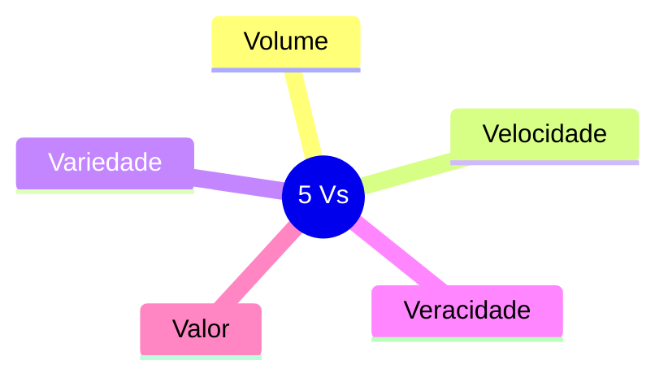

[[100-Volumes/01-Fundamentos/01-Dados/README]] | [[03-O-que-sao-Dados|03 - O que são Dados]] | [[05-Tipos-de-Dados|05 - Tipos de Dados]]

---

# Características dos Dados

> [!quote]
> "Os dados possuem propriedades próprias. Compreendê-las é o primeiro passo para construir soluções robustas."

---

# Objetivo

Ao concluir este capítulo você será capaz de:

- identificar as principais características dos dados;
- compreender como essas características influenciam arquiteturas de dados;
- reconhecer desafios relacionados ao crescimento e à qualidade dos dados;
- analisar diferentes conjuntos de dados sob a perspectiva da Engenharia de Dados.

---

# Introdução

Nem todos os dados são iguais.

Alguns ocupam poucos bytes.

Outros representam petabytes de informação.

Alguns mudam constantemente.

Outros permanecem praticamente imutáveis durante anos.

Alguns são altamente estruturados.

Outros chegam em formatos completamente livres.

Essas diferenças determinam quais tecnologias serão utilizadas para armazenar, processar e disponibilizar os dados.

Por isso, antes de aprender ferramentas, precisamos compreender as propriedades fundamentais dos dados.

---

# O que caracteriza um conjunto de dados?

Quando um Engenheiro de Dados recebe uma nova fonte de dados, normalmente as primeiras perguntas são:

- Qual o volume?
- Com que frequência chegam novos registros?
- Qual o formato?
- Quem produz esses dados?
- Eles são confiáveis?
- Qual o tempo de retenção?
- Existe histórico?
- Como serão consumidos?

Essas respostas influenciam diretamente a arquitetura da solução.

---

# Principais características

## Volume

Volume representa a quantidade de dados armazenados ou produzidos.

Pode variar desde alguns megabytes até petabytes.

Exemplos:

| Sistema | Volume aproximado |
|----------|------------------:|
| Cadastro de funcionários | 500 MB |
| ERP de médio porte | 2 TB |
| Streaming de vídeo | centenas de PB |
| Redes sociais | vários EB |

Quanto maior o volume, maior a necessidade de processamento distribuído.

---

## Velocidade

Velocidade representa a rapidez com que os dados são produzidos.

Exemplos:

- vendas em tempo real;
- sensores IoT;
- GPS;
- PIX;
- bolsa de valores.

Quando a velocidade é elevada, normalmente utilizamos arquiteturas de streaming.

---

## Variedade

Os dados podem assumir diferentes formatos.

Exemplos:

- tabelas relacionais;
- arquivos CSV;
- JSON;
- XML;
- imagens;
- vídeos;
- áudio;
- documentos PDF;
- logs.

Quanto maior a variedade, maior a complexidade da integração.

---

## Veracidade

Nem todos os dados são corretos.

Problemas comuns:

- duplicidades;
- valores nulos;
- inconsistências;
- registros incompletos;
- erros de digitação.

Garantir veracidade é uma das responsabilidades da Engenharia de Dados.

---

## Valor

Dados somente possuem valor quando ajudam na tomada de decisão.

Grandes volumes de dados sem propósito apenas aumentam custos de armazenamento e processamento.

Um dos papéis do Engenheiro de Dados é garantir que os dados disponíveis possam ser utilizados de forma eficiente pelo negócio.

---

# Os 5 Vs do Big Data

As características apresentadas anteriormente deram origem ao modelo conhecido como **5 Vs do Big Data**.



Esses cinco conceitos continuam sendo utilizados para avaliar plataformas modernas de dados.

---

# Outras características importantes

Com a evolução das plataformas de dados, outras propriedades passaram a ser igualmente relevantes.

## Volatilidade

Quanto tempo o dado permanece válido?

Exemplos:

- cotação de ações muda em segundos;
- endereço residencial pode permanecer anos sem alteração.

---

## Temporalidade

Todo dado possui um instante de criação.

Em muitos casos também possui:

- data de atualização;
- data de expiração;
- versão.

Essas informações permitem reconstruir o histórico de eventos.

---

## Sensibilidade

Alguns dados exigem proteção adicional.

Exemplos:

- CPF;
- cartão de crédito;
- prontuário médico;
- salário;
- biometria.

Esses dados estão sujeitos a legislações como a LGPD.

---

## Granularidade

Refere-se ao nível de detalhe armazenado.

Exemplo:

Alta granularidade:

| Venda | Produto | Horário | Caixa |

Baixa granularidade:

| Loja | Total vendido no dia |

Quanto maior a granularidade, maior a flexibilidade analítica.

---

# Como essas características influenciam a arquitetura?

```mermaid
flowchart LR

Dados --> Volume

Dados --> Velocidade

Dados --> Variedade

Volume --> Spark

Velocidade --> Streaming

Variedade --> Data Lake

Veracidade --> Qualidade

Valor --> Analytics
```

Cada característica influencia diretamente a escolha das tecnologias utilizadas.

---

# Conexão com a prática

Imagine que a DataRetail S.A. decidiu lançar um marketplace.

Em poucos meses surgem novas fontes de dados:

- avaliações de clientes;
- fotos de produtos;
- vídeos;
- mensagens;
- localização dos entregadores;
- histórico de navegação.

A plataforma deixa de armazenar apenas tabelas relacionais.

Agora precisa lidar com:

- grande volume;
- alta velocidade;
- formatos variados;
- dados sensíveis;
- necessidade de histórico.

É exatamente nesse momento que arquiteturas modernas, como Lakehouse e processamento distribuído, tornam-se necessárias.

---

# Estudo de Caso — DataRetail S.A.

A seguir estão algumas fontes de dados da empresa.

| Fonte | Volume | Velocidade | Variedade |
|--------|---------|------------|------------|
| ERP | Médio | Baixa | Estruturado |
| E-commerce | Alto | Média | JSON |
| Aplicativo | Muito Alto | Alta | Eventos |
| Marketplace | Muito Alto | Alta | Imagens + JSON |
| IoT | Alto | Muito Alta | Streaming |

Observe que não existe uma única arquitetura ideal para todas essas fontes.

A Engenharia de Dados consiste justamente em combinar diferentes tecnologias para atender às características específicas de cada conjunto de dados.

---

# Boas práticas

> [!tip]
>
> Antes de definir qualquer arquitetura, caracterize os dados.
>
> Pergunte sempre:
>
> - Qual o volume?
> - Qual a velocidade?
> - Qual o formato?
> - Existe histórico?
> - Há requisitos legais?
> - Qual será o consumo?

Essas respostas orientarão praticamente todas as decisões técnicas.

---

# Erros comuns

> [!warning]
>
> - Escolher tecnologias antes de compreender os dados.
> - Ignorar crescimento futuro do volume.
> - Subestimar a velocidade de geração.
> - Não considerar requisitos de segurança.
> - Armazenar todos os dados da mesma forma.

---

# Resumo Executivo

- Dados possuem características próprias.
- Essas características determinam como serão armazenados, processados e disponibilizados.
- Os 5 Vs do Big Data continuam sendo uma referência importante.
- Volume, velocidade, variedade, veracidade e valor influenciam diretamente as arquiteturas modernas.
- Um bom Engenheiro de Dados sempre analisa os dados antes de escolher tecnologias.

---

# Conceitos-chave

- Volume
- Velocidade
- Variedade
- Veracidade
- Valor
- Granularidade
- Temporalidade
- Sensibilidade
- Volatilidade

---

# Veja Também

## Próximo capítulo

➡️ [[05-Tipos-de-Dados|05 - Tipos de Dados]]

## Atlas

- [[Big-Data|Big Data]]
- [[Qualidade-de-Dados|Qualidade de Dados]]
- [[Data-Lake|Data Lake]]
- [[Lakehouse]]
- [[Apache-Spark|Apache Spark]]

## Volume

- [[100-Volumes/01-Fundamentos/01-Dados/README]]

---

> [!summary]
> Compreender as características dos dados é essencial para projetar plataformas eficientes. Antes de decidir por tecnologias como PostgreSQL, Spark, Iceberg ou Airflow, o Engenheiro de Dados deve analisar o comportamento, o volume, a velocidade, a variedade e os requisitos de qualidade dos dados que serão tratados.
