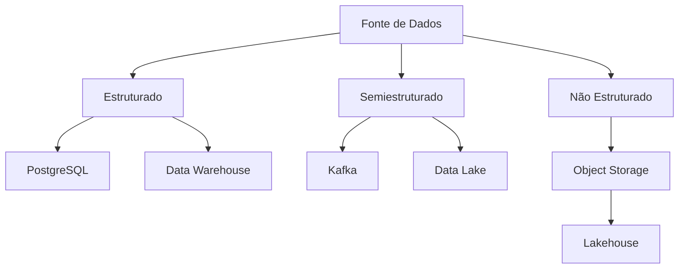

[[100-Volumes/01-Fundamentos/01-Dados/README]] | [[04-Caracteristicas-dos-Dados|04 - Características dos Dados]] | [[06-Estruturacao-dos-Dados|06 - Estruturação dos Dados]]

---

# Tipos de Dados

> [!quote]
> "Antes de armazenar um dado, precisamos compreender sua natureza."

---

# Objetivo

Ao concluir este capítulo você será capaz de:

- classificar diferentes tipos de dados;
- compreender como cada tipo influencia o armazenamento e o processamento;
- reconhecer formatos utilizados no mercado;
- selecionar tecnologias adequadas para cada cenário.

---

# Introdução

Quando falamos em "dados", normalmente imaginamos apenas tabelas contendo números e textos.

Na realidade, as organizações trabalham com uma enorme variedade de formatos.

Uma empresa moderna pode armazenar simultaneamente:

- pedidos de venda;
- imagens;
- vídeos;
- documentos PDF;
- mensagens de WhatsApp;
- arquivos JSON;
- sensores IoT;
- coordenadas GPS;
- gravações telefônicas;
- logs de aplicações.

Todos esses elementos são dados.

O desafio está em tratá-los adequadamente.

---

# Classificações dos dados

Existem diversas formas de classificar os dados.

Neste capítulo utilizaremos as classificações mais importantes para Engenharia de Dados.

---

# Dados Estruturados

São dados organizados segundo um esquema previamente definido.

Possuem:

- linhas;
- colunas;
- tipos definidos;
- regras de integridade.

Exemplo:

| CPF | Nome | Cidade |
|------|-------|---------|
| 12345678901 | João | São Paulo |
| 98765432100 | Maria | Curitiba |

São normalmente armazenados em bancos relacionais.

Exemplos:

- PostgreSQL
- Oracle
- SQL Server
- MySQL

---

# Dados Semiestruturados

Possuem organização parcial.

Existe uma estrutura, porém ela pode variar entre registros.

Exemplo JSON

```json
{
  "cliente":"João",
  "telefone":"11999999999",
  "email":"joao@email.com"
}
```

Outro registro pode conter novos atributos:

```json
{
  "cliente":"Maria",
  "telefone":"21988888888",
  "idade":32,
  "vip":true
}
```

A estrutura evolui naturalmente.

Tecnologias comuns:

- MongoDB
- Elasticsearch
- Apache Kafka
- Apache Iceberg

---

# Dados Não Estruturados

Não possuem uma estrutura tabular.

Exemplos:

- fotos;
- vídeos;
- documentos;
- contratos;
- áudios;
- e-mails;
- PDFs;
- imagens médicas.

São responsáveis por grande parte do crescimento dos Data Lakes.

---

# Comparação

| Característica | Estruturado | Semiestruturado | Não Estruturado |
|----------------|-------------|-----------------|-----------------|
| Esquema fixo | ✅ | Parcial | ❌ |
| Fácil consulta SQL | ✅ | Parcial | ❌ |
| Flexibilidade | Baixa | Alta | Muito Alta |
| Volume típico | Médio | Alto | Muito Alto |

---

# Dados Mestres (Master Data)

Representam entidades fundamentais do negócio.

Exemplos:

- clientes;
- produtos;
- fornecedores;
- lojas;
- funcionários.

São relativamente estáveis e utilizados por diversos sistemas.

---

# Dados Transacionais

Representam eventos de negócio.

Exemplos:

- vendas;
- pagamentos;
- pedidos;
- transferências bancárias;
- movimentações de estoque.

Características:

- alto volume;
- alta frequência;
- crescimento contínuo.

---

# Dados Analíticos

São produzidos para apoiar análises e tomada de decisão.

Exemplos:

- indicadores;
- agregações;
- dashboards;
- métricas;
- cubos analíticos.

Normalmente estão presentes em Data Warehouses e Lakehouses.

---

# Dados de Referência

São conjuntos relativamente pequenos utilizados para padronizar outros dados.

Exemplos:

- estados brasileiros;
- municípios;
- moedas;
- idiomas;
- códigos CNAE;
- tabelas de países.

Mudam pouco ao longo do tempo.

---

# Dados Históricos

São registros preservados para consultas futuras.

Exemplos:

- vendas dos últimos cinco anos;
- histórico de preços;
- alterações cadastrais;
- versões de contratos.

Permitem análises temporais e auditorias.

---

# Dados em Tempo Real

São produzidos continuamente.

Exemplos:

- PIX;
- GPS;
- sensores industriais;
- telemetria;
- bolsa de valores;
- monitoramento de aplicações.

Normalmente exigem arquiteturas de streaming.

---

# Como essa classificação influencia a arquitetura?



Observe que diferentes tipos de dados normalmente levam a arquiteturas distintas.

---

# Conexão com a prática

Na DataRetail S.A., encontramos exemplos de praticamente todas essas categorias.

| Fonte | Tipo predominante |
|--------|-------------------|
| ERP | Estruturado |
| CRM | Estruturado |
| Marketplace | Semiestruturado |
| Logs da aplicação | Semiestruturado |
| Fotos de produtos | Não Estruturado |
| Vídeos promocionais | Não Estruturado |
| Sensores das lojas | Streaming |
| Dashboard Executivo | Analítico |

Uma plataforma moderna precisa integrar todos esses formatos em um único ecossistema.

---

# Decisão Arquitetural

> [!example]
> **Cenário**
>
> A DataRetail passará a armazenar imagens de produtos em alta resolução, além de metadados (nome do arquivo, tamanho, categoria, data de upload e responsável).
>
> **Pergunta**
>
> Devemos armazenar tudo em um banco relacional?
>
> **Discussão**
>
> Em geral, os metadados podem permanecer em um banco relacional ou em tabelas analíticas, enquanto as imagens são armazenadas em Object Storage (como Amazon S3, Azure Blob Storage ou MinIO). Essa separação reduz custos, melhora a escalabilidade e facilita o processamento.

---

# Boas práticas

> [!tip]
>
> Classifique os dados antes de definir:
>
> - formato de armazenamento;
> - tecnologia;
> - estratégia de particionamento;
> - compressão;
> - políticas de retenção.

---

# Erros comuns

> [!warning]
>
> - Armazenar arquivos grandes em bancos relacionais sem necessidade.
> - Tratar todos os dados como se fossem tabelas.
> - Ignorar metadados.
> - Não considerar o crescimento do volume.
> - Misturar dados operacionais e analíticos sem planejamento.

---

# Resumo Executivo

- Nem todos os dados possuem a mesma natureza.
- A classificação correta influencia diretamente a arquitetura da solução.
- Dados estruturados, semiestruturados e não estruturados coexistem nas organizações modernas.
- Plataformas atuais precisam integrar diferentes formatos de maneira transparente.
- A escolha da tecnologia deve ser consequência das características dos dados, e não o ponto de partida.

---

# Conceitos-chave

- Dados Estruturados
- Dados Semiestruturados
- Dados Não Estruturados
- Master Data
- Dados Transacionais
- Dados Analíticos
- Dados Históricos
- Streaming
- Object Storage

---

# Veja Também

## Próximo capítulo

➡️ [[06-Estruturacao-dos-Dados|06 - Estruturação dos Dados]]

## Atlas

- [[Data-Lake|Data Lake]]
- [[Lakehouse]]
- [[100-Volumes/08-PostgreSQL/README|PostgreSQL]]
- [[Apache-Iceberg|Apache Iceberg]]
- [[Apache-Spark|Apache Spark]]

## Volume

- [[100-Volumes/01-Fundamentos/01-Dados/README]]

---

> [!summary]
> A classificação dos dados é uma das primeiras atividades de um Engenheiro de Dados. Compreender a natureza dos dados permite escolher arquiteturas, tecnologias e estratégias de processamento adequadas, garantindo escalabilidade, desempenho e qualidade das soluções.
