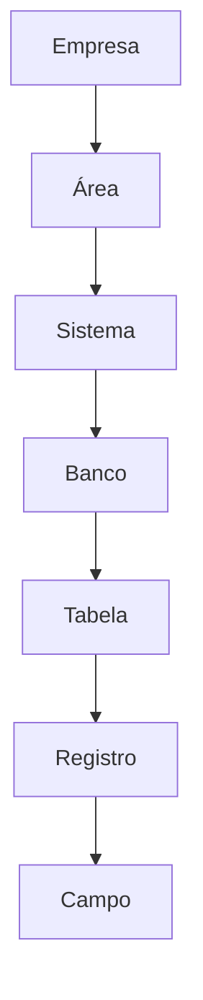

[[100-Volumes/01-Fundamentos/01-Dados/README]] | [[05-Tipos-de-Dados|05 - Tipos de Dados]] | [[07-Ciclo-de-Vida-dos-Dados|07 - Ciclo de Vida dos Dados]]

---

# Estruturação dos Dados

> [!quote]
> "Os dados têm valor, mas somente quando organizados de forma que possam ser encontrados, compreendidos e utilizados."

---

# Objetivo

Ao concluir este capítulo você será capaz de:

- compreender o que significa estruturar dados;
- diferenciar organização lógica e física dos dados;
- entender esquemas (*schemas*);
- reconhecer diferentes formatos de armazenamento;
- compreender como a estrutura dos dados influencia desempenho, qualidade e escalabilidade.

---

# Introdução

Imagine uma biblioteca onde todos os livros foram colocados aleatoriamente em uma única sala.

Mesmo contendo milhares de livros valiosos, encontrar uma informação específica seria extremamente difícil.

Agora imagine essa mesma biblioteca organizada por:

- assunto;
- autor;
- idioma;
- data de publicação.

O conteúdo continua sendo exatamente o mesmo.

O que mudou foi sua **estrutura**.

Na Engenharia de Dados acontece exatamente isso.

Estruturar dados significa organizá-los de forma que possam ser armazenados, consultados, compartilhados e processados com eficiência.

---

# O que significa estruturar dados?

Estruturar dados consiste em definir como eles serão organizados.

Essa organização envolve:

- atributos;
- tipos;
- relacionamentos;
- regras;
- formatos;
- identificação dos registros.

Sem estrutura, grandes volumes de dados tornam-se difíceis de utilizar.

---

# Estrutura lógica × Estrutura física

É importante separar dois conceitos.

## Estrutura lógica

Representa **como o negócio enxerga os dados**.

Exemplo:

Cliente

- CPF
- Nome
- Data de nascimento
- Cidade

Produto

- Código
- Nome
- Categoria
- Preço

Essa estrutura independe da tecnologia utilizada.

---

## Estrutura física

Representa **como os dados são armazenados**.

Pode ser:

- tabelas;
- arquivos CSV;
- Parquet;
- JSON;
- Iceberg;
- bancos NoSQL;
- objetos em Data Lakes.

A estrutura física depende da arquitetura adotada.

---

# Esquema (Schema)

Um **schema** define a estrutura esperada dos dados.

Ele informa:

- quais campos existem;
- seus tipos;
- restrições;
- relacionamentos.

Exemplo simplificado:

```text
Cliente

CPF
Nome
Email
Telefone
Cidade
```

Sempre que um novo registro é inserido, espera-se que siga essa definição.

---

# Schema-on-Write × Schema-on-Read

Uma das decisões arquiteturais mais importantes é definir quando o esquema será validado.

## Schema-on-Write

O esquema é validado durante a gravação.

Exemplo:

Banco PostgreSQL.

Vantagens:

- maior consistência;
- consultas rápidas;
- validação imediata.

Desvantagens:

- menor flexibilidade.

---

## Schema-on-Read

O esquema é interpretado apenas durante a leitura.

Muito utilizado em:

- Data Lakes;
- Apache Spark;
- Hadoop.

Vantagens:

- alta flexibilidade;
- ingestão rápida.

Desvantagens:

- necessidade de tratamento durante o processamento.

---

# Organização hierárquica

Os dados podem ser organizados em diferentes níveis.



Essa organização facilita governança, segurança e manutenção.

---

# Formatos de armazenamento

Os dados podem ser armazenados em diversos formatos.

| Formato | Características |
|----------|-----------------|
| CSV | Simples e portátil |
| JSON | Flexível |
| XML | Hierárquico |
| Parquet | Colunar e compactado |
| ORC | Colunar |
| Avro | Serialização |
| Iceberg | Tabela analítica |
| Delta Lake | Tabela transacional |

Cada formato possui objetivos específicos.

---

# Organização em tabelas

Nos bancos relacionais os dados normalmente são organizados em tabelas.

Exemplo:

```text
CLIENTE

CPF

Nome

Cidade

Telefone
```

Cada linha representa um registro.

Cada coluna representa um atributo.

---

# Organização em documentos

NoSQL normalmente utiliza documentos.

```json
{
  "cliente": {
    "nome": "João",
    "cidade": "São Paulo",
    "telefones": [
      "11999999999",
      "11888888888"
    ]
  }
}
```

Observe que um único documento pode conter estruturas complexas.

---

# Organização em arquivos

Nos Data Lakes os dados frequentemente são armazenados em arquivos.

Exemplo:

```text
clientes/

2026/

07/

clientes_20260714.parquet
```

Além do conteúdo, a organização dos diretórios também influencia o desempenho.

---

# Particionamento

Uma técnica amplamente utilizada consiste em dividir os dados em partições.

Exemplo:

```text
vendas/

ano=2026/

mes=07/

dia=14/
```

Isso permite que mecanismos como Spark e Trino leiam apenas os arquivos necessários.

---

# Conexão com a prática

Na DataRetail S.A., imagine que existam dois bilhões de registros de vendas.

Sem particionamento, uma consulta para obter apenas as vendas de ontem precisaria ler todo o conjunto de dados.

Com particionamento por data, apenas os arquivos correspondentes ao dia desejado são processados.

Essa estratégia reduz drasticamente o tempo de execução e o custo computacional.

---

# Arquitetura em Foco

> [!example]
>
> **Cenário**
>
> A empresa precisa armazenar eventos de acesso ao site.
>
> São produzidos aproximadamente 80 milhões de registros por dia.
>
> **Pergunta**
>
> Devemos armazenar os dados em milhares de arquivos CSV pequenos ou consolidá-los em arquivos Parquet particionados por data?
>
> **Discussão**
>
> Embora CSV seja simples, milhões de arquivos pequenos degradam significativamente o desempenho de processamento distribuído.
>
> Consolidar os dados em arquivos Parquet particionados reduz I/O, melhora compressão e acelera consultas.

---

# Boas práticas

> [!tip]
>
> Sempre planeje:
>
> - estrutura lógica;
> - formato físico;
> - particionamento;
> - esquema;
> - estratégia de evolução do esquema;
> - retenção dos dados.

Essas decisões terão impacto durante toda a vida útil da plataforma.

---

# Erros comuns

> [!warning]
>
> - Misturar dados sem organização.
> - Criar milhares de arquivos pequenos.
> - Ignorar evolução do esquema.
> - Não documentar estruturas.
> - Escolher formatos inadequados para grandes volumes.

---

# Resumo Executivo

- Estruturar dados significa organizá-los para facilitar armazenamento, processamento e consulta.
- Estrutura lógica representa o negócio; estrutura física representa a implementação.
- O conceito de schema é fundamental para garantir consistência.
- Formatos e particionamento influenciam diretamente desempenho e escalabilidade.
- Uma boa estrutura reduz custos e simplifica a evolução da plataforma.

---

# Conceitos-chave

- Estrutura Lógica
- Estrutura Física
- Schema
- Schema-on-Write
- Schema-on-Read
- Particionamento
- Parquet
- CSV
- JSON
- Organização Hierárquica

---

# Veja Também

## Próximo capítulo

➡️ [[07-Ciclo-de-Vida-dos-Dados|07 - Ciclo de Vida dos Dados]]

## Atlas

- [[Data-Lake|Data Lake]]
- [[Lakehouse]]
- [[Apache-Iceberg|Apache Iceberg]]
- [[Apache-Spark|Apache Spark]]
- [[PostgreSQL]]
- [[Pipeline-de-Dados|Pipeline de Dados]]

## Volume

- [[100-Volumes/01-Fundamentos/01-Dados/README]]

---

> [!summary]
> Estruturar dados vai muito além de definir tabelas ou arquivos. É uma decisão arquitetural que influencia desempenho, qualidade, governança e escalabilidade. Uma estrutura bem planejada permite que os dados cresçam de forma sustentável e sejam utilizados eficientemente por toda a organização.