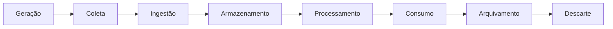

[[100-Volumes/01-Fundamentos/01-Dados/README]] | [[06-Estruturacao-dos-Dados|06 - Estruturação dos Dados]] | [[08-Qualidade-dos-Dados|08 - Qualidade dos Dados]]

---

# Ciclo de Vida dos Dados

> [!quote]
> "Os dados não nascem prontos nem permanecem úteis para sempre. Eles percorrem um ciclo de vida que deve ser gerenciado."

---

# Objetivo

Ao concluir este capítulo você será capaz de:

- compreender o conceito de ciclo de vida dos dados;
- identificar cada etapa desse ciclo;
- entender o papel da Engenharia de Dados em cada fase;
- relacionar tecnologias modernas às diferentes etapas;
- reconhecer riscos e boas práticas durante todo o ciclo de vida.

---

# Introdução

Os dados não permanecem estáticos.

Eles são criados, armazenados, transformados, compartilhados, utilizados e, eventualmente, descartados.

Cada uma dessas etapas apresenta desafios próprios relacionados a:

- qualidade;
- segurança;
- governança;
- desempenho;
- custo;
- conformidade legal.

O papel da Engenharia de Dados é garantir que esse ciclo ocorra de forma controlada, eficiente e segura.

---

# Visão Geral

O ciclo de vida pode ser representado pelas seguintes etapas.

Cada organização pode adaptar esse fluxo, mas os conceitos fundamentais permanecem os mesmos.

---

# Etapa 1 — Geração

Tudo começa quando um evento produz novos dados.

Exemplos:

- uma venda;
- um pagamento via PIX;
- um clique em um site;
- uma leitura de sensor;
- um cadastro de cliente.

Esses eventos ocorrem continuamente.

O Engenheiro de Dados normalmente não controla essa etapa, mas precisa conhecê-la profundamente.

---

# Etapa 2 — Coleta

Após serem produzidos, os dados precisam ser capturados.

As principais fontes incluem:

- bancos relacionais;
- APIs;
- arquivos;
- filas de mensagens;
- dispositivos IoT;
- sistemas legados;
- aplicações SaaS.

Nesta etapa preocupamo-nos com:

- confiabilidade;
- frequência;
- autenticação;
- integridade.

---

# Etapa 3 — Ingestão

Os dados chegam à plataforma de dados.

Existem duas estratégias principais.

## Batch

Grandes volumes processados em intervalos definidos.

Exemplo:

- carga diária de vendas.

---

## Streaming

Eventos processados continuamente.

Exemplo:

- monitoramento de sensores;
- transações financeiras;
- rastreamento de veículos.

---

# Etapa 4 — Armazenamento

Depois da ingestão, os dados precisam ser armazenados.

Dependendo do cenário, podemos utilizar:

| Tecnologia | Uso principal |
|------------|---------------|
| PostgreSQL | Dados transacionais |
| Data Warehouse | Dados analíticos |
| Data Lake | Dados brutos |
| Lakehouse | Dados analíticos modernos |
| Object Storage | Arquivos e grandes volumes |

Nesta etapa são definidas estratégias como:

- particionamento;
- compressão;
- versionamento;
- retenção.

---

# Etapa 5 — Processamento

Os dados raramente podem ser utilizados exatamente como chegam.

Normalmente são necessárias transformações.

Exemplos:

- limpeza;
- padronização;
- enriquecimento;
- deduplicação;
- agregação;
- validação.

Ferramentas comuns:

- Apache Spark;
- SQL;
- Python;
- Trino.

---

# Etapa 6 — Consumo

Os dados passam a gerar valor.

Consumidores típicos:

- dashboards;
- relatórios;
- modelos de Machine Learning;
- APIs;
- aplicações;
- análises exploratórias.

Nesta etapa o objetivo é disponibilizar dados confiáveis para tomada de decisão.

---

# Etapa 7 — Arquivamento

Nem todos os dados precisam permanecer em armazenamento de alto desempenho.

Após determinado período eles podem ser movidos para camadas mais econômicas.

Exemplos:

- backups;
- armazenamento frio (*cold storage*);
- arquivos históricos.

Essa estratégia reduz custos sem perder o histórico.

---

# Etapa 8 — Descarte

Todo dado possui um tempo de retenção.

Após esse período pode ser necessário:

- excluir;
- anonimizar;
- mascarar;
- consolidar.

Essa etapa é importante para atender requisitos legais, como a **LGPD**.

---

# O papel da Engenharia de Dados

Em cada etapa do ciclo de vida existem responsabilidades específicas.

| Etapa | Responsabilidade |
|--------|------------------|
| Geração | Conhecer as fontes |
| Coleta | Capturar corretamente |
| Ingestão | Garantir disponibilidade |
| Armazenamento | Organizar e proteger |
| Processamento | Transformar e validar |
| Consumo | Disponibilizar com qualidade |
| Arquivamento | Reduzir custos |
| Descarte | Atender políticas e legislação |

---

# Conexão com a prática

Na DataRetail S.A., considere a venda de um produto.

O evento percorre todo o ciclo:

1. Cliente realiza a compra.
2. O ERP registra a venda.
3. A plataforma captura a transação.
4. O evento é armazenado no Data Lake.
5. Um pipeline Spark calcula indicadores.
6. O dashboard executivo é atualizado.
7. Após cinco anos, os dados são arquivados.
8. Ao final do período legal de retenção, os registros são descartados ou anonimizados.

Perceba que uma única venda pode passar por diversas tecnologias ao longo de seu ciclo de vida.

---

# Arquitetura em Foco

> [!example]
> **Cenário**
>
> Uma empresa deseja manter todos os dados operacionais em armazenamento de alta performance indefinidamente.
>
> **Pergunta**
>
> Essa decisão é adequada?
>
> **Discussão**
>
> Em geral, não. Dados antigos costumam ser menos acessados e podem ser movidos para camadas de armazenamento mais econômicas, mantendo apenas o histórico necessário. Uma estratégia de arquivamento reduz custos sem comprometer análises ou requisitos regulatórios.

---

# Boas práticas

> [!tip]
>
> Planeje o ciclo de vida dos dados antes da implementação da plataforma.
>
> Defina:
>
> - origem dos dados;
> - frequência de ingestão;
> - política de retenção;
> - estratégia de arquivamento;
> - critérios de descarte;
> - responsáveis por cada etapa.

---

# Erros comuns

> [!warning]
>
> - Não conhecer a origem dos dados.
> - Armazenar tudo indefinidamente.
> - Ignorar políticas de retenção.
> - Não documentar o fluxo dos dados.
> - Descartar dados sem considerar requisitos legais ou de auditoria.

---

# Resumo Executivo

- Os dados percorrem um ciclo de vida desde sua geração até o descarte.
- Cada etapa possui desafios técnicos e de governança.
- A Engenharia de Dados atua em todas essas fases.
- Planejar o ciclo de vida reduz custos, melhora a qualidade e facilita a conformidade regulatória.
- O gerenciamento adequado do ciclo de vida é essencial para plataformas modernas de dados.

---

# Conceitos-chave

- Geração
- Coleta
- Ingestão
- Armazenamento
- Processamento
- Consumo
- Arquivamento
- Descarte
- Retenção
- Governança

---

# Veja Também

## Próximo capítulo

➡️ [[08-Qualidade-dos-Dados|08 - Qualidade dos Dados]]

## Atlas

- [[Pipeline-de-Dados|Pipeline de Dados]]
- [[Data-Lake|Data Lake]]
- [[Lakehouse]]
- [[Apache-Spark|Apache Spark]]
- [[Apache-Airflow|Apache Airflow]]
- [[Qualidade-de-Dados|Qualidade de Dados]]
- Governança de Dados

## Volume

- [[100-Volumes/01-Fundamentos/01-Dados/README]]

---

> [!summary]
> O ciclo de vida dos dados descreve a jornada completa que um dado percorre desde sua criação até seu descarte. Compreender esse ciclo é essencial para projetar plataformas escaláveis, reduzir custos, garantir conformidade regulatória e disponibilizar dados confiáveis para toda a organização.

