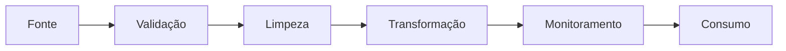

[[100-Volumes/01-Fundamentos/01-Dados/README]] | [[07-Ciclo-de-Vida-dos-Dados|07 - Ciclo de Vida dos Dados]] | [[09-Metadados|09 - Metadados]]

---

# Qualidade dos Dados

> [!quote]
> "Dados de baixa qualidade produzem decisões de baixa qualidade."

---

# Objetivo

Ao concluir este capítulo você será capaz de:

- compreender o conceito de qualidade dos dados;
- identificar as principais dimensões da qualidade;
- reconhecer problemas comuns encontrados em bases de dados;
- entender o impacto da má qualidade nos negócios;
- conhecer boas práticas para garantir dados confiáveis.

---

# Introdução

Imagine um dashboard financeiro mostrando que a empresa faturou **R$ 120 milhões** no último mês.

Agora imagine que milhares de vendas foram registradas em duplicidade.

O dashboard continuará funcionando.

Os gráficos continuarão bonitos.

Os indicadores continuarão sendo calculados.

Mas todas as decisões tomadas a partir dessas informações estarão erradas.

Esse exemplo demonstra uma das principais responsabilidades da Engenharia de Dados:

**garantir que os dados sejam confiáveis.**

---

# O que é Qualidade dos Dados?

Qualidade dos Dados é o conjunto de características que tornam um dado adequado para seu propósito.

Em outras palavras:

> Um dado possui qualidade quando pode ser utilizado com confiança para apoiar processos e decisões.

Não existe dado "perfeito".

Existe dado **adequado ao contexto**.

---

# Por que a qualidade é importante?

Dados são utilizados por:

- diretoria;
- analistas;
- cientistas de dados;
- sistemas operacionais;
- modelos de IA;
- órgãos reguladores.

Um erro aparentemente pequeno pode gerar impactos significativos.

Exemplos:

- pagamentos incorretos;
- clientes duplicados;
- estoque divergente;
- fraudes não identificadas;
- multas regulatórias;
- perda de credibilidade.

---

# As principais dimensões da qualidade

Embora existam diferentes modelos, algumas dimensões são amplamente aceitas.

## Precisão (Accuracy)

O dado representa corretamente a realidade?

Exemplo:

Cliente cadastrado com CPF correto.

---

## Completude (Completeness)

Todos os dados necessários estão presentes?

Exemplo:

Cadastro contendo:

- CPF
- Nome
- Data de nascimento
- Endereço

Caso o endereço esteja ausente, a completude é reduzida.

---

## Consistência (Consistency)

O mesmo dado possui o mesmo significado em diferentes sistemas?

Exemplo:

CRM:

```text
Cliente Ativo
```

ERP:

```text
Cliente Inativo
```

Existe uma inconsistência.

---

## Atualidade (Timeliness)

O dado está atualizado?

Exemplo:

Saldo bancário consultado há três dias.

Pode não representar a situação atual.

---

## Unicidade (Uniqueness)

Cada entidade deve aparecer apenas uma vez.

Exemplo incorreto:

| CPF | Nome |
|------|------|
|123|João|
|123|João|

O cliente foi duplicado.

---

## Validade (Validity)

O dado respeita as regras estabelecidas?

Exemplo:

CPF:

```text
12345678901
```

Formato válido.

Exemplo inválido:

```text
ABC123
```

---

# Resumo das dimensões

| Dimensão | Pergunta principal |
|-----------|--------------------|
| Precisão | Está correto? |
| Completude | Está completo? |
| Consistência | Concorda com outras fontes? |
| Atualidade | Está atualizado? |
| Unicidade | Está duplicado? |
| Validade | Respeita as regras? |

---

# Problemas comuns

Durante projetos de Engenharia de Dados encontramos frequentemente:

- registros duplicados;
- campos obrigatórios nulos;
- datas inválidas;
- códigos inexistentes;
- caracteres especiais inesperados;
- formatos diferentes para o mesmo dado;
- divergências entre sistemas.

Esses problemas precisam ser identificados antes que os dados sejam consumidos.

---

# Como garantir qualidade?

Qualidade não é uma atividade isolada.

Ela deve estar presente em todo o pipeline.



---

# Conexão com a prática

Na DataRetail S.A., um cliente pode comprar pelo:

- site;
- aplicativo;
- loja física.

Se cada sistema cadastrar o mesmo cliente de maneira diferente, teremos:

| Sistema | Nome |
|----------|------|
| ERP | João Silva |
| CRM | João da Silva |
| E-commerce | J. Silva |

Sem regras de qualidade e padronização, torna-se difícil consolidar o histórico desse cliente.

---

# Arquitetura em Foco

> [!example]
> **Cenário**
>
> Um pipeline recebe diariamente um arquivo de clientes contendo milhares de registros sem CPF e com e-mails inválidos.
>
> **Pergunta**
>
> Devemos carregar esses dados diretamente para o Data Warehouse?
>
> **Discussão**
>
> Em geral, não. O pipeline deve validar os dados antes da carga, rejeitando ou direcionando registros inválidos para uma área de quarentena (*quarantine*), onde poderão ser corrigidos e reprocessados.

---

# Tecnologias por etapa

| Atividade | Tecnologias |
|------------|-------------|
| Validação | SQL, Python |
| Transformação | Apache Spark |
| Regras de negócio | Spark, Trino |
| Monitoramento | Airflow, Observabilidade |
| Armazenamento | PostgreSQL, Iceberg |

Nos volumes futuros veremos como essas ferramentas implementam controles de qualidade de forma automatizada.

---

# Boas práticas

> [!tip]
>
> - Defina regras de qualidade antes da ingestão.
> - Automatize validações.
> - Monitore indicadores de qualidade.
> - Documente as regras aplicadas.
> - Corrija a causa do problema, e não apenas seus efeitos.

---

# Erros comuns

> [!warning]
>
> - Assumir que os dados de origem estão corretos.
> - Corrigir registros manualmente sem rastreabilidade.
> - Ignorar registros inválidos.
> - Não medir indicadores de qualidade.
> - Misturar dados validados e não validados na mesma camada.

---

# Resumo Executivo

- Qualidade dos dados é essencial para decisões confiáveis.
- Ela deve ser tratada durante todo o ciclo de vida dos dados.
- As principais dimensões são: precisão, completude, consistência, atualidade, unicidade e validade.
- A automação das validações reduz erros e aumenta a confiança na plataforma.
- Uma plataforma moderna incorpora controles de qualidade desde a ingestão até o consumo.

---

# Conceitos-chave

- Data Quality
- Precisão
- Completude
- Consistência
- Atualidade
- Unicidade
- Validade
- Quarentena de Dados
- Regras de Qualidade

---

# Veja Também

## Próximo capítulo

➡️ [[09-Metadados|09 - Metadados]]

## Atlas

- [[Qualidade-de-Dados|Qualidade de Dados]]
- [[Pipeline-de-Dados|Pipeline de Dados]]
- [[Apache-Spark|Apache Spark]]
- [[Apache-Airflow|Apache Airflow]]
- Governança de Dados

## Volume

- [[100-Volumes/01-Fundamentos/01-Dados/README]]

---

> [!summary]
> Qualidade dos dados é um dos pilares da Engenharia de Dados. Não basta coletar e armazenar informações; é necessário garantir que elas sejam corretas, completas, consistentes e adequadas ao seu propósito. Plataformas modernas incorporam validações automáticas e monitoramento contínuo para assegurar a confiabilidade dos dados ao longo de todo o seu ciclo de vida.
