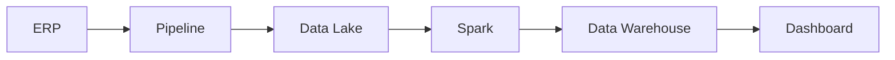

[[100-Volumes/01-Fundamentos/01-Dados/README]] | [[08-Qualidade-dos-Dados|08 - Qualidade dos Dados]] | [[10-Estudo-de-Caso|10 - Estudo de Caso]]

---

# Metadados

> [!quote]
> "Se os dados contam a história, os metadados explicam como interpretá-la."

---

# Objetivo

Ao concluir este capítulo você será capaz de:

- compreender o conceito de metadados;
- identificar diferentes tipos de metadados;
- entender sua importância para governança e qualidade;
- reconhecer como metadados são utilizados em plataformas modernas de dados;
- relacionar metadados com catálogos, linhagem e descoberta de dados.

---

# Introdução

Imagine encontrar um arquivo chamado:

```text
dados.csv
```

Sem qualquer informação adicional, diversas perguntas surgem imediatamente:

- Quem criou esse arquivo?
- Quando foi gerado?
- Qual sistema o produziu?
- O que significa cada coluna?
- Qual é o formato esperado?
- Os dados são confiáveis?
- Quem pode utilizá-los?

Essas respostas normalmente não estão contidas nos próprios dados.

Elas fazem parte dos **metadados**.

---

# O que são Metadados?

Metadados são informações que descrevem outras informações.

Enquanto os dados representam fatos do negócio, os metadados descrevem características desses dados.

Podemos resumir assim:

| Dados | Metadados |
|--------|-----------|
| Valor da venda | Nome da coluna "valor_venda" |
| CPF do cliente | Tipo de dado: VARCHAR(11) |
| Data da compra | Formato: YYYY-MM-DD |
| Arquivo Parquet | Data de criação do arquivo |

---

# Por que metadados são importantes?

Sem metadados, encontrar e interpretar informações torna-se muito mais difícil.

Eles permitem responder perguntas como:

- Qual é a origem deste dado?
- Quem é o responsável?
- Quando foi atualizado?
- Qual sistema o produz?
- Quais regras de qualidade se aplicam?
- Quem pode acessá-lo?

Essas informações são essenciais para a governança dos dados.

---

# Tipos de Metadados

Os metadados podem ser classificados em diferentes categorias.

## Metadados Técnicos

Descrevem aspectos estruturais e tecnológicos.

Exemplos:

- nome da tabela;
- nome da coluna;
- tipo do dado;
- tamanho;
- formato;
- índice;
- particionamento.

Exemplo:

| Campo | Tipo |
|--------|------|
| cpf | VARCHAR(11) |
| nome | VARCHAR(100) |
| nascimento | DATE |

---

## Metadados de Negócio

Descrevem o significado dos dados.

Exemplo:

| Campo | Significado |
|--------|-------------|
| receita_liquida | Receita após impostos e devoluções |
| cliente_ativo | Cliente que realizou compras nos últimos 12 meses |

Esses metadados facilitam o entendimento entre áreas técnicas e de negócio.

---

## Metadados Operacionais

Descrevem como os dados são processados.

Exemplos:

- horário da carga;
- duração do pipeline;
- quantidade de registros processados;
- quantidade de erros;
- versão do processo.

São amplamente utilizados em monitoramento e observabilidade.

---

# Exemplo Completo

Considere a tabela:

```text
clientes
```

Os dados podem ser:

| CPF | Nome | Cidade |
|------|-------|---------|
|12345678901|João|São Paulo|

Os metadados podem ser:

| Propriedade | Valor |
|-------------|-------|
| Origem | CRM |
| Frequência | Diária |
| Responsável | Equipe Comercial |
| Atualização | 02:00 |
| Sensibilidade | LGPD |
| Dono do dado | Gerência de CRM |

Observe que os metadados descrevem a tabela, e não os registros individuais.

---

# Metadados e Catálogo de Dados

Em plataformas modernas, os metadados são organizados em **Catálogos de Dados**.

Esses catálogos permitem:

- pesquisar tabelas;
- localizar datasets;
- visualizar descrições;
- identificar responsáveis;
- consultar políticas de acesso.

Eles funcionam como um mecanismo de busca para os dados da organização.

---

# Metadados e Linhagem

Outra aplicação importante é a **linhagem de dados** (*Data Lineage*).

Ela mostra o caminho percorrido pelos dados desde sua origem até o consumo.



Graças aos metadados, é possível saber:

- de onde veio cada dado;
- quais transformações foram aplicadas;
- quais sistemas foram impactados.

---

# Metadados e Governança

Os metadados são um dos pilares da governança de dados.

Eles permitem:

- classificar dados sensíveis;
- controlar acessos;
- documentar regras de negócio;
- manter conformidade regulatória;
- facilitar auditorias.

Sem metadados adequados, torna-se muito mais difícil garantir rastreabilidade e conformidade.

---

# Conexão com a prática

Na DataRetail S.A., existe uma tabela chamada `vendas`.

Sem metadados, um analista não sabe:

- se os valores estão em reais ou dólares;
- se os registros incluem devoluções;
- quando a tabela foi atualizada;
- quem é o responsável pelo conjunto de dados.

Com um catálogo de metadados, essas informações ficam disponíveis de forma centralizada e padronizada.

---

# Arquitetura em Foco

> [!example]
> **Cenário**
>
> Uma empresa possui milhares de tabelas distribuídas em diferentes bancos de dados e Data Lakes.
>
> **Pergunta**
>
> Como um analista pode descobrir rapidamente qual tabela contém o faturamento mensal?
>
> **Discussão**
>
> Um catálogo de dados baseado em metadados permite pesquisar por termos de negócio, visualizar descrições, identificar responsáveis e entender a linhagem dos dados, reduzindo o tempo gasto na descoberta de informações.

---

# Tecnologias por etapa

| Necessidade | Exemplos de tecnologias |
|--------------|------------------------|
| Catálogo de Dados | Apache Atlas, DataHub, Microsoft Purview |
| Linhagem | OpenLineage, Apache Atlas |
| Metadados em tabelas | Apache Iceberg, Delta Lake |
| Orquestração | Apache Airflow |
| Observabilidade | OpenMetadata, Monte Carlo |

Essas ferramentas serão estudadas em volumes específicos da Academia.

---

# Boas práticas

> [!tip]
>
> - Documente todas as tabelas.
> - Descreva cada coluna.
> - Identifique responsáveis pelos dados.
> - Registre regras de negócio.
> - Mantenha os metadados sincronizados com a plataforma.

---

# Erros comuns

> [!warning]
>
> - Considerar metadados apenas como documentação.
> - Não atualizar descrições após mudanças.
> - Não registrar a origem dos dados.
> - Ignorar a linhagem.
> - Manter conhecimento apenas na memória da equipe.

---

# Resumo Executivo

- Metadados são informações que descrevem os dados.
- Eles facilitam descoberta, entendimento, governança e auditoria.
- Existem metadados técnicos, de negócio e operacionais.
- Catálogos de dados e linhagem dependem fortemente de metadados.
- Plataformas modernas utilizam metadados para automatizar diversos processos.

---

# Conceitos-chave

- Metadados
- Catálogo de Dados
- Data Lineage
- Governança de Dados
- Data Discovery
- Data Steward
- Data Owner

---

# Veja Também

## Próximo capítulo

➡️ [[10-Estudo-de-Caso|10 - Estudo de Caso]]

## Atlas

- [[Governança de Dados]]
- [[Pipeline-de-Dados|Pipeline de Dados]]
- [[Qualidade-de-Dados|Qualidade de Dados]]
- [[Apache-Airflow|Apache Airflow]]
- [[Apache-Iceberg|Apache Iceberg]]

## Volume

- [[100-Volumes/01-Fundamentos/01-Dados/README]]

---

> [!summary]
> Metadados são a base para compreender, localizar, governar e utilizar dados de forma eficiente. Em plataformas modernas, eles deixam de ser apenas documentação e passam a desempenhar um papel central na automação, na governança e na rastreabilidade dos dados ao longo de todo o seu ciclo de vida.