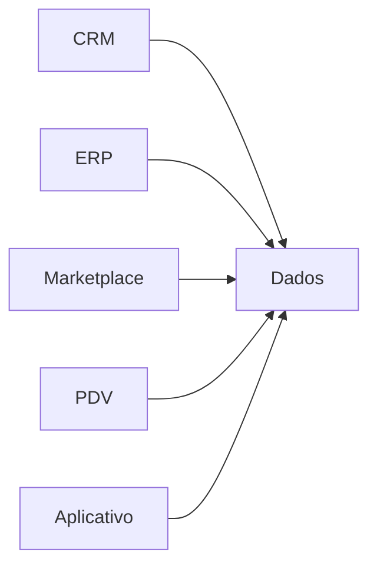
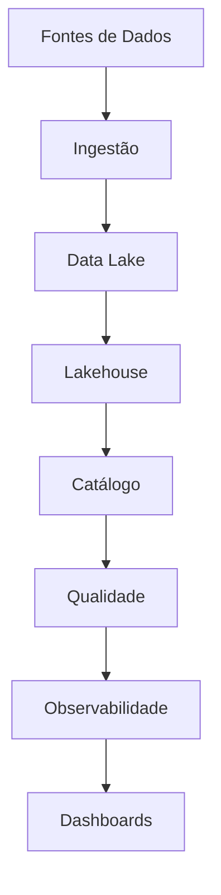

[[100-Volumes/01-Fundamentos/01-Dados/README]] | [[09-Metadados|09 - Metadados]] | [[11-Resumo|11 - Resumo]]

---

# Estudo de Caso — DataRetail S.A.

> [!quote]
> "A melhor forma de aprender Engenharia de Dados é resolver problemas reais."

---

# Objetivo

Neste estudo de caso você acompanhará a primeira etapa da construção da plataforma de dados da **DataRetail S.A.**

Ao final deste capítulo você será capaz de:

- identificar diferentes tipos de dados;
- reconhecer suas características;
- compreender seu ciclo de vida;
- analisar problemas de qualidade;
- identificar metadados relevantes;
- visualizar a necessidade de uma plataforma moderna de dados.

---

# Conhecendo a empresa

A **DataRetail S.A.** é uma empresa fictícia do setor varejista com atuação nacional.

Ela possui:

- 350 lojas físicas;
- e-commerce;
- aplicativo móvel;
- marketplace;
- centro de distribuição;
- programa de fidelidade.

Todos esses canais produzem dados continuamente.

---

# Panorama da operação

## Clientes

- mais de **8 milhões** de clientes cadastrados;

## Produtos

- aproximadamente **500 mil produtos**;

## Pedidos

- cerca de **1,8 milhão de pedidos por dia**;

## Eventos

- aproximadamente **70 milhões de eventos diários** gerados pelo site e aplicativo.

---

# Fontes de Dados

A empresa utiliza diversos sistemas.

| Sistema | Finalidade |
|----------|------------|
| ERP | Gestão financeira e estoque |
| CRM | Cadastro de clientes |
| E-commerce | Pedidos online |
| Marketplace | Vendas de parceiros |
| Aplicativo | Navegação e compras |
| PDV | Vendas em lojas físicas |
| Logística | Entregas |
| Marketing | Campanhas |

Cada sistema possui seu próprio banco de dados e suas próprias regras.

---

# Primeiros desafios

Com o crescimento da empresa, surgiram diversos problemas.

## Dados duplicados

O mesmo cliente aparece várias vezes.

Exemplo:

| CPF | Nome |
|------|------|
|12345678901|João Silva|
|12345678901|João da Silva|

---

## Dados incompletos

| CPF | Nome | E-mail |
|------|------|---------|
|123|Maria||

---

## Dados inconsistentes

CRM

```text
Cliente Ativo
```

ERP

```text
Cliente Inativo
```

---

## Dados espalhados

Cada departamento mantém sua própria base.



Não existe integração.

---

# O desafio da Engenharia de Dados

A diretoria estabelece um objetivo:

> "Criar uma plataforma única de dados para toda a empresa."

Essa plataforma deverá:

- integrar todas as fontes;
- eliminar duplicidades;
- padronizar informações;
- manter histórico;
- permitir análises em tempo real;
- suportar crescimento contínuo.

---

# Primeira análise

Como Engenheiro de Dados, sua equipe inicia respondendo algumas perguntas.

## Quais dados existem?

- clientes;
- produtos;
- pedidos;
- pagamentos;
- estoque;
- campanhas;
- entregas;
- navegação;
- avaliações.

---

## Como esses dados são classificados?

| Tipo | Exemplos |
|--------|-----------|
| Estruturados | ERP |
| Semiestruturados | JSON do aplicativo |
| Não estruturados | Fotos de produtos |

---

## Como é o ciclo de vida?


---

# Problemas identificados

Durante a análise inicial foram encontrados:

- clientes duplicados;
- telefones inválidos;
- endereços incompletos;
- produtos sem categoria;
- arquivos CSV inconsistentes;
- diferentes formatos de datas;
- campos obrigatórios vazios.

---

# Avaliando a qualidade

Algumas perguntas orientam a investigação.

## Precisão

Os dados representam corretamente a realidade?

---

## Completude

Existem campos obrigatórios ausentes?

---

## Consistência

Os mesmos clientes aparecem com informações diferentes?

---

## Atualidade

Os dados estão sincronizados entre os sistemas?

---

## Unicidade

Existem registros duplicados?

---

# Metadados necessários

Para cada tabela será necessário registrar:

- descrição;
- responsável;
- frequência de atualização;
- origem;
- regras de qualidade;
- sensibilidade;
- tempo de retenção.

Sem essas informações a governança será comprometida.

---

# Primeiras decisões arquiteturais

Após a análise, a equipe propõe:

| Necessidade | Solução inicial |
|--------------|-----------------|
| Integração | Pipelines de ingestão |
| Armazenamento bruto | Data Lake |
| Transformações | Apache Spark |
| Consultas | Trino |
| Orquestração | Apache Airflow |
| Dados analíticos | Lakehouse |
| Dados mestres | PostgreSQL |

Essas tecnologias serão estudadas detalhadamente nos próximos volumes.

---

# Reflexão

Observe que ainda **não escrevemos uma única linha de código**.

Mesmo assim, já foi possível responder perguntas fundamentais sobre:

- os dados;
- suas características;
- problemas de qualidade;
- ciclo de vida;
- metadados;
- arquitetura inicial.

Esse é exatamente o papel de um Engenheiro de Dados no início de um projeto.

---

# O que será construído na Academia?

Ao longo dos próximos volumes, a plataforma da DataRetail evoluirá gradualmente.



Cada novo volume adicionará componentes e funcionalidades a essa arquitetura.

---

# Lições aprendidas

Este estudo de caso mostrou que:

- dados existem em diferentes formatos;
- qualidade é essencial;
- metadados são indispensáveis;
- integração é um desafio;
- arquitetura deve ser planejada antes da implementação.

---

# Veja Também

## Próximo capítulo

➡️ [[11-Resumo|11 - Resumo]]

## Projeto Integrador

- [[030-Projetos/DataRetail Platform/README]]

## Atlas

- [[Pipeline-de-Dados|Pipeline de Dados]]
- [[Data-Lake|Data Lake]]
- [[Lakehouse]]
- [[Qualidade-de-Dados|Qualidade de Dados]]
- [[100-Volumes/01-Fundamentos/01-Dados/09-Metadados|Metadados]]

---

> [!summary]
> A DataRetail S.A. representa um ambiente corporativo realista onde coexistem múltiplas fontes de dados, diferentes formatos, problemas de qualidade e desafios de integração. Ao longo da Academia, essa empresa servirá como cenário contínuo para a aplicação prática dos conceitos estudados, permitindo que cada novo módulo contribua para a evolução de uma plataforma moderna de Engenharia de Dados.
