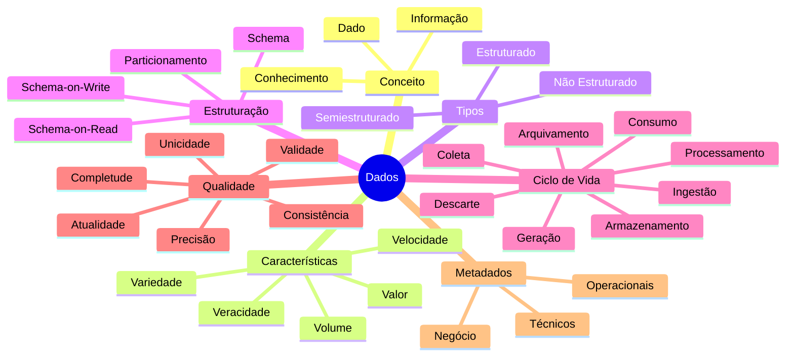
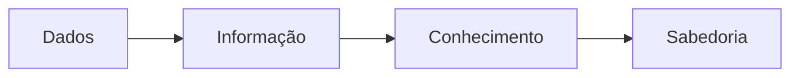
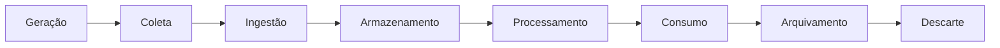
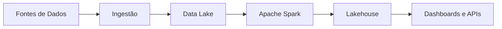

[[100-Volumes/01-Fundamentos/01-Dados/README]] | [[10-Estudo-de-Caso|10 - Estudo de Caso]] | [[12-Perguntas-de-Entrevista|12 - Perguntas de Entrevista]]

---

# Resumo do Módulo — Dados

> [!quote]
> "Uma boa revisão transforma conhecimento recente em conhecimento duradouro."

---

## Objetivo

Este capítulo reúne os principais conceitos estudados no módulo **Dados**, servindo como material de revisão rápida antes de seguir para os próximos módulos da Academia.

Ao final desta revisão você deverá ser capaz de explicar os principais conceitos sem consultar os capítulos anteriores.

---

## Mapa Mental do Módulo

---

## O que são Dados?

Dados são registros de fatos, eventos ou características que representam elementos da realidade.

Sozinhos, possuem pouco significado.

Quando contextualizados, tornam-se informação.

Quando interpretados, geram conhecimento.

---

## Dados × Informação × Conhecimento

---

## Os 5 Vs do Big Data

Os cinco Vs representam características fundamentais dos dados modernos.

| V | Significado |
|---|-------------|
| Volume | Quantidade de dados |
| Velocidade | Frequência de geração |
| Variedade | Diversidade de formatos |
| Veracidade | Confiabilidade |
| Valor | Utilidade para o negócio |

---

## Classificação dos Dados

| Tipo | Exemplos |
|-------|----------|
| Estruturados | Bancos relacionais |
| Semiestruturados | JSON, XML |
| Não Estruturados | Imagens, vídeos, PDFs |

---

## Estruturação dos Dados

Uma boa estrutura influencia diretamente:

- desempenho;
- escalabilidade;
- governança;
- manutenção;
- qualidade.

Principais conceitos:

- Schema
- Schema-on-Write
- Schema-on-Read
- Particionamento

---

## Ciclo de Vida dos Dados

Cada etapa possui desafios próprios e exige tecnologias específicas.

---

## Qualidade dos Dados

As principais dimensões estudadas foram:

| Dimensão | Pergunta |
|-----------|-----------|
| Precisão | Está correto? |
| Completude | Está completo? |
| Consistência | Está coerente? |
| Atualidade | Está atualizado? |
| Unicidade | Existe duplicidade? |
| Validade | Respeita as regras? |

---

## Metadados

Metadados descrevem os dados.

Eles informam, por exemplo:

- origem;
- responsável;
- formato;
- frequência de atualização;
- regras de negócio;
- sensibilidade;
- linhagem.

São fundamentais para governança e descoberta de dados.

---

## A Plataforma da DataRetail

Durante este módulo iniciamos a construção da arquitetura da DataRetail S.A.

Nos próximos volumes essa arquitetura será construída passo a passo.

---

## Conceitos que você deve dominar

Antes de avançar, confirme que consegue explicar:

- O que são dados?
- Qual a diferença entre dado e informação?
- Quais são os 5 Vs do Big Data?
- O que diferencia dados estruturados e não estruturados?
- O que é Schema?
- O que é Schema-on-Read?
- O que é Schema-on-Write?
- Como funciona o ciclo de vida dos dados?
- O que caracteriza dados de qualidade?
- O que são metadados?

Se alguma resposta ainda gerar dúvidas, revise o capítulo correspondente.

---

## Relação com os próximos volumes

Os conceitos aprendidos neste módulo serão utilizados continuamente.

| Volume | Aplicação |
|---------|-----------|
| Linux | Armazenamento e arquivos |
| Git e GitHub | Versionamento de pipelines |
| SQL | Manipulação de dados estruturados |
| Modelagem | Organização lógica dos dados |
| Python | Processamento de dados |
| Apache Spark | Processamento distribuído |
| PostgreSQL | Persistência relacional |
| Lakehouse | Dados analíticos modernos |
| Trino | Consulta distribuída |
| Airflow | Orquestração de pipelines |

---

## Checklist de Aprendizagem

Marque os itens quando se sentir confortável.

- [ ] Sei definir o que são dados.
- [ ] Diferencio dados, informação e conhecimento.
- [ ] Conheço os 5 Vs do Big Data.
- [ ] Sei classificar diferentes tipos de dados.
- [ ] Entendo o conceito de Schema.
- [ ] Compreendo o ciclo de vida dos dados.
- [ ] Conheço as principais dimensões da qualidade.
- [ ] Sei explicar o papel dos metadados.
- [ ] Consigo relacionar esses conceitos com uma plataforma de Engenharia de Dados.

---

## Veja Também

### Próximo capítulo

➡️ [[12-Perguntas-de-Entrevista|12 - Perguntas de Entrevista]]

### Revisar

- [[03-O-que-sao-Dados|03 - O que são Dados]]
- [[04-Caracteristicas-dos-Dados|04 - Características dos Dados]]
- [[05-Tipos-de-Dados|05 - Tipos de Dados]]
- [[06-Estruturacao-dos-Dados|06 - Estruturação dos Dados]]
- [[07-Ciclo-de-Vida-dos-Dados|07 - Ciclo de Vida dos Dados]]
- [[08-Qualidade-dos-Dados|08 - Qualidade dos Dados]]
- [[09-Metadados|09 - Metadados]]

---

> [!success]
> Se você consegue explicar os conceitos apresentados neste resumo sem consultar o material, possui uma base sólida para avançar para os próximos módulos da Academia.
