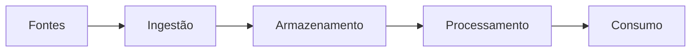

[[100-Volumes/01-Fundamentos/01-Dados/README]] | [[13 - Exercícios]]

---

# Laboratório 01 — Conhecendo os Dados da DataRetail S.A.

> [!quote]
> "Antes de construir uma plataforma de dados, é preciso conhecer profundamente os dados que ela irá armazenar."

---

# Objetivo

Neste laboratório você assumirá o papel de um Engenheiro de Dados recém-integrado à equipe da **DataRetail S.A.**

Sua missão será analisar o ambiente atual da empresa, identificar as fontes de dados, avaliar problemas de qualidade e propor uma arquitetura inicial de alto nível.

Neste laboratório **não haverá programação**.

O foco será desenvolver o raciocínio analítico e arquitetural.

---

# Cenário

A DataRetail S.A. cresceu rapidamente.

Hoje possui:

- 350 lojas físicas;
- e-commerce;
- aplicativo móvel;
- marketplace;
- programa de fidelidade;
- centro de distribuição.

Cada área implantou seu próprio sistema ao longo dos anos.

Como consequência, os dados encontram-se distribuídos em diferentes plataformas.

---

# Situação Atual

Os sistemas existentes são:

| Sistema | Responsável | Tecnologia |
|----------|-------------|------------|
| ERP | Financeiro | PostgreSQL |
| CRM | Comercial | SQL Server |
| Marketplace | Digital | API REST + JSON |
| Aplicativo | Mobile | Eventos JSON |
| PDV | Operações | Oracle |
| Logística | Distribuição | CSV |

---

# Missão

Você foi contratado para iniciar a construção da plataforma de Engenharia de Dados.

Antes de propor qualquer solução, precisa compreender o ambiente.

---

# Atividade 1 — Inventário das Fontes

Preencha a tabela abaixo.

| Fonte | Dados Produzidos | Frequência | Volume | Sensibilidade |
|--------|------------------|------------|---------|---------------|
| ERP | | | | |
| CRM | | | | |
| Marketplace | | | | |
| Aplicativo | | | | |
| PDV | | | | |
| Logística | | | | |

---

# Atividade 2 — Classificação dos Dados

Classifique cada fonte.

| Fonte | Estruturado | Semiestruturado | Não Estruturado |
|--------|:-----------:|:---------------:|:---------------:|
| ERP | | | |
| CRM | | | |
| Marketplace | | | |
| Aplicativo | | | |
| PDV | | | |
| Logística | | | |

---

# Atividade 3 — Características

Para cada fonte responda.

- Qual o volume estimado?
- A velocidade de geração é alta?
- Existe variedade?
- Há risco de baixa qualidade?
- O dado possui valor analítico?

---

# Atividade 4 — Ciclo de Vida

Escolha o processo de **venda online**.

Descreva seu ciclo de vida.

Exemplo.

```text
Cliente realiza compra

↓

ERP registra pedido

↓

Pipeline captura dados

↓

Data Lake

↓

Transformação

↓

Dashboard Executivo
```

Descreva cada etapa utilizando suas próprias palavras.

---

# Atividade 5 — Problemas de Qualidade

Considere o seguinte conjunto de registros.

| CPF | Nome | Cidade | Email |
|------|------|---------|--------|
|12345678901|João Silva|São Paulo|joao@email.com|
|12345678901|João da Silva|São Paulo|joao@email|
||Maria|Rio de Janeiro|maria@email.com|
|99999999999|Carlos|||

Identifique:

- duplicidades;
- campos ausentes;
- valores inválidos;
- inconsistências.

Quais regras de qualidade você implementaria?

---

# Atividade 6 — Metadados

Projete os metadados da tabela **clientes**.

Complete.

| Campo | Valor |
|--------|-------|
| Origem | |
| Responsável | |
| Frequência | |
| Sensibilidade | |
| Tempo de Retenção | |
| Descrição | |

---

# Atividade 7 — Arquitetura Inicial

Sem utilizar nomes de ferramentas específicas, desenhe uma arquitetura contendo:

- fontes;
- ingestão;
- armazenamento;
- processamento;
- consumo.

Utilize Mermaid.

Exemplo de estrutura.



Personalize o diagrama conforme sua proposta.

---

# Atividade 8 — Decisão Arquitetural

Explique.

## Pergunta 1

Por que nem todos os dados devem permanecer em bancos relacionais?

---

## Pergunta 2

Por que conhecer os dados é mais importante do que escolher uma tecnologia?

---

## Pergunta 3

Quais riscos você identificou na situação atual da DataRetail?

---

# Entrega

Produza um documento contendo:

- inventário das fontes;
- classificação dos dados;
- análise das características;
- avaliação da qualidade;
- proposta inicial de arquitetura;
- justificativas das decisões tomadas.

---

# Critérios de Avaliação

| Critério | Peso |
|-----------|-----:|
| Identificação das fontes | 15% |
| Classificação correta | 15% |
| Análise das características | 20% |
| Qualidade dos dados | 20% |
| Arquitetura proposta | 20% |
| Justificativas | 10% |

---

# Desafio Extra ⭐

A diretoria informa que a empresa pretende dobrar de tamanho nos próximos três anos.

Responda.

- Sua arquitetura continua adequada?
- Quais componentes precisariam evoluir?
- Quais novos desafios surgiriam?

---

# Conclusão

Ao finalizar este laboratório você terá realizado a primeira atividade típica de um Engenheiro de Dados: compreender um ambiente antes de propor qualquer solução tecnológica.

Essa habilidade será utilizada repetidamente ao longo de toda a Academia.

---

# Veja Também

- [[10 - Estudo de Caso]]
- [[11 - Resumo]]
- [[12 - Perguntas de Entrevista]]
- [[13 - Exercícios]]
- [[030-Projetos/DataRetail Platform/README]]

---

> [!success]
> **Parabéns!** Você concluiu o **Módulo 01 — Dados**. Agora possui uma base sólida sobre conceitos fundamentais, tipos de dados, estruturação, ciclo de vida, qualidade e metadados. Esses conhecimentos servirão de alicerce para todos os próximos volumes da Academia de Engenharia de Dados.