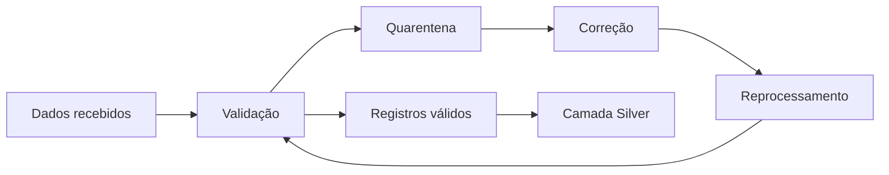
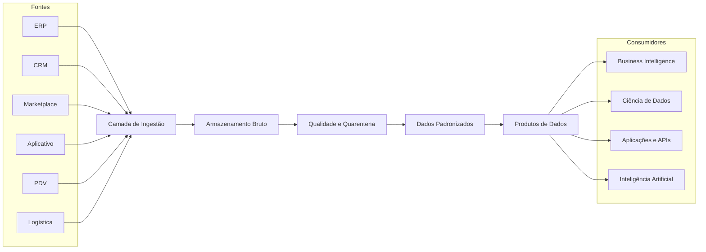

[[14 - Laboratório]] | [[13 - Exercícios]] | [[13 - Gabarito]]

---

# Solução do Laboratório 01 — Conhecendo os Dados da DataRetail S.A.

> [!info]
> Esta é uma solução de referência.
>
> Outras respostas podem estar corretas quando forem coerentes com o cenário, tecnicamente justificadas e alinhadas aos requisitos do negócio.

---

# Objetivo da Solução

Esta nota apresenta uma possível resolução para o primeiro laboratório da Academia.

A solução demonstra como um Engenheiro de Dados pode:

- inventariar fontes;
- classificar dados;
- avaliar características;
- identificar problemas de qualidade;
- documentar metadados;
- propor uma arquitetura inicial;
- justificar decisões técnicas.

---

# 1. Inventário das Fontes

Uma possível versão do inventário é apresentada abaixo.

| Fonte | Dados produzidos | Frequência | Volume estimado | Sensibilidade |
|---|---|---|---:|---|
| ERP | Pedidos, pagamentos, estoque e faturamento | Contínua e cargas diárias | Alto | Alta |
| CRM | Clientes, contatos, campanhas e histórico comercial | Horária | Médio | Muito alta |
| Marketplace | Pedidos, parceiros, produtos e comissões | Próximo do tempo real | Alto | Alta |
| Aplicativo | Cliques, sessões, buscas, carrinhos e compras | Contínua | Muito alto | Alta |
| PDV | Vendas, itens, descontos e pagamentos | Contínua | Muito alto | Alta |
| Logística | Entregas, rotas, ocorrências e comprovantes | Diária e por evento | Alto | Alta |

## Análise

O inventário mostra que a DataRetail possui fontes com características diferentes.

Algumas são predominantemente transacionais, como ERP e PDV.

Outras produzem eventos em alta frequência, como o aplicativo.

A sensibilidade também varia. Informações de clientes, pagamentos e endereços exigem controles de acesso mais rigorosos.

---

# 2. Classificação dos Dados

| Fonte | Estruturado | Semiestruturado | Não estruturado |
|---|:---:|:---:|:---:|
| ERP | ✅ |  |  |
| CRM | ✅ |  |  |
| Marketplace |  | ✅ |  |
| Aplicativo |  | ✅ |  |
| PDV | ✅ |  |  |
| Logística | ✅ | ✅ | ✅ |

## Justificativa

O ERP, o CRM e o PDV normalmente armazenam informações em tabelas relacionais.

O Marketplace e o aplicativo trocam dados frequentemente por APIs e eventos JSON.

A Logística pode combinar:

- tabelas estruturadas;
- arquivos CSV ou JSON;
- fotos de comprovantes;
- documentos;
- coordenadas geográficas.

> [!important]
> Uma fonte não precisa pertencer a apenas uma classificação. Sistemas reais frequentemente produzem mais de um tipo de dado.

---

# 3. Análise das Características

## ERP

- **Volume:** alto;
- **Velocidade:** média;
- **Variedade:** baixa;
- **Veracidade:** geralmente alta, mas sujeita a regras incorretas;
- **Valor:** muito alto;
- **Sensibilidade:** financeira e operacional.

## CRM

- **Volume:** médio;
- **Velocidade:** média;
- **Variedade:** média;
- **Veracidade:** pode sofrer com cadastros duplicados;
- **Valor:** alto;
- **Sensibilidade:** dados pessoais protegidos pela LGPD.

## Marketplace

- **Volume:** alto;
- **Velocidade:** alta;
- **Variedade:** alta;
- **Veracidade:** depende da qualidade dos parceiros;
- **Valor:** alto;
- **Sensibilidade:** comercial e financeira.

## Aplicativo

- **Volume:** muito alto;
- **Velocidade:** muito alta;
- **Variedade:** alta;
- **Veracidade:** exige validação de eventos e versões do aplicativo;
- **Valor:** muito alto para comportamento e personalização;
- **Sensibilidade:** pode conter localização e comportamento do usuário.

## PDV

- **Volume:** muito alto;
- **Velocidade:** alta;
- **Variedade:** baixa;
- **Veracidade:** alta, mas sujeita a duplicidade ou falhas de sincronização;
- **Valor:** crítico para o negócio;
- **Sensibilidade:** financeira.

## Logística

- **Volume:** alto;
- **Velocidade:** média a alta;
- **Variedade:** alta;
- **Veracidade:** pode sofrer com eventos ausentes ou atrasados;
- **Valor:** alto;
- **Sensibilidade:** endereços, localização e dados operacionais.

---

# 4. Ciclo de Vida de uma Venda Online

Uma possível representação é:

```mermaid
flowchart LR
    CLIENTE["Cliente realiza a compra"]
    ECOMMERCE["E-commerce registra o pedido"]
    PAGAMENTO["Pagamento é autorizado"]
    ERP["ERP registra a operação"]
    INGESTAO["Pipeline captura os dados"]
    BRONZE["Camada Bronze"]
    SILVER["Camada Silver"]
    GOLD["Camada Gold"]
    CONSUMO["Dashboards, análises e aplicações"]
    ARQUIVO["Arquivamento"]
    DESCARTE["Descarte ou anonimização"]

    CLIENTE --> ECOMMERCE
    ECOMMERCE --> PAGAMENTO
    PAGAMENTO --> ERP
    ERP --> INGESTAO
    INGESTAO --> BRONZE
    BRONZE --> SILVER
    SILVER --> GOLD
    GOLD --> CONSUMO
    CONSUMO --> ARQUIVO
    ARQUIVO --> DESCARTE
```



## Descrição das etapas

### Geração

O cliente realiza uma compra e produz um novo evento de negócio.

### Registro operacional

O e-commerce e o ERP registram pedido, itens, pagamento e cliente.

### Ingestão

Um pipeline transfere os registros para a plataforma analítica.

### Armazenamento bruto

Os dados são preservados na camada Bronze, próximos do formato original.

### Padronização

Na camada Silver são aplicadas regras de:

- tipagem;
- deduplicação;
- padronização;
- validação;
- integração.

### Disponibilização

Na camada Gold são produzidos indicadores e produtos de dados.

### Consumo

Os dados podem alimentar:

- dashboards;
- relatórios;
- APIs;
- modelos analíticos;
- campanhas.

### Arquivamento e descarte

Após o período de uso frequente, os dados podem ser arquivados e, posteriormente, excluídos ou anonimizados conforme as políticas de retenção.

---

# 5. Problemas de Qualidade

Conjunto analisado:

| CPF | Nome | Cidade | Email |
|---|---|---|---|
| 12345678901 | João Silva | São Paulo | joao@email.com |
| 12345678901 | João da Silva | São Paulo | joao@email |
|  | Maria | Rio de Janeiro | maria@email.com |
| 99999999999 | Carlos |  |  |

## Problemas encontrados

### Duplicidade

O CPF `12345678901` aparece em dois registros.

### Inconsistência

O mesmo cliente possui dois nomes:

- João Silva;
- João da Silva.

### E-mail inválido

O valor `joao@email` não possui formato completo.

### CPF ausente

O registro de Maria não possui CPF.

### Cidade ausente

O registro de Carlos não possui cidade.

### E-mail ausente

O registro de Carlos não possui e-mail.

### CPF possivelmente inválido

O CPF `99999999999` deve ser submetido à validação de dígitos verificadores.

---

# Regras de Qualidade Propostas

| Regra | Dimensão |
|---|---|
| CPF deve estar preenchido quando obrigatório | Completude |
| CPF deve possuir 11 dígitos | Validade |
| CPF deve passar pela validação dos dígitos verificadores | Validade |
| CPF não deve aparecer mais de uma vez no cadastro mestre | Unicidade |
| E-mail deve seguir formato válido | Validade |
| Nome deve ser padronizado | Consistência |
| Cidade deve utilizar nomenclatura oficial | Consistência |
| Campos obrigatórios não podem ser nulos | Completude |
| Registros rejeitados devem ser rastreáveis | Auditabilidade |

---

# Tratamento Proposto



Registros válidos seguem para processamento.

Registros inválidos são direcionados para uma área de quarentena, mantendo:

- motivo da rejeição;
- data;
- origem;
- identificador do pipeline;
- conteúdo original;
- status de correção.

---

# 6. Metadados da Tabela `clientes`

| Campo | Valor de referência |
|---|---|
| Nome | clientes |
| Descrição | Cadastro consolidado de clientes da DataRetail S.A. |
| Origem | CRM, ERP, e-commerce, aplicativo e PDV |
| Responsável técnico | Equipe de Engenharia de Dados |
| Data Owner | Diretoria Comercial |
| Data Steward | Equipe de Governança de Dados |
| Frequência | Horária |
| Sensibilidade | Dados pessoais — LGPD |
| Classificação | Confidencial |
| Chave de negócio | CPF |
| Retenção | Conforme política corporativa e requisitos legais |
| Atualização | Incremental |
| Formato | Tabela analítica |
| Camada | Silver |
| Consumidores | Marketing, BI, CRM, Ciência de Dados |
| SLA | Atualização concluída até 15 minutos após a origem |
| Regras de qualidade | CPF válido, unicidade, campos obrigatórios e e-mail válido |

## Metadados das colunas

| Coluna | Tipo | Obrigatória | Sensibilidade | Descrição |
|---|---|:---:|---|---|
| cliente_id | BIGINT | ✅ | Interna | Identificador técnico |
| cpf | VARCHAR(11) | ✅ | Confidencial | Documento do cliente |
| nome | VARCHAR(150) | ✅ | Confidencial | Nome completo |
| email | VARCHAR(254) |  | Confidencial | E-mail principal |
| cidade | VARCHAR(100) |  | Pessoal | Município de residência |
| data_cadastro | TIMESTAMP | ✅ | Interna | Data de inclusão |
| data_atualizacao | TIMESTAMP | ✅ | Interna | Última alteração |
| origem | VARCHAR(50) | ✅ | Interna | Sistema de origem |

---

# 7. Arquitetura Inicial

Uma proposta de alto nível:



## Componentes da arquitetura

### Fontes

Sistemas que produzem os dados.

### Ingestão

Responsável por capturar e transportar os dados para a plataforma.

### Camada Bronze

Preserva os dados de origem, permitindo auditoria e reprocessamento.

### Qualidade e Quarentena

Separa dados válidos de registros que precisam ser corrigidos.

### Camada Silver

Mantém dados:

- limpos;
- padronizados;
- integrados;
- deduplicados.

### Camada Gold

Disponibiliza produtos de dados orientados a casos de uso.

### Consumo

Atende diferentes perfis e necessidades.

---

# 8. Respostas às Decisões Arquiteturais

## Por que nem todos os dados devem permanecer em bancos relacionais?

Bancos relacionais são adequados para dados estruturados e transacionais, mas podem não ser a melhor opção para:

- imagens;
- vídeos;
- logs;
- grandes volumes de eventos;
- documentos;
- arquivos históricos extensos.

Outras formas de armazenamento oferecem:

- menor custo;
- maior escalabilidade;
- melhor integração com processamento distribuído;
- maior flexibilidade de formatos.

A decisão deve considerar o caso de uso.

---

## Por que conhecer os dados é mais importante do que escolher uma tecnologia?

Uma ferramenta pode ser tecnicamente avançada e ainda assim inadequada ao problema.

Antes de escolher uma tecnologia, é necessário conhecer:

- volume;
- velocidade;
- variedade;
- criticidade;
- requisitos de latência;
- segurança;
- retenção;
- consumidores;
- qualidade esperada.

A arquitetura deve resultar dos requisitos, e não da preferência por uma ferramenta.

---

## Quais riscos existem na situação atual?

Os principais riscos são:

- duplicidade de clientes;
- divergência entre sistemas;
- baixa rastreabilidade;
- ausência de catálogo;
- exposição indevida de dados pessoais;
- cargas manuais;
- dependência de conhecimento informal;
- relatórios contraditórios;
- falta de monitoramento;
- ausência de política de retenção;
- crescimento de custos;
- dificuldade de reprocessamento.

---

# 9. Documento de Entrega

Uma entrega adequada pode conter a seguinte estrutura:

```text
1. Contexto
2. Objetivos
3. Inventário das fontes
4. Classificação dos dados
5. Características dos dados
6. Problemas de qualidade
7. Metadados
8. Ciclo de vida
9. Arquitetura proposta
10. Riscos
11. Recomendações
12. Próximos passos
```

---

# 10. Critérios de Avaliação Aplicados

| Critério | Evidência esperada |
|---|---|
| Identificação das fontes | Todas as fontes relevantes catalogadas |
| Classificação | Tipos de dados corretamente identificados |
| Características | Volume, velocidade, variedade e sensibilidade avaliados |
| Qualidade | Problemas e regras documentados |
| Arquitetura | Fluxo coerente entre fontes e consumo |
| Justificativas | Decisões fundamentadas nos requisitos |

---

# 11. Desafio Extra — Crescimento da Empresa

A arquitetura proposta pode continuar válida conceitualmente, mas precisará evoluir.

## Componentes que podem precisar de evolução

- ingestão paralela;
- processamento distribuído;
- particionamento;
- armazenamento escalável;
- observabilidade;
- catálogo;
- governança;
- automação;
- gestão de custos.

## Novos desafios

- aumento do volume;
- maior concorrência;
- baixa latência;
- crescimento do número de consumidores;
- aumento do número de pipelines;
- segurança;
- conformidade;
- recuperação após falhas;
- qualidade em escala.

## Recomendações

1. Automatizar ingestões.
2. Definir contratos de dados.
3. Implantar catálogo e linhagem.
4. Estabelecer métricas de qualidade.
5. Separar armazenamento e processamento quando adequado.
6. Projetar para crescimento incremental.
7. Implementar observabilidade desde o início.
8. Documentar decisões arquiteturais.

---

# Lições da Solução

Este laboratório demonstra que um projeto de Engenharia de Dados deve começar pelo entendimento do ambiente.

Antes da implementação, é necessário:

- mapear fontes;
- classificar dados;
- avaliar qualidade;
- identificar responsáveis;
- documentar metadados;
- conhecer o ciclo de vida;
- definir uma arquitetura inicial.

> [!important]
> A primeira entrega de um Engenheiro de Dados nem sempre é um pipeline. Em muitos projetos, a primeira entrega de valor é um diagnóstico confiável do ambiente de dados.

---

# Checklist da Solução

- [x] Fontes inventariadas
- [x] Dados classificados
- [x] Características analisadas
- [x] Ciclo de vida documentado
- [x] Problemas de qualidade identificados
- [x] Regras de qualidade propostas
- [x] Metadados definidos
- [x] Arquitetura inicial desenhada
- [x] Riscos documentados
- [x] Crescimento futuro considerado

---

# Próximos Passos no Projeto Integrador

A solução deve ser incorporada à documentação da [[030-Projetos/DataRetail Platform/README|DataRetail Platform]].

Os próximos volumes transformarão esta arquitetura conceitual em uma implementação real, incluindo:

- ambiente Linux;
- versionamento com Git;
- consultas SQL;
- modelagem;
- automações em Python;
- processamento com Spark;
- armazenamento relacional;
- Lakehouse;
- consultas distribuídas;
- orquestração;
- qualidade;
- observabilidade.

---

# Veja Também

- [[14 - Laboratório]]
- [[13 - Exercícios]]
- [[13 - Gabarito]]
- [[10 - Estudo de Caso]]
- [[11 - Resumo]]
- [[030-Projetos/DataRetail Platform/README]]

---

> [!success]
> Esta solução encerra o primeiro laboratório da Academia. O objetivo não foi encontrar uma única arquitetura correta, mas demonstrar um processo estruturado de análise, classificação e tomada de decisão antes da implementação.