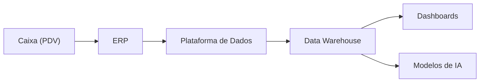

# 02 — Introdução

> [!abstract]
> Dados são um dos ativos mais valiosos de uma organização moderna. Entretanto, seu valor não está apenas em sua existência, mas na forma como são coletados, armazenados, processados, utilizados e protegidos ao longo do tempo. Essa jornada é conhecida como **Ciclo de Vida dos Dados**.

---

## Muito além dos bancos de dados

Quando pensamos em Engenharia de Dados, é comum imaginar bancos de dados, consultas SQL, pipelines de ETL ou grandes plataformas analíticas.

Embora todos esses elementos façam parte da área, eles representam apenas uma parcela de um processo muito maior.

Os dados possuem uma trajetória completa dentro das organizações.

Eles nascem.

São capturados.

São transportados.

São armazenados.

São transformados.

São utilizados para apoiar decisões.

Podem ser reutilizados inúmeras vezes.

Em determinado momento deixam de ter utilidade operacional.

Por fim, precisam ser arquivados ou descartados de maneira segura.

Toda essa jornada constitui o **Ciclo de Vida dos Dados**.

---

## Dados estão sempre em movimento

Uma das características mais importantes dos dados é que eles raramente permanecem estáticos.

Mesmo quando armazenados em um banco de dados, continuam fazendo parte de processos como:

- integrações entre sistemas;
- atualizações cadastrais;
- consolidação de informações;
- geração de relatórios;
- análises estatísticas;
- treinamento de modelos de Machine Learning;
- auditorias;
- backup;
- recuperação de desastres;
- arquivamento.

Em outras palavras, os dados estão constantemente sendo movimentados entre diferentes aplicações e plataformas.

A Engenharia de Dados é responsável por garantir que essa movimentação ocorra de forma eficiente, segura e confiável.

---

## O dado como ativo organizacional

Nas últimas décadas, as organizações passaram a tratar os dados como um ativo estratégico.

Assim como equipamentos, imóveis ou propriedade intelectual, os dados possuem valor econômico e operacional.

No entanto, diferentemente de outros ativos, eles apresentam características particulares.

> [!tip]
> Um dado pode ser copiado sem deixar de existir. Pode ser utilizado simultaneamente por diferentes pessoas, enriquecido continuamente e combinado com outras fontes para gerar novos conhecimentos.

Essa característica torna sua administração mais complexa e exige processos bem definidos durante toda a sua existência.

---

## Por que estudar o ciclo de vida?

Imagine um cliente realizando uma compra em um comércio eletrônico.

Em poucos segundos, diversas informações são produzidas:

- identificação do cliente;
- produtos adquiridos;
- forma de pagamento;
- endereço de entrega;
- horário da compra;
- dispositivo utilizado;
- localização geográfica;
- confirmação financeira.

Nenhuma dessas informações permanece apenas no sistema onde foi criada.

Elas percorrem diversos sistemas até chegar aos consumidores finais.

Durante essa jornada podem ser:

- validadas;
- enriquecidas;
- consolidadas;
- agregadas;
- transformadas;
- analisadas;
- compartilhadas;
- armazenadas para consultas futuras.

Cada etapa adiciona valor aos dados e permite que a empresa tome decisões mais rápidas e mais precisas.

---

## Uma visão sistêmica

O principal objetivo deste módulo é desenvolver uma visão sistêmica sobre os dados.

Em vez de analisar tecnologias isoladamente, aprenderemos a enxergar todo o fluxo de informações dentro da organização.

Essa perspectiva permite responder perguntas como:

- Onde os dados são produzidos?
- Quem é responsável por eles?
- Como chegam até a plataforma analítica?
- Onde ficam armazenados?
- Quem pode acessá-los?
- Como sua qualidade é garantida?
- Quando deixam de ser úteis?
- Como devem ser descartados?

Essas perguntas estarão presentes em praticamente todos os projetos de Engenharia de Dados.

---

## O papel da Engenharia de Dados

A Engenharia de Dados atua como a disciplina responsável por construir e manter toda a infraestrutura necessária para que os dados percorram seu ciclo de vida com segurança, desempenho e confiabilidade.

Isso envolve atividades como:

- integração entre sistemas;
- construção de pipelines;
- armazenamento em diferentes plataformas;
- processamento em lote e em tempo real;
- garantia de qualidade;
- monitoramento;
- governança;
- segurança;
- observabilidade.

Embora cada organização utilize tecnologias diferentes, os princípios permanecem praticamente os mesmos.

---

## O Ciclo de Vida dos Dados

De forma simplificada, podemos representar o ciclo de vida da seguinte maneira.

Cada uma dessas etapas possui objetivos, responsabilidades e tecnologias próprias.

Ao longo dos próximos capítulos estudaremos detalhadamente cada uma delas.

---

## Um exemplo prático

Considere uma rede de supermercados.

Sempre que um cliente passa um produto no caixa, um novo conjunto de dados é criado.

Essas informações seguem uma jornada semelhante à apresentada abaixo.

Embora simplificado, esse fluxo demonstra que os dados percorrem diversos ambientes antes de gerar valor para o negócio.

É justamente essa jornada que será estudada neste módulo.

---

## O que veremos a seguir

Nos próximos capítulos analisaremos cada etapa do ciclo de vida dos dados em detalhes.

Começaremos entendendo o conceito formal de **Ciclo de Vida dos Dados**, sua origem, seus objetivos e por que ele se tornou um dos pilares da Engenharia de Dados moderna.

> [!success]
> Ao concluir este módulo, você será capaz de observar qualquer arquitetura de dados e identificar exatamente em qual etapa do ciclo de vida cada componente está atuando.

---

## Próximo Capítulo

➡️ [[03-O-que-e-o-Ciclo-de-Vida-dos-Dados]]
