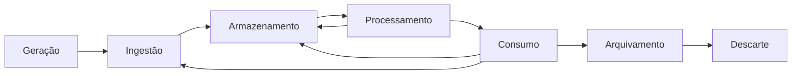
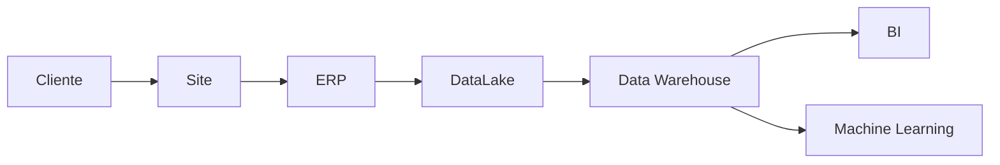

# 03 — O que é o Ciclo de Vida dos Dados

> [!abstract]
> O Ciclo de Vida dos Dados descreve todas as etapas pelas quais um dado passa desde sua criação até seu descarte. Esse conceito fornece uma visão sistêmica sobre a gestão dos dados e constitui um dos pilares da Engenharia de Dados moderna.

---

# Introdução

Toda organização produz dados continuamente.

Uma venda realizada em um supermercado, uma transferência bancária, um acesso a um site, um sensor IoT registrando temperatura ou um usuário clicando em um botão são exemplos de eventos que geram novos dados.

Entretanto, a geração dessas informações representa apenas o início de uma longa jornada.

Depois de criados, os dados percorrem diversos sistemas, sofrem transformações, são enriquecidos, analisados, compartilhados e armazenados até que, em algum momento, deixem de possuir valor operacional e sejam arquivados ou descartados.

Essa jornada é denominada **Ciclo de Vida dos Dados**.

---

# Definição

Podemos definir o Ciclo de Vida dos Dados como:

> [!definition]
>
> O conjunto de processos, atividades e controles que acompanham os dados desde sua criação até sua eliminação, garantindo que permaneçam íntegros, disponíveis, seguros e úteis durante toda a sua existência.

Essa definição destaca que o ciclo não trata apenas da movimentação dos dados.

Ele também envolve aspectos como:

- qualidade;
- segurança;
- governança;
- conformidade legal;
- disponibilidade;
- rastreabilidade;
- preservação.

---

# Uma analogia simples

Uma maneira intuitiva de compreender esse conceito é compará-lo ao ciclo de vida de um documento físico.

Imagine um contrato empresarial.

Inicialmente ele é criado.

Depois é revisado.

Em seguida é assinado.

Posteriormente é armazenado.

Pode ser consultado inúmeras vezes.

Após o término de sua validade permanece arquivado por determinado período.

Finalmente é descartado conforme as políticas da empresa.

Com os dados ocorre exatamente o mesmo.

A diferença é que praticamente todas essas etapas acontecem de forma automatizada e em enorme escala.

---

# Uma visão contínua

O termo "ciclo" pode sugerir um processo linear.

Na prática, isso raramente acontece.

Os dados frequentemente retornam para etapas anteriores.

Um conjunto de dados pode:

- ser reprocessado;
- receber novos atributos;
- ser combinado com outras fontes;
- originar novos conjuntos de dados;
- alimentar diversos sistemas simultaneamente.

Por esse motivo, muitas arquiteturas modernas representam o ciclo como um fluxo contínuo em vez de uma sequência rígida.

Observe que existem retornos para etapas anteriores, ilustrando que os dados podem ser reutilizados diversas vezes.

---

# Por que esse conceito é importante?

A Engenharia de Dados não consiste apenas em mover informações entre sistemas.

Seu verdadeiro objetivo é garantir que os dados estejam disponíveis para quem precisa deles, quando precisam deles e com a qualidade adequada.

Sem compreender o ciclo de vida, torna-se difícil responder perguntas como:

- Onde determinado dado foi produzido?
- Quem é responsável por ele?
- Qual transformação foi aplicada?
- Quem pode utilizá-lo?
- Quanto tempo deve permanecer armazenado?
- Quando deve ser eliminado?

Essas perguntas aparecem diariamente em projetos corporativos.

---

# Os objetivos do Ciclo de Vida dos Dados

A adoção de um ciclo de vida bem definido permite atingir diversos objetivos.

## Organizar o fluxo dos dados

Cada etapa possui responsabilidades claramente definidas.

Isso reduz ambiguidades e facilita a manutenção das plataformas.

---

## Garantir qualidade

Ao longo do ciclo são executadas validações capazes de identificar:

- dados incompletos;
- inconsistências;
- duplicidades;
- valores inválidos;
- registros corrompidos.

---

## Aumentar a confiabilidade

Quando todas as etapas são monitoradas, torna-se possível confiar nas informações produzidas pela organização.

Essa confiança é essencial para relatórios, indicadores e modelos analíticos.

---

## Facilitar a governança

Cada conjunto de dados passa a possuir:

- proprietário;
- responsáveis técnicos;
- regras de acesso;
- classificação;
- políticas de retenção;
- histórico de alterações.

---

## Atender requisitos legais

Diversas legislações exigem controles sobre todo o ciclo de vida dos dados.

Entre elas podemos citar:

- LGPD;
- GDPR;
- HIPAA;
- PCI DSS;
- SOX.

Independentemente da legislação aplicável, todas exigem algum nível de controle sobre a coleta, armazenamento, uso e descarte das informações.

---

# Características do ciclo

Embora existam diferentes modelos, praticamente todos compartilham algumas características fundamentais.

## É contínuo

Novos dados são produzidos continuamente.

O ciclo nunca termina enquanto a organização estiver em operação.

---

## É iterativo

Os dados podem retornar para etapas anteriores diversas vezes.

Por exemplo:

Um algoritmo de Machine Learning pode gerar novos atributos que serão novamente armazenados para utilização futura.

---

## É escalável

Uma pequena empresa pode processar milhares de registros por dia.

Grandes organizações processam bilhões.

O conceito permanece exatamente o mesmo.

---

## É independente de tecnologia

O ciclo de vida existe independentemente da ferramenta utilizada.

Se a empresa utiliza:

- PostgreSQL;
- Oracle;
- SQL Server;
- Snowflake;
- BigQuery;
- Spark;
- Kafka;
- Airflow;

ou qualquer outra tecnologia, o fluxo conceitual continua sendo praticamente idêntico.

Essa característica torna o conceito extremamente duradouro.

Enquanto tecnologias mudam rapidamente, o ciclo de vida permanece praticamente inalterado.

---

# As principais etapas

Embora existam pequenas variações entre autores, este livro utilizará o modelo apresentado abaixo.

| Etapa | Objetivo |
|--------|----------|
| Geração | Produção dos dados |
| Coleta | Captura das informações |
| Ingestão | Entrada na plataforma de dados |
| Armazenamento | Persistência dos dados |
| Processamento | Transformação e enriquecimento |
| Consumo | Utilização pelos usuários e aplicações |
| Arquivamento | Preservação de longo prazo |
| Descarte | Eliminação segura |

Cada uma dessas etapas será estudada detalhadamente nos próximos capítulos.

---

# O papel da Engenharia de Dados

A Engenharia de Dados atua em praticamente todas as etapas do ciclo.

Suas responsabilidades incluem:

- construir pipelines;
- integrar sistemas;
- armazenar dados;
- garantir desempenho;
- monitorar fluxos;
- automatizar processos;
- controlar qualidade;
- implementar governança;
- garantir rastreabilidade.

Por esse motivo, compreender o ciclo de vida é uma das primeiras competências esperadas de um Engenheiro de Dados.

---

# Exemplo prático

Considere uma compra realizada em uma loja virtual.

O pedido segue uma jornada semelhante à apresentada abaixo.

Cada sistema representa apenas uma etapa da jornada.

O cliente visualiza apenas o início do processo.

O Engenheiro de Dados é responsável por garantir que todo o restante funcione corretamente.

---

# Pontos-chave

> [!success]
> Ao estudar Engenharia de Dados, procure sempre responder:
>
> - Onde este dado nasceu?
> - Como ele chegou aqui?
> - O que aconteceu com ele?
> - Quem o modificou?
> - Quem o utiliza?
> - Quanto tempo deve existir?
> - Quando deve ser eliminado?

Essas perguntas resumem praticamente todo o conceito de Ciclo de Vida dos Dados.

---

# Resumo

Neste capítulo apresentamos o conceito de Ciclo de Vida dos Dados e sua importância para a Engenharia de Dados.

Vimos que os dados percorrem uma jornada composta por diferentes etapas, cada uma com responsabilidades específicas.

Também compreendemos que esse conceito é independente de tecnologias e permanece válido em qualquer arquitetura moderna de dados.

Nos próximos capítulos iniciaremos o estudo detalhado de cada etapa, começando pela geração e pela coleta dos dados.

---

# Próximo Capítulo

➡️ [[04-Geracao-e-Coleta-de-Dados]]
