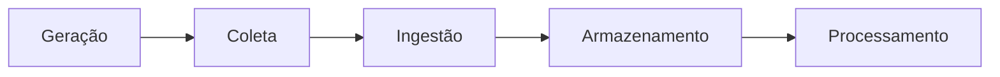
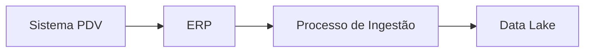

# 05 — Ingestão de Dados

> [!abstract]
> Depois de gerados e coletados, os dados precisam ser transportados até a plataforma onde serão armazenados, transformados e disponibilizados para consumo. Esse processo recebe o nome de **ingestão de dados** e representa uma das principais responsabilidades da Engenharia de Dados.

---

# Introdução

Imagine uma grande empresa de varejo.

Durante apenas um minuto ela pode registrar:

- milhares de compras;
- centenas de pagamentos;
- milhares de acessos ao site;
- atualizações de estoque;
- movimentações financeiras;
- consultas de clientes.

Esses dados são produzidos por sistemas diferentes e permanecem distribuídos em diversos ambientes.

Entretanto, para que possam gerar valor, precisam chegar até a plataforma de dados da organização.

É justamente essa movimentação que caracteriza a ingestão de dados.

---

# O que é ingestão de dados?

> [!definition]
>
> **Ingestão de dados** é o processo responsável por transportar dados de uma ou mais fontes para um ambiente onde poderão ser armazenados, processados e utilizados por aplicações analíticas ou operacionais.

Em outras palavras, a ingestão conecta os sistemas produtores aos sistemas consumidores.

Sem essa etapa, os dados permaneceriam isolados em seus sistemas de origem.

---

# A posição da ingestão no ciclo de vida

A ingestão ocorre logo após a geração e a coleta dos dados.



Embora representada como uma única etapa, a ingestão pode envolver diversos processos intermediários.

---

# Objetivos da ingestão

Uma boa estratégia de ingestão deve permitir que os dados:

- cheguem corretamente ao destino;
- mantenham sua integridade;
- sejam transportados com segurança;
- preservem sua rastreabilidade;
- estejam disponíveis dentro do tempo esperado pelo negócio.

Dependendo do cenário, rapidez pode ser mais importante do que volume.

Em outros casos, a prioridade pode ser confiabilidade ou baixo custo.

---

# Principais origens de dados

A ingestão normalmente ocorre a partir de diferentes fontes.

## Sistemas transacionais

- ERP
- CRM
- Sistemas financeiros
- Sistemas hospitalares
- Sistemas acadêmicos

---

## Bancos de dados

Uma organização pode possuir dezenas ou centenas de bancos de dados diferentes.

Cada um deles pode fornecer informações para análises corporativas.

---

## Arquivos

Também é comum ingerir dados provenientes de:

- CSV;
- TXT;
- JSON;
- XML;
- Parquet;
- Avro;
- ORC.

---

## APIs

Muitas aplicações disponibilizam informações através de interfaces de programação.

Exemplos:

- APIs REST;
- APIs GraphQL;
- Web Services;
- APIs governamentais;
- APIs de parceiros.

---

## Sensores e dispositivos

Equipamentos IoT podem produzir informações continuamente.

Esses dados costumam exigir mecanismos especializados de ingestão devido ao grande volume e velocidade de geração.

---

# Principais destinos

Depois da ingestão, os dados podem ser enviados para diferentes ambientes.

Entre eles:

- Data Lake;
- Data Warehouse;
- Lakehouse;
- bancos relacionais;
- bancos NoSQL;
- sistemas analíticos;
- plataformas de Machine Learning;
- aplicações operacionais.

A escolha depende da arquitetura adotada pela organização.

---

# Modos de ingestão

Existem duas grandes formas de transportar dados.

## Batch

No processamento em lote, os dados são movimentados em intervalos previamente definidos.

Exemplos:

- diariamente;
- a cada hora;
- semanalmente;
- mensalmente.

```text
Sistema Origem

↓

Arquivo

↓

Plataforma de Dados
```

### Vantagens

- simplicidade;
- menor custo;
- facilidade de controle;
- adequado para grandes volumes.

### Limitações

Os dados não ficam imediatamente disponíveis.

Sempre existe algum atraso entre sua geração e seu consumo.

---

## Streaming

Na ingestão contínua, os dados são enviados praticamente no momento em que são produzidos.

```text
Evento

↓

Fila de Eventos

↓

Plataforma de Dados
```

Exemplos de utilização:

- pagamentos;
- monitoramento industrial;
- telemetria;
- IoT;
- fraude bancária;
- rastreamento de veículos.

### Vantagens

- baixa latência;
- atualização quase imediata;
- suporte a aplicações em tempo real.

### Desafios

- maior complexidade;
- monitoramento contínuo;
- necessidade de alta disponibilidade.

---

# ETL e ELT

Durante a ingestão é comum ouvir dois termos bastante conhecidos.

## ETL

**Extract → Transform → Load**

Os dados são transformados antes de serem armazenados.

```text
Origem

↓

Extração

↓

Transformação

↓

Destino
```

---

## ELT

**Extract → Load → Transform**

Primeiro os dados são armazenados.

A transformação ocorre posteriormente.

```text
Origem

↓

Extração

↓

Destino

↓

Transformação
```

> [!note]
> ETL e ELT serão estudados em profundidade no módulo dedicado ao Processamento de Dados. Neste momento, basta compreender que representam diferentes estratégias de movimentação dos dados.

---

# Captura de alterações

Nem sempre é necessário copiar todos os dados novamente.

Em muitos cenários apenas as alterações são transportadas.

Essa estratégia é conhecida como **Captura de Alterações** (*Change Data Capture* — CDC).

Imagine uma tabela com dez milhões de clientes.

Se apenas cem registros foram alterados desde a última execução, normalmente faz mais sentido transportar somente essas alterações do que copiar novamente toda a tabela.

Essa abordagem reduz:

- tempo de processamento;
- consumo de rede;
- utilização de armazenamento;
- custo operacional.

---

# Confiabilidade da ingestão

Uma boa ingestão precisa ser confiável.

Isso significa garantir que:

- nenhum dado seja perdido;
- registros não sejam duplicados;
- erros possam ser identificados;
- falhas possam ser recuperadas;
- todo processamento seja auditável.

Esses requisitos tornam a ingestão muito mais do que uma simples cópia de arquivos.

---

# Boas práticas

Durante o projeto de uma ingestão, recomenda-se:

- documentar todas as fontes;
- registrar horários de processamento;
- preservar identificadores originais;
- manter logs detalhados;
- implementar mecanismos de reprocessamento;
- validar formatos e esquemas;
- monitorar volumes recebidos;
- automatizar sempre que possível.

---

# Erros comuns

> [!failure]
> A ingestão é uma das etapas onde mais ocorrem problemas em plataformas de dados.

Entre os erros mais frequentes destacam-se:

- copiar os mesmos dados diversas vezes;
- perder registros durante falhas;
- ausência de monitoramento;
- depender de processos manuais;
- alterar dados durante a ingestão sem rastreabilidade;
- não registrar a origem dos dados;
- ignorar validações básicas.

Esses problemas costumam gerar impactos em todas as etapas posteriores do ciclo de vida.

---

# Estudo de caso — DataRetail S.A.

Após cada venda realizada nas lojas da DataRetail S.A., os dados precisam ser enviados para a plataforma corporativa.

O fluxo simplificado é o seguinte.



Ao final da ingestão, os dados já estão disponíveis para armazenamento permanente e futuras transformações.

Observe que, nesse momento, os dados ainda não foram necessariamente tratados ou enriquecidos.

O objetivo da ingestão é garantir que eles cheguem corretamente ao ambiente de destino.

---

# Conexão com os próximos capítulos

Depois de ingeridos, os dados precisam ser armazenados de forma organizada, segura e eficiente.

No próximo capítulo estudaremos as principais estratégias de armazenamento e compreenderemos por que essa etapa é essencial para garantir desempenho, escalabilidade e confiabilidade das plataformas de dados.

---

# Resumo

Neste capítulo aprendemos que:

- ingestão é o processo de movimentação dos dados entre sistemas;
- existem diferentes fontes e destinos de dados;
- a ingestão pode ocorrer em lote (*batch*) ou continuamente (*streaming*);
- ETL e ELT representam estratégias distintas de movimentação;
- CDC permite transportar apenas alterações;
- confiabilidade e rastreabilidade são requisitos fundamentais dessa etapa.

Esses conceitos servirão de base para o entendimento das arquiteturas modernas de dados estudadas nos próximos módulos.

---

# Próximo Capítulo

➡️ [[06-Armazenamento-de-Dados]]
