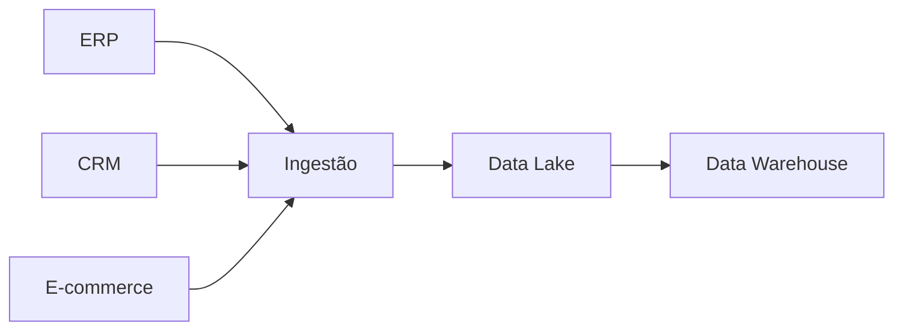

# 06 — Armazenamento de Dados

> [!abstract]
> Após serem gerados e ingeridos, os dados precisam ser armazenados de forma segura, organizada e eficiente. O armazenamento é a etapa responsável por preservar os dados durante seu ciclo de vida, permitindo que possam ser consultados, transformados, compartilhados e reutilizados sempre que necessário.

---

## Introdução

Imagine uma empresa que registra milhões de transações diariamente.

Se essas informações fossem mantidas apenas na memória dos computadores que as processaram, seriam perdidas assim que os equipamentos fossem desligados.

Da mesma forma, se cada sistema armazenasse seus dados de maneira isolada e sem organização, seria praticamente impossível reutilizá-los para análises, auditorias ou tomada de decisão.

O armazenamento resolve esse problema.

Ele garante que os dados permaneçam disponíveis durante o tempo necessário, preservando sua integridade, segurança e capacidade de reutilização.

---

## O que é armazenamento de dados?

> [!definition]
>
> **Armazenamento de dados** é o conjunto de processos, tecnologias e práticas responsáveis por registrar, preservar e disponibilizar dados para utilização futura.

O objetivo do armazenamento não é apenas guardar informações.

Ele deve garantir que os dados possam ser:

- localizados;
- recuperados;
- protegidos;
- compartilhados;
- utilizados com eficiência.

---

## A posição do armazenamento no ciclo de vida

O armazenamento ocorre logo após a ingestão.

Embora representado como uma única etapa, diferentes formas de armazenamento podem coexistir dentro da mesma organização.

---

## Por que armazenar dados?

Existem diversas razões para preservar dados.

Entre as principais estão:

- continuidade das operações;
- suporte às decisões;
- histórico corporativo;
- auditoria;
- atendimento à legislação;
- treinamento de modelos de Inteligência Artificial;
- geração de indicadores;
- recuperação de desastres;
- compartilhamento entre sistemas.

Sem armazenamento adequado, praticamente nenhuma iniciativa de dados seria possível.

---

## Persistência

Uma característica fundamental do armazenamento é a **persistência**.

Persistir significa gravar dados em um meio que continue existindo mesmo após o desligamento dos equipamentos.

> [!important]
>
> Persistência não significa apenas salvar arquivos. Significa garantir que os dados permaneçam disponíveis, íntegros e recuperáveis durante todo o período em que forem necessários.

Essa propriedade diferencia o armazenamento permanente da memória utilizada durante o processamento.

---

## Tipos de armazenamento

As organizações utilizam diferentes formas de armazenar dados.

Cada uma atende necessidades específicas.

### Bancos de Dados Relacionais

Organizam informações em tabelas relacionadas entre si.

Características:

- estrutura rígida;
- consistência elevada;
- linguagem SQL;
- suporte a transações;
- excelente para sistemas operacionais.

Exemplos de utilização:

- sistemas bancários;
- ERPs;
- CRMs;
- sistemas acadêmicos.

---

### Bancos de Dados Não Relacionais

Conhecidos como bancos **NoSQL**, são utilizados quando a flexibilidade ou a escalabilidade são prioridades.

Podem armazenar:

- documentos;
- chave-valor;
- grafos;
- colunas;
- séries temporais.

São amplamente utilizados em aplicações modernas e ambientes distribuídos.

---

### Data Warehouse

O Data Warehouse concentra dados estruturados voltados para análise.

Suas principais características incluem:

- integração de múltiplas fontes;
- dados históricos;
- suporte à inteligência de negócios;
- consultas analíticas;
- consistência elevada.

Seu foco principal é apoiar decisões estratégicas.

---

### Data Lake

O Data Lake armazena grandes volumes de dados em seu formato original.

Pode conter simultaneamente:

- dados estruturados;
- semiestruturados;
- não estruturados.

Seu objetivo é preservar os dados para diferentes usos futuros.

---

### Lakehouse

O Lakehouse procura combinar características dos Data Lakes e dos Data Warehouses.

Essa arquitetura busca reunir:

- flexibilidade;
- escalabilidade;
- governança;
- desempenho analítico;
- confiabilidade.

Nos módulos avançados estudaremos detalhadamente essa arquitetura.

---

## Arquivos também armazenam dados

Nem todo armazenamento ocorre em bancos de dados.

Diversas organizações trabalham diretamente com arquivos.

Exemplos comuns incluem:

- CSV;
- JSON;
- XML;
- Parquet;
- ORC;
- Avro;
- arquivos de log;
- documentos;
- imagens;
- vídeos.

Em plataformas modernas, esses arquivos normalmente ficam armazenados em sistemas distribuídos ou em serviços de armazenamento de objetos.

---

## Organização dos dados

Armazenar dados não significa apenas gravá-los em disco.

Também é necessário organizá-los.

Uma boa organização facilita:

- localização;
- manutenção;
- processamento;
- auditoria;
- governança;
- reutilização.

É por esse motivo que arquiteturas modernas costumam separar os dados em diferentes camadas ou áreas de responsabilidade.

---

## Crescimento contínuo

Uma característica importante do armazenamento é que seu volume tende a crescer continuamente.

Enquanto aplicações tradicionais armazenavam milhares de registros, plataformas atuais frequentemente armazenam:

- bilhões de linhas;
- milhões de arquivos;
- petabytes de informações.

Esse crescimento exige soluções escaláveis e políticas adequadas de gerenciamento.

---

## Segurança durante o armazenamento

Durante toda a permanência dos dados no ambiente corporativo, diversos controles devem ser aplicados.

Entre eles:

- autenticação;
- autorização;
- criptografia;
- controle de acesso;
- auditoria;
- backup;
- recuperação de desastres.

> [!warning]
>
> Um armazenamento eficiente não é apenas rápido. Ele também precisa proteger os dados contra perdas, alterações indevidas e acessos não autorizados.

---

## Boas práticas

Independentemente da tecnologia utilizada, algumas práticas são recomendadas.

- Definir padrões de organização.
- Documentar os conjuntos de dados.
- Manter metadados atualizados.
- Implementar políticas de backup.
- Controlar acessos.
- Monitorar utilização do armazenamento.
- Planejar crescimento futuro.
- Definir políticas de retenção.

Essas práticas aumentam a confiabilidade da plataforma.

---

## Erros comuns

> [!failure]
> Muitos problemas observados em plataformas de dados estão relacionados ao armazenamento inadequado.

Entre os mais frequentes destacam-se:

- armazenar dados sem documentação;
- ausência de políticas de backup;
- crescimento descontrolado;
- duplicação desnecessária;
- falta de organização;
- inexistência de políticas de retenção;
- excesso de permissões de acesso;
- ausência de monitoramento da capacidade.

Esses problemas tendem a aumentar significativamente os custos operacionais e dificultam a governança dos dados.

---

## Estudo de caso — DataRetail S.A.

Após a ingestão dos dados provenientes dos sistemas de vendas, pagamentos e logística, a DataRetail S.A. precisa armazená-los de forma adequada.

Uma visão simplificada dessa arquitetura pode ser representada da seguinte forma.

Nesse cenário:

- o **Data Lake** preserva os dados recebidos de diversas fontes;
- o **Data Warehouse** organiza as informações para análises e indicadores;
- ambos fazem parte da estratégia de armazenamento da empresa.

---

## Conexão com os próximos módulos

O armazenamento é um dos pilares da Engenharia de Dados.

Nos próximos volumes estudaremos detalhadamente:

- modelagem de dados;
- bancos relacionais;
- bancos NoSQL;
- Data Lakes;
- Data Warehouses;
- Lakehouses;
- armazenamento em objetos;
- formatos de arquivo;
- particionamento;
- catalogação;
- tabelas analíticas.

Todo esse conteúdo se apoia nos conceitos apresentados neste capítulo.

---

## Resumo

Neste capítulo aprendemos que:

- armazenamento é responsável pela persistência dos dados;
- diferentes tecnologias atendem diferentes necessidades;
- arquivos também são mecanismos de armazenamento;
- segurança e organização fazem parte do armazenamento;
- escalabilidade é um requisito essencial das plataformas modernas;
- o armazenamento prepara os dados para as etapas seguintes do ciclo de vida.

---

## Próximo Capítulo

➡️ [[07-Processamento-de-Dados]]
