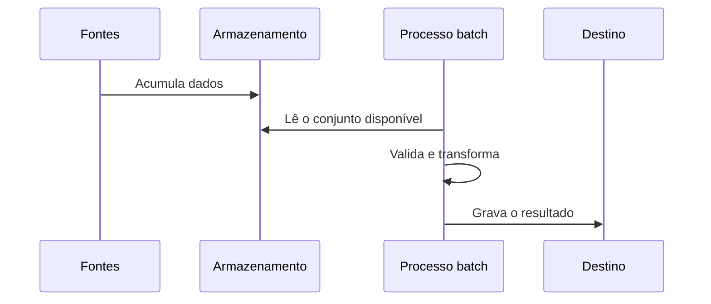
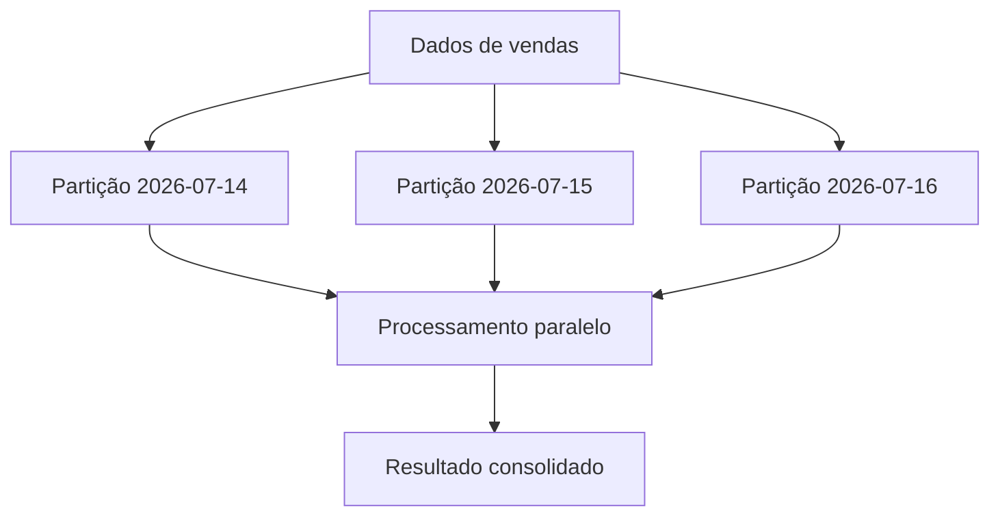
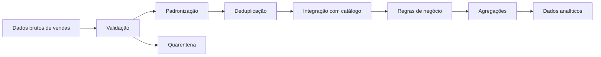

# 07 — Processamento de Dados

> [!abstract]
> Depois de ingeridos e armazenados, os dados precisam ser preparados para cumprir uma finalidade. O processamento transforma registros brutos em informações consistentes, organizadas e adequadas ao consumo por pessoas, aplicações e outros sistemas.

---

## Objetivos

Ao concluir este capítulo, você será capaz de:

- explicar o papel do processamento no ciclo de vida dos dados;
- distinguir processamento batch de processamento streaming;
- compreender as diferenças conceituais entre [[ETL]] e [[ELT]];
- reconhecer transformações comuns em pipelines de dados;
- relacionar qualidade, desempenho, segurança e observabilidade ao processamento;
- identificar propriedades necessárias para reprocessamentos confiáveis;
- analisar uma estratégia de processamento no cenário da DataRetail S.A.

---

## Introdução

Dados armazenados nem sempre estão prontos para utilização.

Uma venda pode chegar com o horário em um fuso diferente, o identificador de uma loja pode estar ausente e o valor monetário pode utilizar uma representação incompatível com o sistema analítico. Mesmo quando cada registro é tecnicamente válido, registros provenientes de fontes diferentes podem seguir regras distintas.

O processamento existe para converter essa matéria-prima em dados úteis.

Ele pode corrigir formatos, aplicar regras de negócio, combinar fontes, calcular métricas, remover duplicidades e organizar os resultados para usos específicos. Essa etapa conecta o armazenamento ao consumo e determina, em grande parte, a confiabilidade das análises produzidas pela organização.

---

## O que é processamento de dados?

> [!definition]
>
> **Processamento de dados** é o conjunto de operações que lê dados de entrada, aplica regras técnicas ou de negócio e produz dados de saída adequados a uma finalidade conhecida.

Todo processamento possui pelo menos três elementos:

1. **entrada**, que representa os dados disponíveis;
2. **transformação**, que representa as operações executadas;
3. **saída**, que representa o resultado produzido.


O resultado pode ser uma nova tabela, um arquivo, um evento, uma métrica, um índice de busca ou uma resposta enviada a outra aplicação.

---

## A posição do processamento no ciclo de vida

Em uma visão simplificada, o processamento ocorre após a ingestão e o armazenamento.


Na prática, essa ordem não é rígida. Algumas validações e transformações podem ocorrer durante a ingestão. Um resultado processado também pode voltar ao armazenamento e servir como entrada para outro pipeline.

> [!important]
>
> O ciclo de vida não deve ser interpretado como uma sequência executada uma única vez. Dados podem ser processados, armazenados e reprocessados diversas vezes enquanto permanecerem úteis para a organização.

---

## Por que os dados precisam ser processados?

Sistemas operacionais são construídos para atender seus próprios processos. Por isso, os dados que produzem refletem necessidades diferentes.

Um sistema de vendas pode registrar o código interno de um produto, enquanto o catálogo utiliza uma chave global. O sistema financeiro pode consolidar valores por dia, enquanto a plataforma de comércio eletrônico registra cada evento individualmente.

O processamento permite:

- padronizar representações;
- corrigir ou separar registros inválidos;
- integrar dados de fontes distintas;
- aplicar regras de negócio;
- enriquecer registros com novas informações;
- calcular indicadores;
- reduzir o volume necessário para determinados usos;
- proteger informações sensíveis;
- preparar estruturas eficientes para consulta.

Sem essas operações, o consumidor precisaria interpretar as particularidades de cada fonte, aumentando a duplicação de lógica e o risco de resultados contraditórios.

---

## Transformações comuns

O tipo de transformação depende do domínio e da finalidade dos dados. Algumas operações aparecem com frequência em plataformas de dados.

### Validação

A validação verifica se um registro atende a regras definidas.

Exemplos:

- identificadores obrigatórios não podem ser nulos;
- quantidades não podem ser negativas em uma venda comum;
- datas devem utilizar formatos reconhecidos;
- códigos de estado devem pertencer a um domínio permitido.

Registros inválidos podem ser rejeitados, direcionados para uma área de quarentena ou aceitos com uma marcação explícita. A decisão deve ser definida de acordo com o impacto de negócio.

### Padronização

A padronização converte representações diferentes para uma convenção comum.

Isso inclui:

- datas e horários;
- unidades de medida;
- moedas;
- capitalização de textos;
- nomes de campos;
- tipos de dados.

### Limpeza

A limpeza trata problemas conhecidos, como espaços indevidos, caracteres inválidos, valores ausentes e registros corrompidos.

Limpar não significa inventar dados. Quando um valor não pode ser determinado com segurança, a ausência deve permanecer explícita ou ser tratada por uma regra de negócio documentada.

### Deduplicação

A deduplicação identifica registros que representam o mesmo fato.

Ela pode utilizar uma chave de negócio, um identificador técnico ou uma combinação de atributos. A regra deve também definir qual versão será preservada quando os registros divergirem.

### Integração

A integração combina dados de fontes diferentes.

Uma venda pode ser enriquecida com informações do produto, da loja e do cliente. Para isso, as fontes precisam compartilhar chaves compatíveis ou regras confiáveis de correspondência.

### Agregação

A agregação resume múltiplos registros em uma visão de maior nível.

O exemplo SQL abaixo calcula o valor vendido por loja em cada dia.

```sql
SELECT
    data_venda,
    loja_id,
    SUM(valor_total) AS receita_bruta
FROM vendas
GROUP BY
    data_venda,
    loja_id;
```

O resultado atende consultas gerenciais com menos detalhes do que a tabela original. Os dados detalhados, entretanto, podem continuar preservados para auditoria e outras análises.

### Enriquecimento

O enriquecimento acrescenta atributos derivados ou provenientes de outras fontes.

Exemplos incluem classificar uma venda por região, calcular a faixa de valor de um pedido ou associar um produto à sua categoria vigente.

### Mascaramento e anonimização

Dados pessoais ou confidenciais podem exigir transformações de proteção antes do consumo.

Dependendo da finalidade, o processamento pode:

- ocultar parte de um valor;
- substituir identificadores por tokens;
- aplicar pseudonimização;
- remover atributos desnecessários;
- produzir informações agregadas.

Essas técnicas não são equivalentes. A escolha deve considerar a finalidade do uso, os riscos de reidentificação e as obrigações aplicáveis.

---

## ETL e ELT

Dois padrões importantes organizam a relação entre transformação e armazenamento.

### ETL

Extract, Transform and Load ([[ETL]]) significa extrair, transformar e carregar.

Nesse modelo, os dados são transformados antes de chegar ao repositório de destino.


O ETL é útil quando o destino deve receber apenas dados previamente conformados ou quando existem restrições rígidas de estrutura e qualidade.

### ELT

Extract, Load and Transform ([[ELT]]) significa extrair, carregar e transformar.

Nesse modelo, os dados são primeiro carregados e depois transformados utilizando a capacidade computacional da plataforma de destino.


O ELT favorece a preservação dos dados recebidos e permite criar diferentes produtos a partir da mesma entrada.

| Aspecto | ETL | ELT |
| --- | --- | --- |
| Momento da transformação | Antes da carga no destino | Depois da carga no destino |
| Dados brutos no destino | Podem não ser preservados | Normalmente são preservados |
| Capacidade de processamento | Camada intermediária | Plataforma de destino |
| Flexibilidade para novos usos | Depende do que foi carregado | Maior quando a origem é preservada |

> [!note]
>
> ETL e ELT não são concorrentes absolutos. Uma arquitetura pode aplicar validações antes da carga e executar transformações analíticas depois dela.

---

## Processamento batch

No processamento **batch**, os dados são agrupados e processados em execuções delimitadas.

Uma execução pode ocorrer a cada hora, ao final do dia ou quando determinado volume estiver disponível.



Características comuns:

- processamento de conjuntos delimitados;
- execução periódica ou sob demanda;
- maior tolerância a atrasos;
- facilidade para recalcular períodos históricos;
- uso eficiente de recursos em grandes volumes.

Fechamentos financeiros, consolidações diárias e recomputação de indicadores históricos são exemplos típicos.

---

## Processamento streaming

No processamento **streaming**, os dados são tratados à medida que eventos chegam, normalmente de forma contínua.

Características comuns:

- baixa latência;
- fluxos potencialmente ilimitados;
- manutenção de estado ao longo do tempo;
- necessidade de lidar com eventos atrasados ou fora de ordem;
- operação contínua.

Casos de uso incluem detecção de fraude, monitoramento de equipamentos, atualização de estoques e personalização de experiências digitais.

> [!warning]
>
> Streaming não significa necessariamente processamento instantâneo. A latência real depende da arquitetura, das garantias exigidas e do tamanho das janelas utilizadas.

---

## Batch e streaming são decisões de requisito

A escolha não deve ser orientada apenas pela disponibilidade de uma tecnologia.

| Critério | Batch | Streaming |
| --- | --- | --- |
| Latência típica | Minutos a horas | Milissegundos a minutos |
| Natureza da entrada | Conjunto delimitado | Fluxo contínuo |
| Complexidade operacional | Geralmente menor | Geralmente maior |
| Reprocessamento histórico | Mais direto | Exige estratégia específica |
| Exemplo | Relatório diário | Alerta de fraude |

Se uma área de negócio utiliza um relatório apenas na manhã seguinte, uma execução batch noturna pode atender ao requisito com menor complexidade. Quando uma decisão perde valor após poucos segundos, o processamento contínuo pode ser necessário.

Arquiteturas modernas frequentemente combinam os dois modelos.

---

## Processamento completo e incremental

Um processamento **completo** lê novamente todo o conjunto de dados relevante.

Essa abordagem é conceitualmente simples e pode ser apropriada para volumes pequenos. Entretanto, seu custo cresce com o histórico.

Um processamento **incremental** trata somente dados novos ou modificados desde uma referência conhecida. Essa referência pode ser um horário, uma versão, um identificador crescente ou um registro de alterações.

O incremental reduz o trabalho repetido, mas introduz responsabilidades adicionais:

- identificar corretamente as mudanças;
- tratar atualizações e exclusões;
- controlar o estado da última execução;
- recuperar períodos perdidos;
- evitar duplicidades.

---

## Idempotência e reprocessamento

Falhas fazem parte de sistemas distribuídos. Uma execução pode terminar depois de gravar apenas parte do resultado, ou a confirmação de uma operação pode ser perdida.

> [!definition]
>
> Uma operação é **idempotente** quando sua repetição, com a mesma entrada, não altera o resultado esperado além do efeito produzido pela primeira execução bem-sucedida.

Idempotência permite repetir uma etapa com segurança.

Estratégias comuns incluem:

- substituir integralmente uma partição;
- realizar atualização por uma chave única;
- registrar quais entradas já foram processadas;
- gravar em uma área temporária antes de publicar o resultado;
- utilizar versões imutáveis dos conjuntos de dados.

O pipeline também deve definir como executar **backfill**, isto é, como processar ou recalcular períodos históricos que não foram produzidos corretamente.

---

## Particionamento e paralelismo

Grandes volumes podem ser divididos em partes menores para processamento paralelo.

Uma tabela de vendas, por exemplo, pode ser particionada por data. Diferentes partições podem ser processadas por unidades de execução distintas.



O particionamento adequado reduz a quantidade de dados lida e facilita reprocessamentos seletivos. Uma escolha inadequada pode criar muitas partições pequenas ou concentrar trabalho excessivo em uma única partição.

Ferramentas distribuídas como [[Apache-Spark|Apache Spark]] utilizam particionamento e paralelismo para processar conjuntos maiores do que a capacidade de uma única máquina.

---

## Qualidade durante o processamento

Testes de qualidade devem ser parte do pipeline, e não uma verificação ocasional realizada somente no final.

Algumas dimensões importantes são:

- **completude:** os campos necessários estão preenchidos;
- **validade:** os valores respeitam formatos e domínios;
- **unicidade:** fatos que deveriam ser únicos não estão duplicados;
- **consistência:** valores relacionados não se contradizem;
- **atualidade:** os dados foram processados dentro do prazo esperado.

Uma falha pode interromper a publicação, gerar um alerta ou colocar registros em quarentena. A resposta apropriada depende da criticidade do produto de dados.

---

## Metadados e linhagem

O processamento deve produzir evidências sobre sua própria execução.

Metadados operacionais podem registrar:

- horário de início e término;
- versão do código;
- origem utilizada;
- quantidade de registros lidos, rejeitados e gravados;
- regras aplicadas;
- responsável pelo conjunto de dados;
- identificador da execução.

A **linhagem de dados** descreve de onde os dados vieram, quais transformações sofreram e quais resultados dependem deles.

Sem linhagem, uma alteração em uma fonte pode afetar relatórios e aplicações sem que as equipes consigam localizar rapidamente a causa.

---

## Observabilidade do processamento

Uma execução concluída tecnicamente ainda pode produzir dados incorretos. Por isso, observar apenas se o processo terminou não é suficiente.

Uma estratégia de observabilidade deve acompanhar:

- duração das execuções;
- atraso dos dados;
- volume de entrada e saída;
- taxa de rejeição;
- consumo de recursos;
- falhas e tentativas de recuperação;
- mudanças inesperadas de schema;
- comportamento das métricas de negócio.

Esses sinais ajudam a diferenciar uma falha de infraestrutura de um problema silencioso de qualidade.

---

## Segurança e privacidade

O processamento pode ampliar a exposição dos dados ao criar cópias intermediárias ou combinar informações antes isoladas.

Controles importantes incluem:

- conceder apenas os acessos necessários;
- criptografar dados em trânsito e em repouso;
- evitar informações sensíveis em logs;
- proteger áreas temporárias;
- aplicar regras de mascaramento de forma consistente;
- remover artefatos intermediários conforme a política de retenção;
- auditar alterações em regras críticas.

Uma transformação tecnicamente correta pode ser inadequada se produzir um conjunto mais sensível do que suas fontes originais.

---

## Estudo de caso — DataRetail S.A.

A DataRetail S.A. recebe dados de vendas realizadas em lojas físicas e no comércio eletrônico. Os registros são preservados no Data Lake antes da preparação analítica.

As fontes apresentam diferenças:

- lojas físicas registram horários locais;
- o comércio eletrônico utiliza UTC;
- produtos possuem códigos legados em parte das lojas;
- cancelamentos podem chegar depois da venda;
- alguns eventos podem ser reenviados após falhas de comunicação.

O pipeline diário executa as seguintes etapas:

1. lê apenas as partições ainda não consolidadas;
2. valida identificadores e valores obrigatórios;
3. converte horários para uma referência comum;
4. relaciona códigos legados ao catálogo corporativo;
5. remove eventos duplicados por identificador da transação;
6. incorpora cancelamentos e devoluções;
7. calcula métricas de venda por loja, canal e produto;
8. publica o resultado para consumo analítico.



Cada execução registra as contagens de entrada, rejeição e saída. Se a taxa de rejeição ultrapassar o limite acordado, o resultado não é publicado automaticamente.

Para corrigir uma regra de cancelamento, a equipe pode reprocessar apenas as partições afetadas. Como a publicação substitui cada partição de forma idempotente, a repetição não duplica as vendas.

Esse cenário demonstra que processamento envolve mais do que executar cálculos: ele combina regras de negócio, qualidade, confiabilidade operacional, segurança e capacidade de recuperação.

---

## Boas práticas

- Definir claramente entradas, saídas e responsáveis.
- Preservar os dados de origem necessários para auditoria e reprocessamento.
- Versionar código, regras e schemas.
- Tornar as operações idempotentes sempre que possível.
- Separar registros inválidos sem ocultar as causas.
- Testar regras técnicas e regras de negócio.
- Coletar métricas de execução e qualidade.
- Planejar backfills antes que uma falha histórica ocorra.
- Escolher batch ou streaming a partir do requisito de latência.
- Evitar transformações sem documentação ou linhagem.

---

## Erros comuns

> [!failure]
> Pipelines podem concluir sem erro e ainda assim produzir um resultado inadequado. A ausência de falhas técnicas não comprova a qualidade dos dados.

Entre os erros mais frequentes estão:

- alterar dados sem preservar a origem necessária;
- aplicar regras de negócio não documentadas;
- processar novamente a mesma entrada e duplicar resultados;
- ignorar registros atrasados;
- escolher streaming sem necessidade de baixa latência;
- executar sempre cargas completas quando o volume exige incrementalidade;
- usar chaves instáveis em integrações;
- não controlar mudanças de schema;
- registrar dados sensíveis em logs;
- monitorar apenas sucesso ou falha da execução.

---

## Resumo

Neste capítulo aprendemos que:

- processamento converte dados de entrada em resultados adequados ao consumo;
- validação, padronização, limpeza, integração, agregação e enriquecimento são transformações recorrentes;
- ETL e ELT diferem principalmente pelo momento em que a transformação ocorre;
- batch e streaming atendem requisitos distintos de latência e operação;
- cargas incrementais reduzem trabalho, mas exigem controle de mudanças e estado;
- idempotência e backfill tornam o reprocessamento mais seguro;
- qualidade, metadados, linhagem, observabilidade e segurança fazem parte do processamento;
- o valor do pipeline depende tanto da correção técnica quanto da fidelidade às regras de negócio.

---

## Próximo Capítulo

➡️ 08 — Consumo e Compartilhamento
