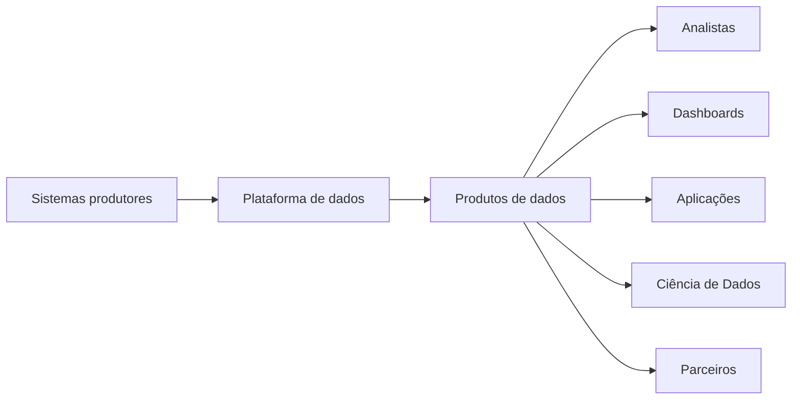
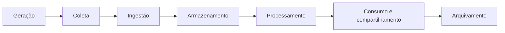
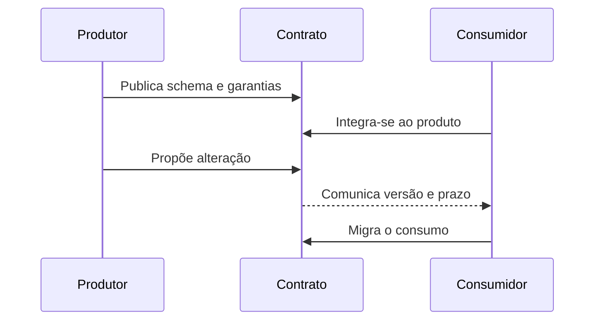
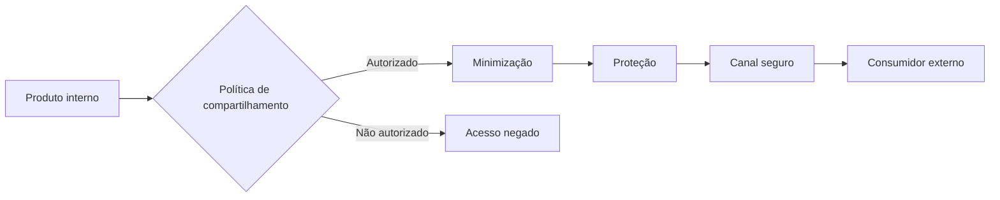
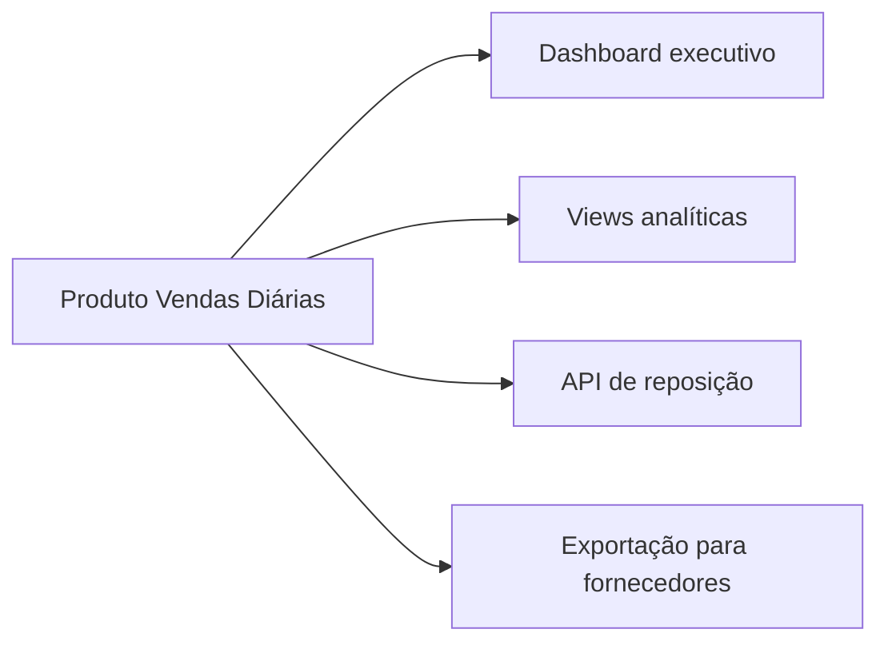

# 08 — Consumo e Compartilhamento de Dados

> [!abstract]
> Dados gerados, ingeridos, armazenados e processados somente produzem valor quando chegam aos consumidores adequados. Esta etapa conecta produtos de dados a pessoas, aplicações e processos, preservando significado, qualidade, segurança e rastreabilidade.

---

## Objetivos

Ao concluir este capítulo, você será capaz de:

- explicar o papel do consumo no ciclo de vida dos dados;
- identificar diferentes perfis de consumidores;
- comparar padrões de acesso e entrega de dados;
- compreender o conceito de produto de dados;
- relacionar contratos, metadados e camada semântica à confiança;
- analisar requisitos de qualidade, segurança e nível de serviço;
- distinguir compartilhamento interno de compartilhamento externo;
- projetar uma estratégia básica de consumo para a DataRetail S.A.

---

## Introdução

Uma plataforma pode ingerir bilhões de registros, armazená-los com segurança e processá-los corretamente. Ainda assim, todo esse trabalho será insuficiente se o resultado não puder ser utilizado para uma finalidade real.

Um analista precisa encontrar a tabela correta. Um dashboard precisa apresentar métricas consistentes. Uma aplicação precisa receber respostas dentro da latência esperada. Um parceiro precisa acessar apenas os dados autorizados.

O consumo e o compartilhamento tratam dessa última conexão.

Essa etapa não consiste apenas em conceder acesso a arquivos ou tabelas. Ela envolve definir o que será disponibilizado, para quem, por qual interface, com qual significado e sob quais garantias.

---

## O que é consumo de dados?

> [!definition]
>
> **Consumo de dados** é a utilização de dados por pessoas, aplicações ou processos para executar análises, tomar decisões, automatizar atividades ou produzir novos resultados.

O consumidor pode consultar diretamente um conjunto de dados, receber eventos, chamar uma API, utilizar um dashboard ou executar um modelo analítico.

Em todos esses casos, existe uma relação entre um produtor e um consumidor.



---

## A posição do consumo no ciclo de vida

O consumo utiliza os resultados produzidos pelas etapas anteriores.



O fluxo também pode retornar. Uma análise pode gerar uma classificação que será armazenada e utilizada por outro processo. Um modelo pode produzir previsões que alimentam aplicações operacionais.

> [!important]
>
> Consumo não é necessariamente o fim do fluxo. Um dado consumido pode originar novos dados e iniciar outro ciclo de vida.

---

## Quem consome dados?

Consumidores possuem objetivos e requisitos diferentes. Uma única forma de acesso raramente atende a todos.

### Analistas de dados

Analistas exploram informações, testam hipóteses e produzem indicadores. Normalmente precisam de:

- acesso por SQL;
- dados documentados;
- histórico suficiente;
- métricas com significado estável;
- autonomia para combinar conjuntos autorizados.

### Profissionais de negócio

Gestores e equipes operacionais geralmente consomem dashboards, relatórios e alertas. Eles esperam:

- linguagem próxima ao domínio;
- navegação compreensível;
- indicadores consistentes;
- atualização previsível;
- explicações sobre filtros e regras.

### Cientistas de dados

Projetos de ciência de dados utilizam dados para experimentos, treinamento e avaliação de modelos. Seus requisitos incluem:

- dados históricos detalhados;
- reprodutibilidade;
- acesso a diferentes versões;
- compreensão de vieses e limitações;
- rastreabilidade das variáveis.

### Aplicações

Aplicações consomem dados por interfaces programáticas, tabelas, arquivos ou eventos. Elas dependem de:

- schemas estáveis;
- baixa taxa de falhas;
- formatos previsíveis;
- controle de versões;
- latência compatível com a operação.

### Autoridades, clientes e parceiros

Consumidores externos podem receber relatórios regulatórios, arquivos contratados, consultas controladas ou dados agregados. O compartilhamento exige controles adicionais de finalidade, privacidade e auditoria.

---

## Dados brutos não são produtos de consumo

Dados brutos são importantes para preservação e reprocessamento, mas frequentemente carregam complexidades das fontes:

- códigos internos;
- registros duplicados;
- formatos instáveis;
- campos sem descrição;
- dados sensíveis desnecessários;
- regras de negócio ainda não aplicadas.

Expor diretamente essa camada transfere a complexidade para cada consumidor. Equipes diferentes podem interpretar os mesmos registros de maneiras incompatíveis.

Dados destinados ao consumo devem apresentar propósito, estrutura e garantias conhecidos.

---

## Produto de dados

> [!definition]
>
> Um **produto de dados** é um conjunto de dados ou serviço preparado para atender consumidores definidos, acompanhado de documentação, responsabilidade, qualidade e forma de acesso conhecidas.

Uma tabela isolada não se torna automaticamente um produto. O consumidor precisa compreender:

- qual problema o produto resolve;
- quem é responsável por ele;
- de quais fontes ele depende;
- o significado de seus campos e métricas;
- com que frequência é atualizado;
- quais limitações possui;
- como solicitar acesso ou suporte.

Produtos de dados podem assumir diversas formas:

- tabelas analíticas;
- views;
- dashboards;
- APIs;
- arquivos publicados;
- streams de eventos;
- conjuntos de treinamento;
- métricas certificadas.

---

## Formas de consumo

A interface deve ser escolhida conforme o perfil do consumidor e os requisitos de uso.

### Consultas SQL

SQL permite exploração e composição de dados estruturados.

```sql
SELECT
    data_venda,
    canal,
    receita_liquida
FROM analytics.vendas_diarias
WHERE data_venda >= DATE '2026-07-01'
ORDER BY data_venda, canal;
```

Essa forma é adequada para análises, relatórios e transformações posteriores. Ela exige controle de acesso, documentação e capacidade computacional compatível com as consultas.

### Dashboards e relatórios

Dashboards apresentam métricas e tendências por meio de visualizações. São apropriados quando o consumidor precisa acompanhar perguntas recorrentes.

Um dashboard não substitui a definição das métricas. Duas visualizações podem apresentar valores diferentes se utilizarem filtros, períodos ou regras de cálculo incompatíveis.

### APIs

APIs disponibilizam dados por contratos programáticos. São úteis quando aplicações precisam consultar entidades, indicadores ou resultados específicos.

Uma API deve definir:

- parâmetros aceitos;
- schema da resposta;
- autenticação;
- limites de uso;
- tratamento de erros;
- política de versionamento.

### Arquivos

Arquivos CSV, JSON, Parquet e outros formatos são utilizados em integrações, intercâmbios periódicos e entregas externas.

O compartilhamento precisa informar formato, codificação, compactação, particionamento, convenção de nomes e mecanismo de entrega.

### Eventos

Streams de eventos permitem que consumidores reajam a mudanças continuamente. O contrato deve explicar o significado do evento, sua chave, sua versão e as garantias de entrega.

### Notebooks e ambientes analíticos

Notebooks facilitam exploração, prototipação e comunicação entre código e análise. Entretanto, resultados importantes não devem depender apenas de execuções manuais sem versionamento e rastreabilidade.

---

## Acesso por pull e entrega por push

Existem dois padrões gerais de interação.

No modelo **pull**, o consumidor solicita os dados quando precisa. Consultas SQL e chamadas a APIs são exemplos comuns.

No modelo **push**, o produtor envia ou publica dados quando um evento ou período ocorre. Notificações, arquivos entregues e streams são exemplos.

| Aspecto | Pull | Push |
| --- | --- | --- |
| Iniciativa | Consumidor | Produtor |
| Exemplo | Consulta SQL | Evento publicado |
| Ritmo | Determinado pela solicitação | Determinado pela produção |
| Controle do consumidor | Maior sobre o momento | Maior dependência do fluxo recebido |

Uma arquitetura pode combinar os dois. Um evento pode notificar que uma nova partição está disponível, e o consumidor pode consultá-la quando estiver pronto.

---

## Camada semântica

Dados tecnicamente corretos ainda podem ser interpretados de formas diferentes.

Por exemplo, **receita** pode representar:

- valor bruto dos pedidos;
- valor após descontos;
- valor após cancelamentos;
- valor efetivamente recebido;
- valor convertido para uma moeda de referência.

Uma camada semântica organiza métricas, dimensões e regras de negócio compartilhadas. Seu objetivo é reduzir interpretações contraditórias entre relatórios e equipes.

> [!example]
>
> Se “cliente ativo” significa ter realizado ao menos uma compra nos últimos 90 dias, essa regra deve estar documentada e ser reutilizada. Não deve ser redefinida silenciosamente em cada dashboard.

---

## Contratos de dados

Um contrato explicita expectativas entre produtores e consumidores.

Ele pode descrever:

- schema e tipos;
- significado dos campos;
- chaves e regras de nulidade;
- frequência de atualização;
- limites de qualidade;
- política de compatibilidade;
- classificação de segurança;
- responsável pelo produto;
- procedimento de comunicação de mudanças.

Contratos não eliminam mudanças. Eles tornam mudanças visíveis e administráveis.

Adicionar um campo opcional pode ser compatível com consumidores existentes. Renomear um campo ou alterar sua unidade pode exigir uma nova versão e um período de migração.



---

## Descoberta e metadados

Um consumidor não consegue utilizar o que não consegue encontrar ou compreender.

Catálogos e documentação devem permitir responder:

- quais produtos existem;
- quem pode utilizá-los;
- quem é o responsável;
- quais campos estão disponíveis;
- quando ocorreu a última atualização;
- de onde os dados vieram;
- quais produtos dependem deles;
- qual é sua classificação de sensibilidade.

Wikis e catálogos não devem ser tratados como inventários estáticos. A documentação precisa acompanhar o produto para evitar que descrições antigas orientem decisões atuais.

---

## Qualidade para consumo

Qualidade depende da finalidade.

Um conjunto adequado para uma análise exploratória pode não ser suficiente para fechar demonstrações financeiras. Um atraso de dez minutos pode ser aceitável para um dashboard e inadequado para um alerta operacional.

As garantias devem ser expressas em termos observáveis, como:

- percentual máximo de valores ausentes;
- unicidade da chave;
- prazo de atualização;
- período histórico disponível;
- reconciliação com a fonte;
- tolerância para registros atrasados.

> [!warning]
>
> Declarar que um produto possui “alta qualidade” é insuficiente. O consumidor precisa conhecer critérios verificáveis e limitações relevantes para seu uso.

---

## Níveis de serviço

Produtos críticos precisam de expectativas operacionais explícitas.

Três conceitos ajudam a organizar essas expectativas:

- **indicador de nível de serviço:** medida observada, como disponibilidade ou atraso;
- **objetivo de nível de serviço:** valor-alvo para o indicador;
- **acordo de nível de serviço:** compromisso formal entre as partes, quando aplicável.

Exemplos de objetivos:

- dados de vendas disponíveis até 7h;
- API disponível em 99,9% do período;
- 95% das respostas abaixo de 300 milissegundos;
- correções críticas comunicadas em até uma hora.

Objetivos devem refletir o impacto de negócio. Garantias rigorosas aumentam custo e complexidade operacional.

---

## Segurança no consumo

O fato de um dado estar pronto para análise não significa que todos possam acessá-lo.

Uma estratégia de segurança deve considerar:

- identidade do consumidor;
- finalidade do uso;
- classificação dos dados;
- menor privilégio;
- segregação de funções;
- expiração de acessos temporários;
- auditoria de consultas e entregas;
- proteção contra extração indevida.

Controles podem ser aplicados em diferentes níveis:

- produto;
- tabela;
- coluna;
- linha;
- visão mascarada;
- resposta de API;
- arquivo entregue.

O acesso também precisa ser revisto. Permissões concedidas para um projeto temporário não devem permanecer indefinidamente.

---

## Privacidade e minimização

Compartilhar apenas o necessário reduz riscos.

Se um relatório precisa contar clientes por região, talvez não exista motivo para disponibilizar nome, documento ou endereço completo. A agregação e a remoção de atributos podem atender ao objetivo com menor exposição.

A minimização deve observar:

- finalidade declarada;
- atributos estritamente necessários;
- granularidade apropriada;
- período de retenção;
- possibilidade de reidentificação;
- restrições de reutilização.

Anonimização, pseudonimização e mascaramento possuem propriedades diferentes e não devem ser tratados como sinônimos.

---

## Compartilhamento interno

O compartilhamento entre áreas da mesma organização ainda exige governança.

Problemas comuns incluem planilhas copiadas sem controle, extrações locais desatualizadas e métricas redefinidas por cada equipe.

Uma estratégia interna deve favorecer:

- produtos oficiais e localizáveis;
- acesso controlado;
- definições reutilizáveis;
- responsáveis conhecidos;
- comunicação de mudanças;
- redução de cópias desnecessárias.

---

## Compartilhamento externo

O compartilhamento com clientes, fornecedores, parceiros ou autoridades amplia o limite de confiança.

Antes da entrega, é necessário definir:

- base e finalidade do compartilhamento;
- dados e granularidade permitidos;
- canal seguro;
- frequência;
- responsabilidades das partes;
- prazo de disponibilidade;
- regras de retenção e descarte;
- auditoria e resposta a incidentes.



Enviar um arquivo por um canal seguro não resolve sozinho o problema. Também é necessário controlar o conteúdo, o destinatário e o uso posterior.

---

## Interoperabilidade

Compartilhar dados exige que produtor e consumidor interpretem estrutura e significado de maneira compatível.

Aspectos importantes incluem:

- formato aberto ou documentado;
- codificação de caracteres;
- representação de datas e fusos horários;
- precisão numérica;
- unidades de medida;
- valores nulos;
- identificação de versões;
- convenções de schema.

Um arquivo pode ser lido tecnicamente e ainda produzir erros se uma parte interpretar vírgula como separador decimal e a outra como delimitador de campos.

---

## Observabilidade do consumo

Compreender o uso ajuda a operar e evoluir os produtos.

Métricas úteis incluem:

- consumidores ativos;
- consultas e chamadas por período;
- tempo de resposta;
- falhas de acesso;
- volume transferido;
- produtos sem uso;
- consumidores afetados por uma mudança;
- custo por produto ou grupo de consumidores.

Esses sinais não devem justificar vigilância indevida sobre pessoas. A coleta precisa respeitar finalidade, segurança e políticas organizacionais.

---

## Estudo de caso — DataRetail S.A.

A DataRetail S.A. consolidou vendas físicas e digitais em um produto chamado **Vendas Diárias**.

Esse produto atende quatro consumidores:

1. diretoria comercial, por um dashboard atualizado diariamente;
2. analistas, por views SQL com histórico detalhado;
3. aplicação de reposição, por uma API com agregações por loja e produto;
4. fornecedores estratégicos, por arquivos semanais com dados agregados.



O produto define **receita líquida** como o valor de vendas após descontos, cancelamentos e devoluções confirmadas. A mesma definição alimenta o dashboard e as views analíticas.

As interfaces possuem requisitos diferentes:

| Consumidor | Interface | Atualização | Granularidade |
| --- | --- | --- | --- |
| Diretoria | Dashboard | Diária, até 7h | Loja e canal |
| Analistas | SQL | Diária | Transação autorizada |
| Reposição | API | A cada 15 minutos | Loja e produto |
| Fornecedores | Arquivo | Semanal | Produto e região |

Os fornecedores não recebem identificadores de clientes nem valores por transação. A entrega contém apenas agregações necessárias ao planejamento de abastecimento.

O catálogo registra proprietário, schema, métricas, linhagem, frequência e canal de suporte. Alterações incompatíveis na API geram uma nova versão, enquanto a anterior permanece disponível durante o período de migração.

Esse desenho evita que uma única tabela seja exposta indiscriminadamente e adapta cada interface ao uso, ao risco e ao nível de serviço necessário.

---

## Boas práticas

- Identificar consumidores e decisões atendidas.
- Publicar dados com propósito e responsável definidos.
- Documentar métricas e regras de negócio.
- Estabelecer contratos para interfaces críticas.
- Aplicar menor privilégio e revisar acessos.
- Minimizar dados pessoais e confidenciais.
- Versionar mudanças incompatíveis.
- Definir indicadores e objetivos de nível de serviço.
- Monitorar qualidade, atualização e utilização.
- Preferir produtos oficiais a cópias locais sem controle.
- Planejar descontinuação e migração de consumidores.

---

## Erros comuns

> [!failure]
> Disponibilizar acesso não garante consumo confiável. Sem significado, responsabilidade e controles, a facilidade de acesso pode ampliar inconsistências e riscos.

Entre os erros frequentes estão:

- expor dados brutos como interface oficial;
- criar métricas diferentes para o mesmo conceito;
- desconhecer quem utiliza um produto;
- alterar schemas sem comunicar consumidores;
- conceder acesso mais amplo do que o necessário;
- compartilhar informações pessoais sem finalidade;
- depender de planilhas copiadas e desatualizadas;
- prometer baixa latência sem necessidade de negócio;
- manter produtos sem responsável;
- desativar interfaces sem plano de migração;
- confundir sucesso da entrega com qualidade do conteúdo.

---

## Resumo

Neste capítulo aprendemos que:

- consumo conecta os resultados da plataforma a pessoas, aplicações e processos;
- consumidores diferentes exigem interfaces e garantias diferentes;
- produtos de dados combinam conteúdo, propósito, responsabilidade e qualidade;
- SQL, dashboards, APIs, arquivos e eventos atendem padrões distintos de uso;
- camada semântica e contratos reduzem interpretações e mudanças incompatíveis;
- metadados tornam os produtos encontráveis e compreensíveis;
- níveis de serviço devem refletir requisitos reais;
- segurança, privacidade e minimização são requisitos do compartilhamento;
- compartilhamento externo exige controles adicionais de finalidade e auditoria;
- observar o consumo ajuda a operar, evoluir e descontinuar produtos.

---

## Próximo Capítulo

➡️ [[09-Arquivamento-e-Descarte-de-Dados|09 — Arquivamento e Descarte de Dados]]
