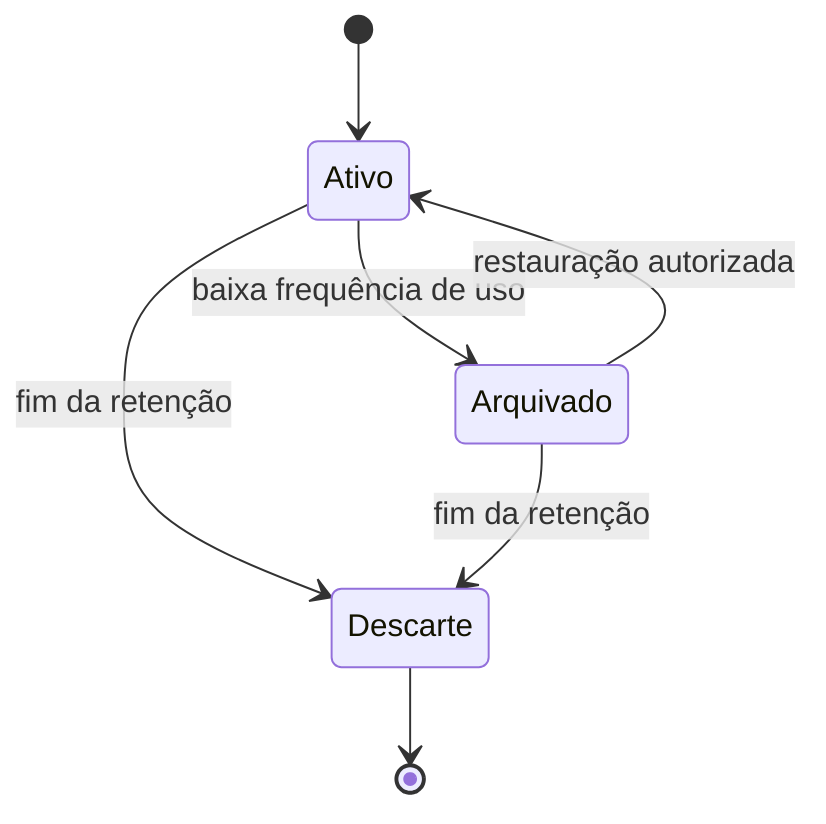
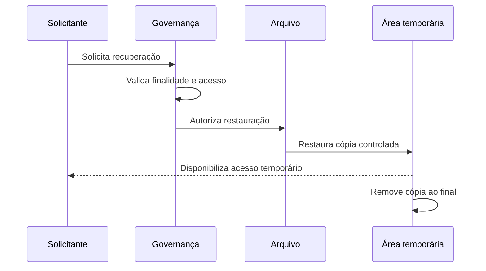
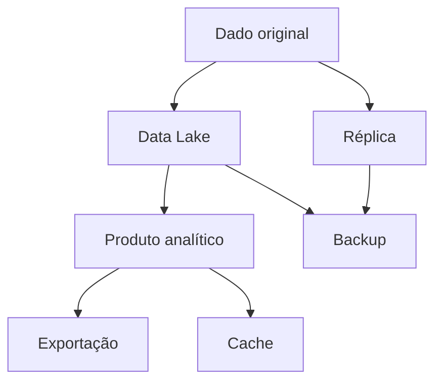
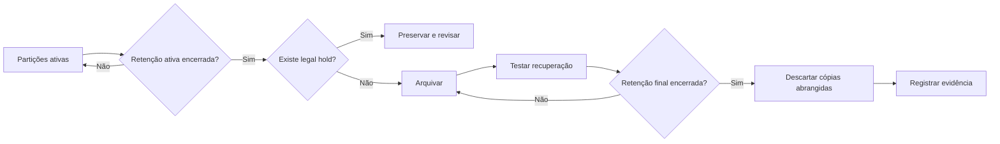

# 09 — Arquivamento e Descarte de Dados

> [!abstract]
> Dados não devem permanecer indefinidamente nos ambientes ativos. Quando deixam de ser utilizados com frequência, podem ser arquivados; quando sua retenção perde a finalidade ou ultrapassa o período permitido, precisam ser descartados de forma controlada, segura e verificável.

---

## Objetivos

Ao concluir este capítulo, você será capaz de:

- explicar a função do arquivamento e do descarte no ciclo de vida;
- diferenciar dados ativos, arquivados e descartados;
- compreender políticas e prazos de retenção;
- identificar requisitos de recuperação, integridade e segurança de arquivos;
- distinguir exclusão lógica de descarte físico;
- reconhecer o impacto de réplicas, caches e backups;
- relacionar classificação, finalidade e obrigações ao tempo de retenção;
- analisar uma política para a DataRetail S.A.

---

## Introdução

Plataformas de dados tendem a crescer continuamente. Novas transações chegam, transformações produzem outras versões e consumidores criam extrações. Sem gestão, o ambiente acumula informações que já não atendem a uma necessidade conhecida.

Manter tudo para sempre parece uma forma de evitar perdas, mas cria problemas:

- aumenta custos;
- amplia a superfície de exposição;
- dificulta buscas e governança;
- prolonga obrigações sobre dados pessoais;
- torna migrações e recuperações mais lentas;
- preserva informações sem valor demonstrável.

Arquivamento e descarte encerram o ciclo de maneira planejada. Eles equilibram disponibilidade histórica, requisitos de negócio, obrigações aplicáveis, custo e risco.

---

## Conceitos fundamentais

> [!definition]
>
> **Arquivamento** é a transferência de dados pouco acessados para uma condição de conservação de longo prazo, na qual permanecem íntegros e recuperáveis conforme requisitos definidos.

> [!definition]
>
> **Descarte de dados** é a eliminação controlada dos dados e das cópias abrangidas, de modo que deixem de estar disponíveis ou recuperáveis além do que a política autoriza.

Arquivar não significa excluir. Dados arquivados continuam existentes, protegidos e sujeitos à governança.



---

## A etapa final do ciclo de vida

O arquivamento e o descarte sucedem o uso, mas precisam ser planejados desde a criação dos dados.


Se a organização somente pensar em retenção quando o ambiente estiver cheio, poderá não saber quais cópias existem, quais consumidores dependem delas ou quais registros precisam permanecer preservados.

> [!important]
>
> A destinação final deve fazer parte do desenho do dado. Todo conjunto relevante precisa ter responsável, classificação, prazo de retenção e procedimento de descarte.

---

## Estados dos dados

Uma política pode organizar os dados em três estados gerais.

### Dados ativos

São utilizados por operações, análises ou processos recorrentes. Normalmente permanecem em camadas com maior disponibilidade e desempenho.

### Dados arquivados

Possuem baixa frequência de acesso, mas precisam ser preservados. Podem atender auditorias, investigações, análises históricas ou obrigações específicas.

### Dados destinados ao descarte

Encerraram o período de retenção e não estão protegidos por uma exceção válida. Devem entrar em um fluxo controlado de eliminação.

| Estado | Frequência de acesso | Objetivo principal | Expectativa de recuperação |
| --- | --- | --- | --- |
| Ativo | Alta ou regular | Operação e análise | Imediata ou rápida |
| Arquivado | Baixa | Preservação | Conforme prazo definido |
| Descartado | Nenhuma | Redução de risco e custo | Não recuperável além das exceções |

---

## Política de retenção

> [!definition]
>
> Uma **política de retenção** define por quanto tempo cada categoria de dados deve permanecer armazenada, por qual motivo e qual ação ocorrerá ao final do prazo.

O período não deve ser escolhido apenas pela capacidade técnica de armazenamento. Ele pode depender de:

- finalidade de negócio;
- contratos;
- auditoria;
- requisitos regulatórios;
- defesa de direitos;
- valor histórico;
- risco associado;
- necessidade de reprocessamento.

Uma política completa registra:

- categoria e responsável;
- evento que inicia a contagem;
- período de retenção;
- localizações abrangidas;
- condições de arquivamento;
- método de descarte;
- exceções e aprovações;
- evidência de execução.

O evento inicial é importante. “Manter por cinco anos” é ambíguo sem informar se a contagem começa na criação, no encerramento do contrato ou em outro marco.

---

## Classificação e inventário

Não é possível aplicar retenção de forma confiável sem conhecer os dados.

O inventário deve relacionar produtos, tabelas, arquivos, streams, extrações, réplicas e backups relevantes. A classificação acrescenta contexto sobre sensibilidade, criticidade e finalidade.

Metadados úteis incluem:

- proprietário;
- sistema de origem;
- classificação de segurança;
- presença de dados pessoais;
- consumidores;
- prazo e fundamento da retenção;
- localização de cópias;
- dependências e linhagem;
- última utilização conhecida.

Dados sem responsável ou classificação tendem a permanecer esquecidos porque ninguém possui autoridade clara para decidir seu destino.

---

## Critérios para arquivamento

Nem todo dado antigo deve ser arquivado. A decisão considera valor, obrigação e possibilidade de uso futuro justificável.

Critérios comuns incluem:

- frequência de acesso abaixo de um limite;
- encerramento de um período operacional;
- substituição por uma versão consolidada;
- necessidade de preservar evidência;
- custo elevado na camada ativa;
- obrigação de retenção sem necessidade de consulta frequente.

Arquivar por idade, sem analisar a finalidade, pode mover dados ainda necessários ou preservar dados que já deveriam ter sido descartados.

---

## Requisitos de um arquivo confiável

Um arquivo precisa manter mais do que os bytes originais.

Ele deve preservar:

- **integridade:** conteúdo sem alterações indevidas;
- **autenticidade:** origem e contexto verificáveis;
- **legibilidade:** formatos ainda interpretáveis;
- **confidencialidade:** acesso apenas por identidades autorizadas;
- **rastreabilidade:** registro de movimentações e acessos;
- **recuperabilidade:** restauração dentro do prazo esperado.

Checksums podem ajudar a detectar alterações acidentais ou corrupção.

```bash
set -euo pipefail

sha256sum vendas-2025.parquet > vendas-2025.parquet.sha256
sha256sum --check vendas-2025.parquet.sha256
```

O checksum comprova que o conteúdo verificado corresponde ao valor registrado, mas não substitui controle de acesso, cópias resilientes ou documentação de origem.

---

## Formatos e obsolescência

Longos períodos de retenção introduzem risco tecnológico. Um formato, codec, software ou mecanismo de criptografia pode deixar de ser suportado.

Uma estratégia de preservação deve:

- preferir formatos documentados;
- conservar schemas e metadados;
- registrar codificação e compressão;
- manter chaves de criptografia disponíveis e protegidas;
- testar leitura periodicamente;
- planejar migrações de formato ou mídia.

Migrar um arquivo exige controles para demonstrar que o conteúdo permaneceu íntegro e que a versão anterior recebeu a destinação correta.

---

## Recuperação de dados arquivados

Arquivos existem para serem recuperados quando uma necessidade autorizada surgir.

O procedimento deve definir:

1. quem pode solicitar;
2. quem aprova;
3. qual prazo de recuperação é esperado;
4. onde os dados restaurados ficarão;
5. como o acesso será auditado;
6. quando a cópia temporária será removida.



Testes periódicos são necessários. Um backup ou arquivo que nunca foi restaurado oferece apenas uma expectativa, não uma garantia demonstrada.

---

## Legal hold e outras exceções

Uma investigação, auditoria ou disputa pode exigir a suspensão temporária do descarte de determinados dados. Essa preservação excepcional é frequentemente chamada de **legal hold**.

A exceção precisa ser:

- formalmente autorizada;
- limitada aos dados relevantes;
- comunicada aos responsáveis;
- protegida contra descarte automático;
- revisada periodicamente;
- encerrada quando sua justificativa deixar de existir.

> [!warning]
>
> Suspender o descarte de todo o ambiente por tempo indefinido não é uma política adequada. A exceção deve possuir escopo, responsável e critério de encerramento.

---

## Exclusão lógica e exclusão física

Na exclusão **lógica**, o registro é marcado como inativo ou removido das consultas usuais, mas seu conteúdo ainda existe.

Na exclusão **física**, o conteúdo é removido do mecanismo de armazenamento abrangido.

A exclusão lógica pode apoiar recuperação operacional ou rastreamento de estado, porém não deve ser apresentada como descarte definitivo.

Em plataformas analíticas, uma instrução de exclusão também pode criar uma nova versão sem remover imediatamente arquivos antigos. Compactação, coleta de versões ou expiração de snapshots podem ser necessárias para concluir o descarte físico.

---

## Cópias, caches e derivados

O mesmo dado pode existir em muitos lugares:

- sistema de origem;
- área de ingestão;
- tabelas processadas;
- réplicas;
- caches;
- índices;
- exports;
- notebooks;
- ambientes de teste;
- arquivos compartilhados;
- backups.

Excluir somente a tabela principal pode deixar cópias acessíveis.



A linhagem ajuda a localizar derivados, mas a política também precisa definir até que ponto agregações irreversíveis permanecem abrangidas pelo descarte.

---

## Backups e descarte

Backups existem para recuperação e seguem ciclos próprios. Alterá-los registro a registro pode comprometer integridade e capacidade de restauração.

Uma abordagem comum combina:

- impedir novos usos do dado excluído;
- limitar rigorosamente o acesso aos backups;
- manter backups apenas pelo prazo definido;
- garantir expiração automática;
- reaplicar exclusões quando uma restauração ocorrer;
- documentar a janela residual.

Backups não devem se tornar arquivos permanentes sem política. Sua finalidade é recuperação, e não retenção ilimitada.

---

## Métodos de descarte

O método depende da mídia, da arquitetura e do nível de risco.

Possibilidades incluem:

- exclusão segura de objetos e versões;
- expiração automática por política de ciclo de vida;
- destruição de chaves criptográficas exclusivas;
- sobrescrita quando tecnicamente aplicável;
- destruição física de mídias;
- descarte certificado por fornecedor.

A simples remoção de uma referência em catálogo pode não apagar o conteúdo subjacente.

> [!note]
>
> Criptografia auxilia o descarte quando as chaves são adequadamente isoladas e destruídas, mas não corrige cópias em texto aberto nem substitui um inventário confiável.

---

## Automação e evidências

Políticas manuais não escalam bem. Sistemas podem automatizar transições de camada e expirações com base em metadados.

Uma execução de descarte deve produzir evidências como:

- política aplicada;
- escopo;
- data e identificador da execução;
- quantidade de itens processados;
- exceções encontradas;
- aprovações exigidas;
- resultado de verificações posteriores.

Essas evidências não devem reproduzir o conteúdo sensível que foi eliminado.

---

## Estudo de caso — DataRetail S.A.

A DataRetail S.A. classifica os dados de vendas em três camadas:

| Categoria | Camada ativa | Arquivo | Destinação final |
| --- | --- | --- | --- |
| Transações detalhadas | 24 meses | Conforme política aprovada | Descarte verificável |
| Agregações mensais | 5 anos | Histórico corporativo | Revisão ao final |
| Logs técnicos | 90 dias | Somente incidentes autorizados | Expiração automática |

Os prazos são exemplos didáticos e precisam ser confirmados pela organização conforme finalidade e obrigações aplicáveis.

Ao final de cada mês, um processo identifica partições elegíveis. Antes da movimentação, ele verifica se existe legal hold, calcula checksums e registra o manifesto do arquivo.



Uma restauração cria uma cópia temporária criptografada, acessível somente ao grupo autorizado. Ao término da análise, essa cópia recebe descarte automático.

Quando as transações atingem o fim da retenção, o processo remove objetos, versões expiradas e derivados identificáveis. Os backups permanecem inacessíveis para uso comum e expiram segundo sua janela; se houver restauração, uma lista de exclusões pendentes é reaplicada antes da liberação do ambiente.

---

## Boas práticas

- Definir retenção no início do ciclo de vida.
- Associar cada conjunto a um responsável e uma finalidade.
- Inventariar cópias, derivados e backups.
- Automatizar transições e expirações quando possível.
- Preservar schemas, metadados e checksums nos arquivos.
- Testar recuperação periodicamente.
- Restringir e auditar acessos a dados arquivados.
- Formalizar exceções com escopo e prazo.
- Diferenciar exclusão lógica de descarte físico.
- Produzir evidências sem copiar o dado descartado.
- Revisar políticas quando sistemas ou finalidades mudarem.

---

## Erros comuns

> [!failure]
> Dados esquecidos não deixam de gerar responsabilidade. Sem destinação conhecida, eles acumulam custo, risco e complexidade.

Entre os erros frequentes estão:

- manter todos os dados indefinidamente;
- definir prazos sem evento inicial;
- arquivar sem testar restauração;
- excluir apenas a tabela principal;
- ignorar réplicas, caches, exports e ambientes de teste;
- tratar exclusão lógica como descarte definitivo;
- usar backups como arquivo permanente;
- suspender descarte sem escopo ou revisão;
- perder schemas ou chaves necessárias à leitura;
- descartar dados sem evidência de execução;
- automatizar exclusões sem mecanismos de exceção e aprovação.

---

## Resumo

Neste capítulo aprendemos que:

- arquivamento preserva dados pouco acessados, enquanto descarte encerra sua retenção;
- políticas precisam definir prazo, evento inicial, fundamento e destino;
- classificação, inventário e linhagem tornam a política executável;
- arquivos devem permanecer íntegros, legíveis, protegidos e recuperáveis;
- restaurações precisam de autorização, prazo e remoção da cópia temporária;
- legal hold suspende o descarte de um escopo específico;
- exclusão lógica não equivale a eliminação física;
- cópias, derivados e backups exigem tratamento explícito;
- automação reduz falhas, mas precisa gerar evidências e respeitar exceções;
- planejar a destinação desde a origem reduz custo e risco durante todo o ciclo.

---

## Próximo Capítulo

➡️ 10 — Estudo de Caso: Ciclo de Vida na DataRetail S.A.
