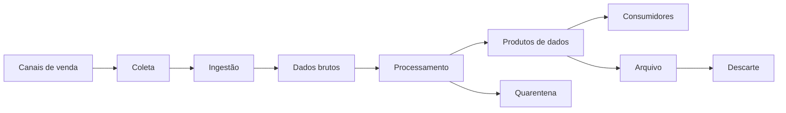
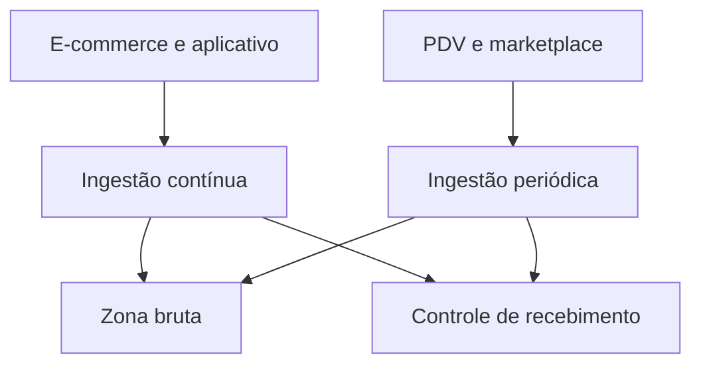
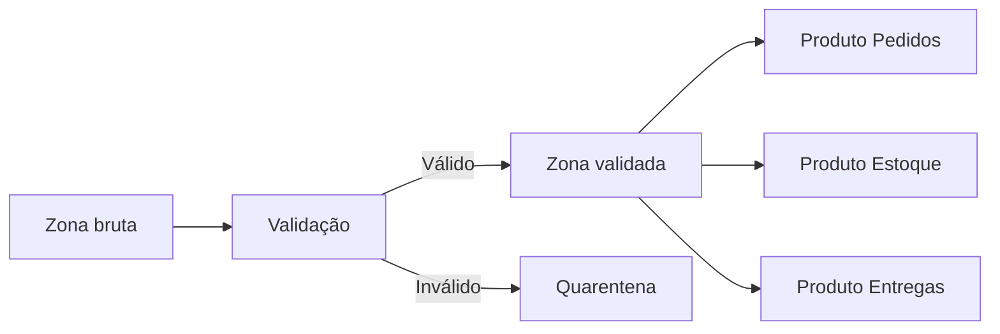
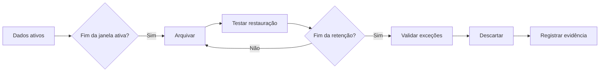
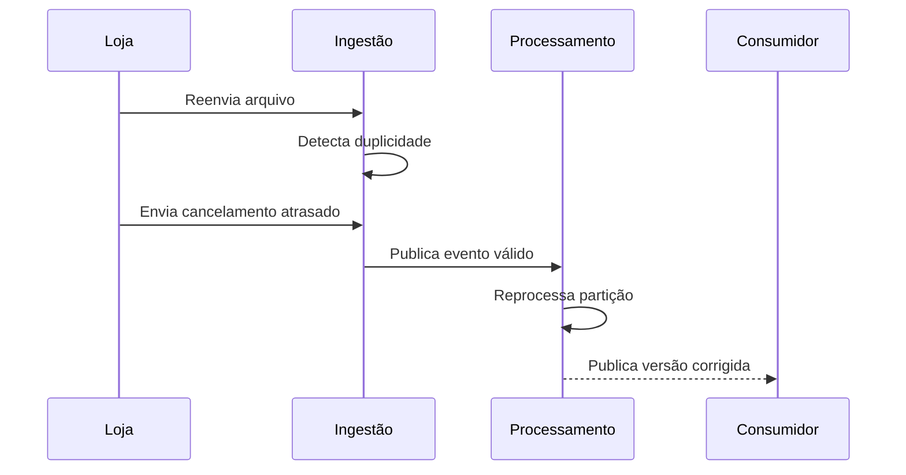

# 10 — Estudo de Caso: Ciclo de Vida dos Dados na DataRetail S.A.

> [!abstract]
> Este estudo acompanha os dados de um pedido desde sua geração até o descarte. O objetivo é transformar as etapas conceituais do ciclo de vida em decisões de arquitetura, qualidade, segurança e operação para a DataRetail S.A.

---

## Objetivos

Ao concluir este estudo de caso, você será capaz de:

- mapear o ciclo de vida de um domínio de negócio;
- identificar produtores, consumidores e responsáveis;
- relacionar requisitos de negócio a decisões técnicas;
- definir controles para qualidade, segurança e observabilidade;
- analisar falhas e estratégias de recuperação;
- propor retenção, arquivamento e descarte coerentes;
- reconhecer dependências entre todas as etapas do ciclo.

---

## Contexto da empresa

A DataRetail S.A. opera lojas físicas, comércio eletrônico, aplicativo móvel e marketplace. Seus pedidos movimentam estoque, pagamento, logística, relacionamento com clientes e indicadores gerenciais.

O crescimento dos canais revelou um problema: cada sistema mantém uma visão parcial do pedido.

| Sistema | Responsabilidade | Exemplo de dado produzido |
| --- | --- | --- |
| E-commerce | Compra digital | Pedido e itens |
| PDV | Venda física | Cupom e pagamentos |
| Marketplace | Venda de parceiros | Pedido externo |
| Pagamentos | Autorização financeira | Status e transação |
| Estoque | Reserva de produtos | Quantidade reservada |
| Logística | Entrega | Eventos de transporte |
| CRM | Relacionamento | Identificador do cliente |

A diretoria quer responder com consistência:

- Qual foi a receita líquida de cada canal?
- Quantos pedidos foram cancelados?
- Quais produtos precisam de reposição?
- Qual é o prazo real de entrega?
- Quais clientes podem receber uma comunicação pós-venda?

Responder a essas perguntas exige administrar o ciclo completo, não apenas copiar tabelas para um repositório central.

---

## Escopo do estudo

O domínio escolhido é **Pedidos**. O ciclo começa quando um canal aceita uma intenção de compra e termina quando os dados detalhados ultrapassam o prazo de retenção e recebem descarte autorizado.

O estudo considera:

- pedidos digitais e físicos;
- itens e valores;
- pagamentos;
- cancelamentos e devoluções;
- eventos de entrega;
- produtos analíticos derivados.

Dados completos de cartão não fazem parte do produto analítico. O sistema de pagamentos fornece somente identificadores e estados necessários à conciliação.

---

## Requisitos

A equipe registra requisitos antes de escolher ferramentas.

### Requisitos funcionais

- Consolidar pedidos de todos os canais.
- Preservar a origem para auditoria e reprocessamento.
- Atualizar indicadores operacionais em até 15 minutos.
- Disponibilizar fechamento financeiro diário até 7h.
- Incorporar cancelamentos e devoluções atrasados.
- Compartilhar agregações com fornecedores autorizados.
- Arquivar e descartar dados conforme política aprovada.

### Requisitos não funcionais

- Suportar reprocessamento sem duplicação.
- Criptografar dados em trânsito e em repouso.
- Restringir atributos pessoais.
- Registrar linhagem e métricas de execução.
- Detectar mudanças incompatíveis de schema.
- Recuperar partições arquivadas dentro do prazo acordado.

> [!important]
>
> Os requisitos de latência são diferentes. Reposição de estoque precisa de atualização intradiária, enquanto o fechamento financeiro exige completude e reconciliação diária. Um único modo de processamento não precisa atender todos os usos.

---

## Visão integrada do ciclo



Governança, qualidade, segurança, metadados e observabilidade atravessam todas as etapas.

---

## Etapa 1 — Geração e coleta

Cada canal gera um identificador de pedido e eventos de mudança de estado. A equipe define um envelope comum para transporte, sem obrigar todos os sistemas a usar o mesmo modelo interno.

```json
{
  "event_id": "evt-7f31",
  "event_type": "pedido_confirmado",
  "occurred_at": "2026-07-16T14:32:08Z",
  "source": "ecommerce",
  "schema_version": 2,
  "order_id": "web-98451"
}
```

O contrato exige `event_id`, horário, origem, versão e identificador do pedido. A aplicação não envia número completo de cartão nem outros atributos desnecessários.

Controles definidos:

- identificador único por evento;
- horário em UTC;
- autenticação do produtor;
- versionamento de schema;
- classificação dos campos;
- registro da finalidade.

---

## Etapa 2 — Ingestão

Eventos operacionais são ingeridos continuamente para reposição e acompanhamento. Sistemas legados enviam arquivos delimitados em janelas periódicas.



A zona bruta preserva a entrada e metadados como origem, horário de recebimento, checksum e execução responsável. A gravação usa caminhos separados por fonte e data.

O pipeline confirma recebimento somente depois de persistir o dado. Reenvios são esperados e tratados pelo `event_id` ou por uma chave composta documentada para arquivos legados.

---

## Etapa 3 — Armazenamento

A arquitetura utiliza responsabilidades distintas:

- **zona bruta:** preserva dados recebidos;
- **zona validada:** mantém registros conformes e tipados;
- **produtos analíticos:** organizam dados para usos conhecidos;
- **quarentena:** isola registros que exigem correção.



O acesso à zona bruta é restrito. Analistas utilizam produtos publicados, nos quais atributos pessoais foram removidos ou protegidos conforme a finalidade.

---

## Etapa 4 — Processamento

O fluxo de processamento executa:

1. validação de schema e campos obrigatórios;
2. padronização de datas, moedas e identificadores;
3. deduplicação de eventos;
4. associação de códigos legados ao catálogo corporativo;
5. ordenação das mudanças de estado;
6. aplicação de cancelamentos e devoluções;
7. cálculo de valores bruto e líquido;
8. publicação de produtos.

O processamento intradiário atualiza estoque e operação. O processamento diário reconcilia pedidos, pagamentos e devoluções antes de publicar o fechamento.

Exemplo de reconciliação:

```sql
SELECT
    p.data_referencia,
    COUNT(*) AS pedidos,
    SUM(p.valor_liquido) AS receita_liquida
FROM analytics.pedidos p
WHERE p.data_referencia = DATE '2026-07-15'
GROUP BY p.data_referencia;
```

Cada partição diária é publicada de forma idempotente. Se uma regra mudar, a equipe pode reconstruir o período a partir da zona bruta sem somar os resultados duas vezes.

---

## Etapa 5 — Qualidade e observabilidade

O produto Pedidos possui controles verificáveis.

| Controle | Critério | Resposta |
| --- | --- | --- |
| Unicidade | Um registro atual por pedido | Bloquear publicação |
| Completude | Pedido e canal preenchidos | Enviar para quarentena |
| Validade | Valor total não negativo | Alertar e segregar |
| Atualidade | Intradiário com atraso inferior a 15 min | Alertar operação |
| Reconciliação | Total compatível com pagamentos | Bloquear fechamento |

Métricas operacionais registram quantidade recebida, rejeitada e publicada, duração, atraso, versão do código e origem.

Uma execução tecnicamente bem-sucedida ainda falha no objetivo se publicar metade dos pedidos esperados. Por isso, volume e comportamento de negócio também são observados.

---

## Etapa 6 — Consumo e compartilhamento

O mesmo domínio origina interfaces diferentes.

| Consumidor | Produto | Interface | Garantia principal |
| --- | --- | --- | --- |
| Operações | Pedidos intradiários | API | Atualização em 15 min |
| Finanças | Fechamento diário | SQL | Reconciliação até 7h |
| Diretoria | Vendas executivas | Dashboard | Métricas certificadas |
| Fornecedores | Demanda agregada | Arquivo | Sem dados pessoais |

A definição de **receita líquida** é mantida no catálogo e reutilizada. A API possui versão explícita, enquanto os arquivos de fornecedores incluem manifesto com período, schema, checksum e contagem de linhas.

Acesso é concedido pelo menor privilégio. Consultas, exportações e mudanças de permissão são auditadas.

---

## Etapa 7 — Arquivamento e descarte

Ao perder frequência de acesso, partições detalhadas são movidas para uma camada de arquivo. O processo preserva schema, manifesto, checksum, classificação e responsável.

Antes do descarte, a automação verifica:

- término do prazo aplicável;
- ausência de legal hold;
- dependências conhecidas;
- réplicas e derivados abrangidos;
- autorização exigida;
- política dos backups.



Os prazos definitivos são aprovados pelas áreas responsáveis e não são codificados sem uma política vigente.

---

## Responsabilidades

| Papel | Responsabilidade no caso |
| --- | --- |
| Dono do domínio | Aprovar significado e finalidade |
| Engenharia de Dados | Construir e operar pipelines |
| Sistemas produtores | Cumprir contratos de origem |
| Governança | Manter catálogo, classificação e políticas |
| Segurança | Definir e verificar controles de acesso |
| Consumidores | Utilizar conforme finalidade e contrato |
| Operações | Responder a alertas e incidentes |

Responsabilidade compartilhada não significa responsabilidade indefinida. Cada decisão crítica possui um aprovador identificável.

---

## Incidente: eventos duplicados e atrasados

Após uma indisponibilidade de rede, algumas lojas reenviam arquivos de vendas. Ao mesmo tempo, cancelamentos chegam depois do fechamento diário.

Sem controles, a receita seria duplicada e os cancelamentos apareceriam somente no período seguinte.

A resposta utiliza capacidades planejadas:

1. o controle de recebimento identifica o reenvio;
2. a deduplicação impede pedidos repetidos;
3. eventos atrasados atualizam as partições afetadas;
4. o fechamento é reprocessado de forma idempotente;
5. consumidores recebem a indicação da nova versão;
6. métricas e linhagem registram o impacto.



O incidente mostra por que confiabilidade não pode ser adicionada apenas depois da primeira falha.

---

## Critérios de aceite

A solução é aceita quando:

- todas as fontes possuem contrato e responsável;
- eventos podem ser reenviados sem duplicar resultados;
- registros inválidos são rastreáveis;
- fechamento e pagamentos são reconciliados;
- produtos possuem definição, proprietário e nível de serviço;
- atributos sensíveis estão protegidos;
- linhagem conecta fontes e consumidores;
- restauração de arquivo foi testada;
- descarte contempla cópias conhecidas e produz evidência;
- um incidente pode ser investigado por métricas e logs.

---

## Decisões e trade-offs

### Preservar a entrada bruta

Favorece auditoria e reprocessamento, mas aumenta custo e responsabilidade. A retenção precisa limitar essa preservação.

### Combinar batch e streaming

Atende latências diferentes, mas cria mais caminhos operacionais. As definições de negócio devem permanecer consistentes entre eles.

### Separar produtos por finalidade

Reduz exposição e adapta interfaces, mas exige governar versões e dependências adicionais.

### Automatizar o descarte

Melhora consistência e escala, mas exige metadados confiáveis, aprovações e mecanismos para exceções.

---

## Lições aprendidas

O caso da DataRetail S.A. demonstra que:

- o ciclo de vida começa no desenho do dado, não no armazenamento;
- requisitos de consumidores orientam latência e formato;
- preservar a origem torna correções históricas possíveis;
- qualidade e observabilidade precisam acompanhar cada etapa;
- idempotência reduz o risco de reprocessamento;
- segurança e privacidade dependem da finalidade;
- arquivamento sem teste de recuperação é incompleto;
- descarte precisa alcançar cópias e produzir evidências;
- responsabilidades claras conectam decisões técnicas ao negócio.

---

## Próximo Capítulo

➡️ 11 — Resumo do Módulo
