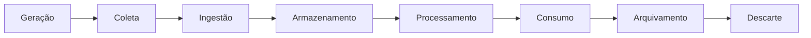
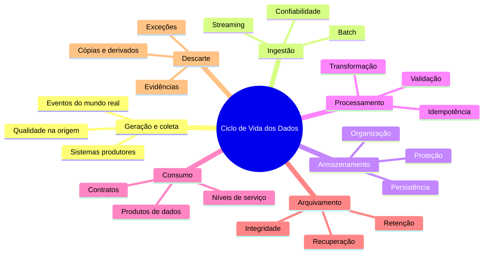

# 11 — Resumo do Módulo

> [!summary]
> O Ciclo de Vida dos Dados descreve a jornada dos dados desde sua geração até o descarte. Cada etapa possui objetivos próprios, mas qualidade, segurança, governança, metadados e observabilidade atravessam todo o ciclo.

---

## Visão geral

Dados não permanecem estáticos. Eles são gerados por eventos e processos, coletados, ingeridos, armazenados, transformados, consumidos, compartilhados, arquivados e finalmente descartados.

Essa representação facilita o estudo, mas o funcionamento real é iterativo. Resultados podem voltar ao armazenamento, dados históricos podem ser reprocessados e o consumo pode gerar novos dados.

---

## Mapa dos conceitos

---

## Geração e coleta

A geração ocorre quando um evento, atividade ou sistema produz uma representação de algo. O dado não é o próprio evento: ele é um registro construído sobre esse evento.

A coleta captura essa representação para uso posterior. Pode ocorrer por entrada manual, instrumentação automática, importação ou integração entre sistemas.

Pontos centrais:

- definir finalidade antes de coletar;
- capturar somente atributos necessários;
- atribuir identificadores e horários confiáveis;
- validar o mais próximo possível da origem;
- documentar produtor, significado e versão;
- proteger dados sensíveis desde o início.

Problemas introduzidos nessa etapa se propagam para todas as seguintes.

---

## Ingestão

Ingestão transporta dados das fontes para destinos controlados. Ela pode processar conjuntos delimitados em batch ou fluxos contínuos em streaming.

Uma ingestão confiável precisa lidar com:

- reenvios;
- duplicidades;
- falhas parciais;
- atrasos;
- mudanças de schema;
- controle do que foi recebido;
- preservação de metadados técnicos.

Confirmar uma entrega antes de persistir os dados pode causar perda. Repetir uma entrega sem deduplicação pode causar duplicidade.

---

## Armazenamento

Armazenamento garante persistência e recuperação. Bancos relacionais, bancos NoSQL, Data Warehouses, Data Lakes, Lakehouses e arquivos atendem necessidades distintas.

A decisão considera:

- estrutura e volume;
- padrões de leitura e escrita;
- consistência;
- latência;
- custo;
- segurança;
- crescimento;
- retenção.

Guardar dados não é suficiente. Eles precisam permanecer organizados, documentados, protegidos e recuperáveis.

---

## Processamento

Processamento converte entradas em resultados adequados a uma finalidade. Operações comuns incluem validação, padronização, limpeza, deduplicação, integração, agregação e enriquecimento.

Conceitos essenciais:

- [[ETL]] transforma antes da carga no destino;
- [[ELT]] carrega antes de transformar no destino;
- batch trata conjuntos delimitados;
- streaming trata fluxos contínuos;
- incrementalidade reduz trabalho repetido;
- idempotência permite repetir uma operação sem duplicar seu efeito;
- backfill recompõe períodos históricos.

Batch e streaming são escolhas orientadas por requisitos, especialmente latência e complexidade operacional.

---

## Consumo e compartilhamento

Dados geram valor quando atendem pessoas, aplicações e processos. Consumidores diferentes exigem interfaces diferentes, como SQL, dashboards, APIs, arquivos e eventos.

Um produto de dados precisa apresentar:

- propósito;
- consumidores conhecidos;
- responsável;
- documentação;
- regras de negócio;
- qualidade mensurável;
- forma de acesso;
- política de mudanças;
- nível de serviço compatível.

Contratos e camada semântica reduzem ambiguidades. Segurança, finalidade e minimização limitam o que cada consumidor pode receber.

---

## Arquivamento e descarte

Dados pouco acessados podem ser arquivados quando ainda precisam ser preservados. Dados que atingiram o final de sua retenção, sem uma exceção válida, devem ser descartados.

Uma política de retenção define:

- categoria dos dados;
- evento inicial da contagem;
- período;
- fundamento;
- localizações abrangidas;
- exceções;
- método de descarte;
- evidências esperadas.

Arquivos precisam permanecer íntegros, legíveis, protegidos e testados para recuperação. O descarte deve considerar versões, réplicas, caches, exports, derivados e backups.

Exclusão lógica oculta ou inativa um registro, mas não equivale necessariamente à eliminação física.

---

## Controles transversais

Algumas responsabilidades não pertencem a apenas uma etapa.

| Controle | Função ao longo do ciclo |
| --- | --- |
| Qualidade | Verificar se os dados atendem ao uso esperado |
| Segurança | Proteger confidencialidade, integridade e disponibilidade |
| Privacidade | Limitar coleta, acesso, compartilhamento e retenção |
| Metadados | Explicar origem, estrutura, significado e responsabilidade |
| Linhagem | Conectar fontes, transformações e consumidores |
| Observabilidade | Detectar atrasos, falhas e comportamentos inesperados |
| Governança | Definir decisões, políticas, papéis e evidências |

> [!important]
>
> Aplicar esses controles apenas no consumo é tarde demais. Eles devem acompanhar os dados desde a origem até sua destinação final.

---

## Relação entre etapas e decisões

| Etapa | Pergunta principal | Risco recorrente |
| --- | --- | --- |
| Geração | O que deve ser registrado? | Coleta incorreta ou excessiva |
| Ingestão | Como transportar com confiabilidade? | Perda ou duplicidade |
| Armazenamento | Onde e como preservar? | Desorganização e exposição |
| Processamento | Como produzir um resultado correto? | Regra inconsistente |
| Consumo | Para quem e com quais garantias? | Uso indevido ou interpretação divergente |
| Arquivamento | O que ainda precisa ser preservado? | Arquivo ilegível ou inacessível |
| Descarte | O que deve deixar de existir? | Cópias residuais e ausência de evidência |

Uma decisão em uma etapa altera as demais. Coletar um atributo pessoal cria responsabilidades de proteção, compartilhamento e descarte. Prometer baixa latência modifica ingestão, processamento, observabilidade e custo.

---

## DataRetail S.A.

No estudo de caso, o domínio de pedidos conectou canais de venda, pagamentos, estoque, logística e consumidores analíticos.

As decisões principais foram:

- envelope comum e versionado para eventos;
- preservação controlada da entrada;
- separação entre zonas bruta, validada, quarentena e produtos;
- processamento intradiário e fechamento diário;
- deduplicação e publicação idempotente;
- métricas verificáveis de qualidade;
- interfaces específicas para cada consumidor;
- retenção com recuperação testada e descarte evidenciado.

Eventos duplicados e cancelamentos atrasados demonstraram que reprocessamento e rastreabilidade precisam ser projetados antes dos incidentes.

---

## Checklist de projeto

Ao analisar um novo conjunto de dados, verifique:

- [ ] Existe uma finalidade definida?
- [ ] Produtor, responsável e consumidores são conhecidos?
- [ ] O schema e o significado estão documentados?
- [ ] Há identificadores, horários e versões confiáveis?
- [ ] Reenvios e falhas parciais podem ser tratados?
- [ ] A origem necessária para reprocessamento é preservada?
- [ ] Transformações são testadas e idempotentes?
- [ ] Qualidade e atualização possuem critérios mensuráveis?
- [ ] Acesso segue menor privilégio e minimização?
- [ ] Mudanças são comunicadas por contrato ou versão?
- [ ] Retenção possui prazo, fundamento e evento inicial?
- [ ] Recuperação de arquivos foi testada?
- [ ] O descarte alcança cópias e produz evidências?

---

## Autoavaliação

Antes de avançar, confirme se você consegue explicar:

1. Por que o ciclo de vida não é estritamente linear?
2. Qual é a diferença entre geração, coleta e ingestão?
3. Quando batch é mais apropriado do que streaming?
4. Por que idempotência é importante para reprocessamento?
5. O que transforma uma tabela em um produto de dados?
6. Como contratos reduzem o impacto de mudanças?
7. Por que exclusão lógica não comprova descarte?
8. Quais controles atravessam todas as etapas?

Se alguma resposta ainda não estiver clara, retorne ao capítulo correspondente antes dos exercícios práticos.

---

## Síntese final

> [!summary]
> Engenharia de Dados não se limita a mover ou armazenar informações. Ela administra uma jornada completa, na qual cada dado precisa nascer com propósito, circular com confiabilidade, permanecer protegido, gerar valor e deixar de existir no momento adequado.

---

## Próximo Capítulo

➡️ 12 — Perguntas de Entrevista
