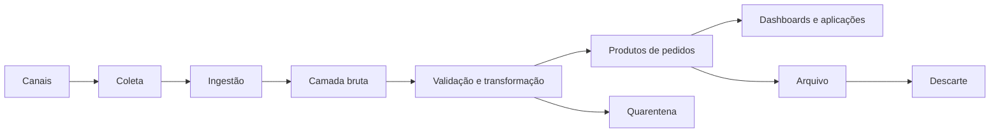

# 12 — Perguntas de Entrevista

> [!abstract]
> Esta revisão reúne perguntas conceituais e situações práticas recorrentes em entrevistas de Engenharia de Dados. O objetivo é exercitar raciocínio e comunicação técnica, não memorizar frases.

---

## Como utilizar este capítulo

Para cada pergunta:

1. responda sem consultar o material;
2. apresente primeiro o conceito;
3. explique a decisão ou mecanismo;
4. use um exemplo;
5. reconheça trade-offs e limitações.

> [!tip]
>
> Uma boa resposta de entrevista é objetiva, mas não superficial. Comece com a ideia central e aprofunde conforme as perguntas complementares.

---

## Nível 1 — Fundamentos

### 1. O que é o Ciclo de Vida dos Dados?

#### O que o entrevistador avalia

Compreensão sistêmica do caminho percorrido pelos dados.

#### Resposta esperada

É a jornada dos dados desde sua geração e coleta até ingestão, armazenamento, processamento, consumo, arquivamento e descarte. O ciclo também inclui controles transversais, como qualidade, segurança, metadados, governança e observabilidade.

Ele não é estritamente linear: dados podem ser reprocessados, reutilizados e gerar novos dados.

---

### 2. Qual é a diferença entre geração, coleta e ingestão?

#### Resposta esperada

- **Geração:** criação de uma representação de um fato ou evento.
- **Coleta:** captura dessa representação.
- **Ingestão:** transporte confiável da fonte para um destino controlado.

Um clique gera um evento, o código de instrumentação o coleta e um pipeline o ingere na plataforma.

---

### 3. Por que qualidade deve começar na origem?

#### Resposta esperada

Porque erros de identificação, horário, formato ou significado se propagam. Corrigir depois pode ser caro ou impossível quando o contexto original foi perdido. Validação na origem não elimina controles posteriores, mas reduz ambiguidade e retrabalho.

---

### 4. Quais controles atravessam todo o ciclo?

#### Resposta esperada

- qualidade;
- segurança;
- privacidade;
- metadados;
- linhagem;
- observabilidade;
- governança.

Uma resposta forte explica que esses controles mudam de implementação em cada etapa, mas não deixam de existir.

---

### 5. Qual é a diferença entre dados ativos, arquivados e descartados?

#### Resposta esperada

Dados ativos atendem usos recorrentes. Dados arquivados são pouco acessados, mas permanecem íntegros e recuperáveis. Dados descartados atingiram sua destinação final e não devem continuar disponíveis além das exceções autorizadas.

---

## Nível 2 — Ingestão e armazenamento

### 6. Quando escolher ingestão batch ou streaming?

#### O que o entrevistador avalia

Capacidade de decidir a partir de requisitos, e não de preferência por ferramentas.

#### Resposta esperada

Batch é apropriado quando dados podem ser processados em conjuntos e a latência aceita minutos ou horas. Streaming é indicado quando eventos precisam ser tratados continuamente e atrasos reduzem o valor da decisão.

A escolha considera latência, volume, custo, complexidade operacional, ordenação, estado e reprocessamento. Uma arquitetura pode combinar ambos.

#### Pergunta complementar

Um relatório usado somente às 8h precisa de streaming?

Não necessariamente. Uma carga batch concluída antes do horário pode atender com menor complexidade.

---

### 7. Como evitar perda ou duplicidade durante a ingestão?

#### Resposta esperada

Uma estratégia pode combinar:

- identificadores únicos;
- persistência antes da confirmação;
- checkpoints;
- deduplicação;
- operações idempotentes;
- controle de arquivos ou eventos recebidos;
- retentativas limitadas;
- métricas e reconciliação.

Garantias dependem das capacidades de origem, transporte e destino. Declarar “exactly once” sem delimitar o escopo é insuficiente.

---

### 8. Por que preservar uma camada bruta?

#### Resposta esperada

Ela possibilita auditoria, investigação, novas transformações e reprocessamento após correção de regras. Entretanto, aumenta custo e risco, portanto precisa de acesso restrito, metadados e retenção definida.

---

### 9. Como escolher uma tecnologia de armazenamento?

#### Resposta esperada

A decisão considera estrutura, volume, padrões de acesso, consistência, latência, concorrência, durabilidade, escalabilidade, segurança, recuperação, custo e retenção.

Não existe armazenamento universal. Bancos transacionais, armazenamento de objetos e plataformas analíticas resolvem problemas diferentes.

---

## Nível 3 — Processamento

### 10. Qual é a diferença entre [[ETL]] e [[ELT]]?

#### Resposta esperada

No ETL, os dados são extraídos, transformados e depois carregados no destino. No ELT, são extraídos, carregados e transformados utilizando a plataforma de destino.

Os padrões podem coexistir: validações mínimas podem ocorrer antes da carga e transformações analíticas depois dela.

---

### 11. O que é idempotência e por que ela importa?

#### Resposta esperada

Uma operação idempotente pode ser repetida com a mesma entrada sem produzir efeitos adicionais indevidos. Isso é importante porque falhas e retentativas são esperadas.

Exemplos incluem substituir uma partição, atualizar pela chave do negócio ou registrar entradas já processadas.

---

### 12. Qual é a diferença entre carga completa e incremental?

#### Resposta esperada

A carga completa processa novamente todo o escopo. É simples, mas pode se tornar cara. A incremental processa somente mudanças desde uma referência, reduzindo trabalho, mas exigindo controle de estado, atualizações, exclusões, atrasos e períodos perdidos.

---

### 13. Como lidar com eventos atrasados ou fora de ordem?

#### Resposta esperada

É necessário diferenciar horário do evento de horário de processamento, definir tolerância, manter estado quando necessário e permitir correções de resultados já publicados. Estratégias incluem janelas, marca-d'água, versionamento e reprocessamento das partições afetadas.

A regra depende do domínio: um cancelamento atrasado pode exigir correção financeira, mesmo depois do fechamento inicial.

---

## Nível 4 — Consumo e governança

### 14. O que transforma uma tabela em um produto de dados?

#### Resposta esperada

Um produto possui propósito, consumidores, responsável, documentação, significado, regras de qualidade, forma de acesso, política de mudanças e nível de serviço. Uma tabela sem contexto é apenas um objeto técnico.

---

### 15. O que é um contrato de dados?

#### Resposta esperada

É uma definição explícita das expectativas entre produtor e consumidor, incluindo schema, semântica, chaves, nulidade, atualização, qualidade, segurança, compatibilidade e responsáveis.

Ele não impede mudanças; cria um processo previsível para versioná-las e comunicá-las.

---

### 16. Como evitar métricas contraditórias entre dashboards?

#### Resposta esperada

- definir métricas e dimensões em uma camada semântica ou fonte certificada;
- documentar filtros, períodos e regras;
- atribuir responsável;
- testar reconciliação;
- versionar mudanças;
- fazer os dashboards reutilizarem a mesma definição.

O problema costuma ser semântico, não apenas técnico.

---

### 17. Qual é a diferença entre SLI, SLO e SLA?

#### Resposta esperada

- **SLI:** indicador observado, como atraso ou disponibilidade.
- **SLO:** objetivo definido para esse indicador.
- **SLA:** compromisso formal entre partes, quando aplicável.

Exemplo: atraso é o SLI; dados disponíveis até 7h em 99% dos dias é o SLO.

---

## Nível 5 — Retenção e descarte

### 18. O que uma política de retenção deve definir?

#### Resposta esperada

Categoria, responsável, finalidade ou fundamento, evento inicial da contagem, período, localizações abrangidas, condição de arquivamento, exceções, método de descarte e evidências.

“Reter por cinco anos” é ambíguo sem definir quando a contagem começa.

---

### 19. Exclusão lógica significa que o dado foi descartado?

#### Resposta esperada

Não. A exclusão lógica normalmente oculta ou marca o registro, mas o conteúdo permanece armazenado. O descarte pode exigir remoção física de versões, réplicas, caches, exports e outros derivados.

---

### 20. Como tratar dados excluídos que ainda existem em backups?

#### Resposta esperada

Uma política coerente restringe o uso dos backups, define uma janela de expiração, impede retenção indefinida e reaplica exclusões quando ocorre restauração. A abordagem deve ser documentada e compatível com requisitos de recuperação e descarte.

---

### 21. O que é legal hold?

#### Resposta esperada

É a suspensão autorizada do descarte de dados relevantes para uma investigação, auditoria ou disputa. Deve ter escopo, responsável, proteção contra expiração automática, revisão e critério de encerramento.

---

## Perguntas de cenário

### 22. Um dashboard apresenta metade das vendas esperadas, mas o pipeline terminou com sucesso. Como investigar?

#### Resposta esperada

Uma investigação estruturada deve:

1. confirmar período, filtros e definição da métrica;
2. comparar volume produzido por cada fonte;
3. verificar atraso e completude da ingestão;
4. analisar rejeições e quarentena;
5. validar transformações e joins;
6. reconciliar produto, camada bruta e sistema de origem;
7. consultar linhagem, versão e métricas da execução;
8. identificar consumidores afetados antes de republicar.

O sucesso técnico da execução não comprova completude do dado.

---

### 23. Uma fonte reenviou o mesmo arquivo após uma falha. O que você faria?

#### Resposta esperada

Verificaria identificador, checksum e controle de recebimento. Se o conteúdo já tiver sido processado, evitaria duplicação. Se a execução anterior foi parcial, retomaria ou reprocessaria de forma idempotente e reconciliaria as contagens.

Depois investigaria por que a confirmação falhou e se os alertas foram suficientes.

---

### 24. Uma área solicita acesso a todos os dados de clientes para criar um relatório agregado. Como responder?

#### Resposta esperada

Primeiro entenderia a finalidade e os campos realmente necessários. Para um relatório agregado, ofereceria um produto com granularidade e atributos mínimos, sem expor identificadores pessoais desnecessários. Também definiria autorização, prazo, auditoria e restrições de reutilização.

---

### 25. Uma regra de negócio mudou e dois anos precisam ser recalculados. Como planejar o backfill?

#### Resposta esperada

Confirmaria a versão da regra, disponibilidade e imutabilidade das entradas, particionamento, dependências, custo e consumidores. Executaria em escopo controlado, com testes, idempotência, métricas e reconciliação. A publicação precisaria ser atômica ou versionada, com comunicação do impacto.

---

## Pergunta de arquitetura

### 26. Desenhe o ciclo de vida de pedidos de uma empresa varejista

Uma resposta consistente deve incluir:

Além do desenho, explique:

- contratos e identificadores;
- batch versus streaming;
- deduplicação e eventos atrasados;
- segurança e minimização;
- qualidade e observabilidade;
- retenção e recuperação;
- responsáveis e consumidores.

---

## Autoavaliação

| Tema | Consigo explicar | Consigo aplicar em cenário |
| --- | :---: | :---: |
| Etapas do ciclo | ☐ | ☐ |
| Batch e streaming | ☐ | ☐ |
| Idempotência e backfill | ☐ | ☐ |
| Produtos e contratos | ☐ | ☐ |
| Qualidade e observabilidade | ☐ | ☐ |
| Retenção e descarte | ☐ | ☐ |

---

## Dicas para entrevistas

- Responda primeiro à pergunta central.
- Explique pressupostos antes de escolher uma solução.
- Diferencie requisito de tecnologia.
- Use exemplos com falhas e recuperação.
- Discuta custo, risco e complexidade.
- Evite garantias absolutas sem delimitar o escopo.
- Admita informações ausentes e faça perguntas de clarificação.

> [!success]
> Se você consegue justificar as respostas e adaptar os conceitos aos cenários, já demonstra uma compreensão mais útil do que a simples memorização das etapas.

---

## Próximo Capítulo

➡️ [[13-Exercicios|13 — Exercícios]]
