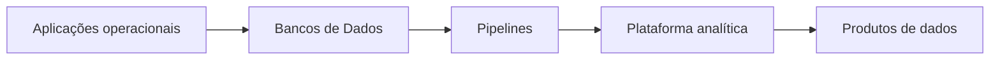

# 02 — Introdução

## O problema da persistência organizada

Aplicações precisam lembrar clientes, pedidos, saldos e eventos depois que um processo termina. Arquivos permitem persistência, mas deixam para cada aplicação responsabilidades difíceis: concorrência, busca, integridade, segurança, recuperação e evolução estrutural.

Um Banco de Dados oferece uma representação organizada. Um SGBD controla o acesso a essa representação e implementa mecanismos reutilizáveis.

## Por que não usar apenas arquivos?

Considere dois caixas alterando o mesmo estoque. Sem coordenação, ambos podem ler dez unidades, vender oito e gravar dois, embora dezesseis tenham sido vendidos. Também é necessário recuperar uma gravação interrompida e impedir acesso indevido.

SGBDs centralizam políticas para:

- concorrência;
- integridade;
- transações;
- consulta;
- segurança;
- backup e recuperação;
- metadados.

## Banco de Dados em Engenharia de Dados

Engenheiros de Dados interagem com Bancos de Dados como fontes, destinos e componentes operacionais. Precisam extrair sem prejudicar aplicações, preservar tipos e chaves, tratar mudanças e escolher tecnologias adequadas.

## Uma família de soluções

“Banco de Dados” não significa somente tabelas relacionais. Documentos, grafos, chave-valor e séries temporais atendem padrões diferentes. A escolha deve começar por requisitos, não pela popularidade de uma ferramenta.

## Questões orientadoras

- Qual é o modelo dos dados?
- Quais garantias de consistência são necessárias?
- Como os dados serão consultados?
- Qual é o volume e a taxa de mudança?
- Quantos usuários concorrem?
- Qual falha pode ser tolerada?
- Como ocorrerão recuperação e retenção?

## Próximo Capítulo

➡️ [[03-O-que-e-um-Banco-de-Dados|03 — O que é um Banco de Dados]]
