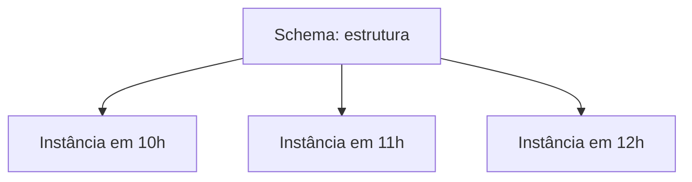

# 03 — O que é um Banco de Dados

## Definição

> [!definition]
> Um **Banco de Dados** é uma coleção persistente e organizada de dados relacionados, criada para representar um domínio e atender usos conhecidos.

A coleção possui significado. Uma pasta aleatória de arquivos não se torna um Banco de Dados apenas porque contém informações.

## Banco de Dados e SGBD

O Banco de Dados é o conteúdo organizado. O **Sistema Gerenciador de Banco de Dados (SGBD)** é o software que define, consulta, modifica, protege e recupera esse conteúdo.

| Conceito | Exemplo |
| --- | --- |
| Banco de Dados | clientes, pedidos e produtos |
| SGBD | PostgreSQL, MySQL ou outro gerenciador |
| Aplicação | sistema de vendas que usa o SGBD |

## Schema e instância

O **schema** descreve estrutura, tipos, restrições e relacionamentos. A **instância** é o conjunto de valores existente em determinado momento.

O schema muda com menor frequência; a instância muda a cada inserção, atualização ou exclusão.

## Catálogo e metadados

O catálogo registra objetos, colunas, tipos, restrições, índices, permissões e estatísticas. O próprio SGBD consulta esses metadados para validar operações e planejar consultas.

## Abstração

Sistemas de Bancos de Dados separam níveis:

- **externo:** visões de usuários e aplicações;
- **lógico:** entidades, atributos e relacionamentos;
- **físico:** páginas, arquivos e estruturas de acesso.

Essa separação permite alterar detalhes físicos sem reescrever toda aplicação, propriedade chamada **independência física de dados**. Independência lógica reduz o impacto de mudanças no modelo lógico sobre visões externas, embora seja mais difícil de alcançar.

## Integridade

Restrições preservam regras como:

- chave única;
- campo obrigatório;
- referência a registro existente;
- domínio permitido;
- regra entre valores.

Garantir integridade no Banco de Dados protege múltiplos consumidores, não apenas uma aplicação.

## Boas práticas

- Definir propósito e domínio.
- Usar tipos e restrições coerentes.
- Documentar significado e responsáveis.
- Separar modelo lógico de decisões físicas.
- Não tratar o SGBD como armazenamento sem regras.

## Erros comuns

- confundir Banco de Dados com SGBD;
- depender somente da aplicação para integridade;
- usar textos para todos os tipos;
- criar objetos sem convenção ou responsável;
- expor estrutura física diretamente aos consumidores.

## Próximo Capítulo

➡️ [[04-Sistemas-Gerenciadores-de-Bancos-de-Dados|04 — Sistemas Gerenciadores de Bancos de Dados]]
