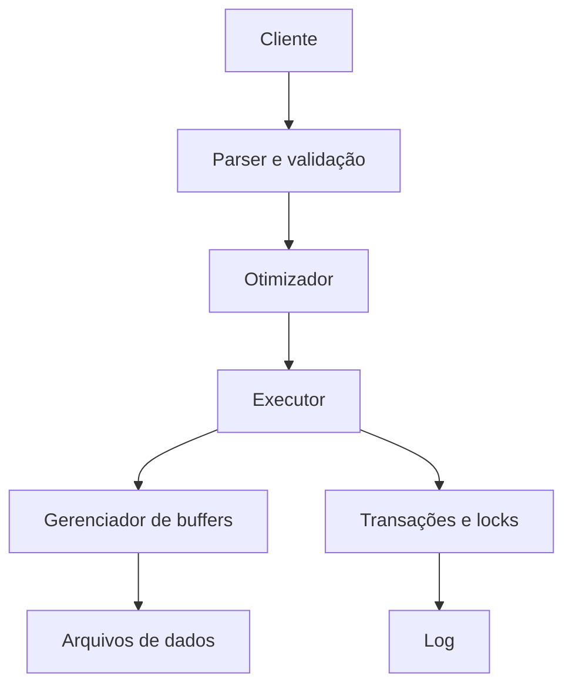

# 04 — Sistemas Gerenciadores de Bancos de Dados

## O papel do SGBD

Um SGBD recebe comandos de aplicações e usuários, valida permissões e regras, escolhe estratégias de execução, coordena concorrência, persiste alterações e recupera o estado após falhas.

## Processador de consultas

O parser interpreta o comando. O validador resolve objetos, tipos e permissões. O otimizador compara planos possíveis. O executor percorre operadores como leitura, filtro, junção, ordenação e agregação.

## Gerenciador de armazenamento

Organiza arquivos, páginas, registros e índices. O buffer mantém páginas frequentes em memória e decide quando ler ou gravar no armazenamento persistente.

## Gerenciador de transações

Coordena unidades de trabalho concorrentes e preserva garantias mesmo quando operações falham. Pode utilizar locks, versões de registros ou combinações de técnicas.

## Recuperação

O log registra informações necessárias para refazer alterações confirmadas ou desfazer efeitos incompletos. Checkpoints reduzem o trecho de histórico examinado após reinício.

## Segurança

Autenticação identifica; autorização limita operações. Auditoria registra ações relevantes. Criptografia e gestão de segredos complementam, mas não substituem menor privilégio.

## Administração

O SGBD oferece mecanismos para:

- backup e restauração;
- monitoramento;
- estatísticas;
- manutenção de índices;
- replicação;
- configuração de recursos;
- gestão de usuários.

## Sistemas embarcados, cliente-servidor e distribuídos

Um SGBD embarcado executa dentro da aplicação. Um sistema cliente-servidor centraliza o serviço. Um sistema distribuído coordena dados em vários nós. Cada modelo altera operação, latência e falhas possíveis.

## Boas práticas

- Conhecer garantias reais do produto.
- Monitorar capacidade, latência e erros.
- Testar restauração, não apenas backup.
- Aplicar menor privilégio.
- Planejar mudanças de schema.

## Erros comuns

- ignorar limites de conexão;
- operar sem backup testado;
- conceder privilégios amplos;
- presumir que todo comando eficiente em um ambiente escala para outro;
- confundir replicação com backup.

## Próximo Capítulo

➡️ [[05-Modelos-de-Bancos-de-Dados|05 — Modelos de Bancos de Dados]]
