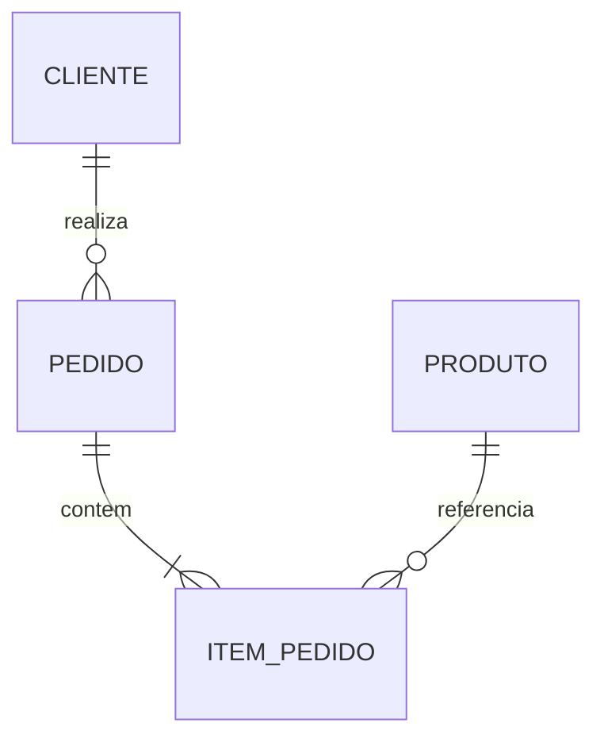

# 05 — Modelos de Bancos de Dados

## O que é um modelo de dados?

Um modelo define como informações, relacionamentos e operações são representados. Ele influencia integridade, consultas, evolução e distribuição.

## Modelo relacional

Representa dados em relações compostas por linhas e atributos. Chaves identificam registros e conectam relações. Restrições preservam regras; álgebra relacional fundamenta operações de consulta.

É adequado quando consistência, relações e consultas flexíveis são centrais.

## Chave-valor

Associa uma chave única a um valor opaco ou pouco interpretado pelo gerenciador. Favorece acesso direto, cache, sessões e configurações. Consultas por atributos internos tendem a ser limitadas.

## Documentos

Armazena documentos com estrutura hierárquica, frequentemente semelhante a JSON. Favorece agregados recuperados juntos e evolução flexível. Duplicação e consistência entre documentos exigem atenção.

## Família de colunas

Organiza valores por chaves e famílias de colunas, com foco em distribuição e grandes volumes. O desenho costuma partir dos padrões de consulta.

## Grafos

Representa vértices, arestas e propriedades. É apropriado quando percorrer relacionamentos é a operação dominante, como fraude, redes e recomendações.

## Séries temporais

Otimiza dados indexados pelo tempo, ingestão contínua, janelas, agregações e retenção. Métricas e sensores são exemplos.

## Comparação

| Modelo | Força | Limitação típica |
| --- | --- | --- |
| Relacional | integridade e consultas | escalabilidade distribuída exige desenho |
| Chave-valor | acesso por chave | consulta secundária limitada |
| Documento | agregados flexíveis | relações globais complexas |
| Colunas | escala e distribuição | modelagem orientada à consulta |
| Grafo | travessias | agregações tabulares podem ser inadequadas |
| Temporal | tempo e retenção | uso geral limitado |

## Persistência poliglota

Uma organização pode usar modelos diferentes por carga. Isso reduz compromissos inadequados, mas aumenta operação, integração, competências e governança.

> [!important]
> “NoSQL” não significa ausência de schema ou consistência. O schema pode estar implícito na aplicação, e as garantias variam entre produtos.

## Boas práticas

- Começar por padrões de acesso e garantias.
- Modelar evolução e retenção.
- Avaliar operação e recuperação.
- Evitar multiplicar tecnologias sem benefício claro.

## Erros comuns

- escolher por tendência;
- usar documento para esconder modelagem deficiente;
- presumir que flexibilidade elimina governança;
- ignorar consultas futuras e migração.

## Próximo Capítulo

➡️ [[06-Arquitetura-e-Armazenamento-Interno|06 — Arquitetura e Armazenamento Interno]]
