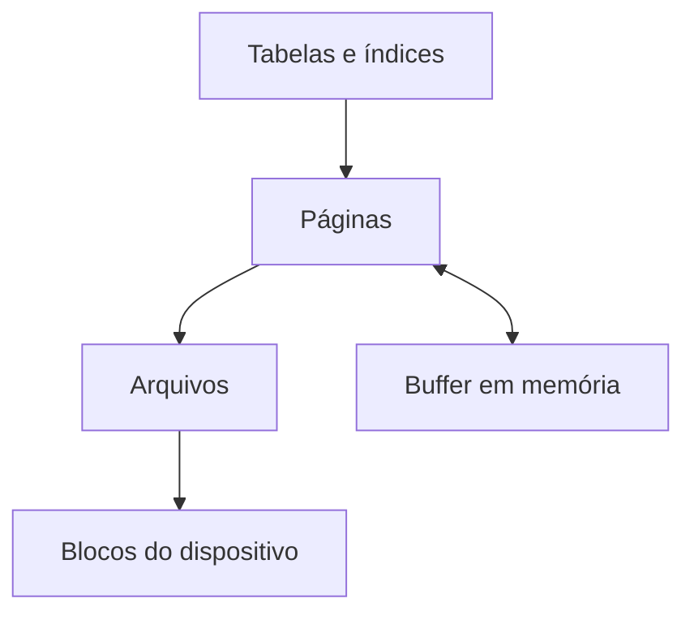
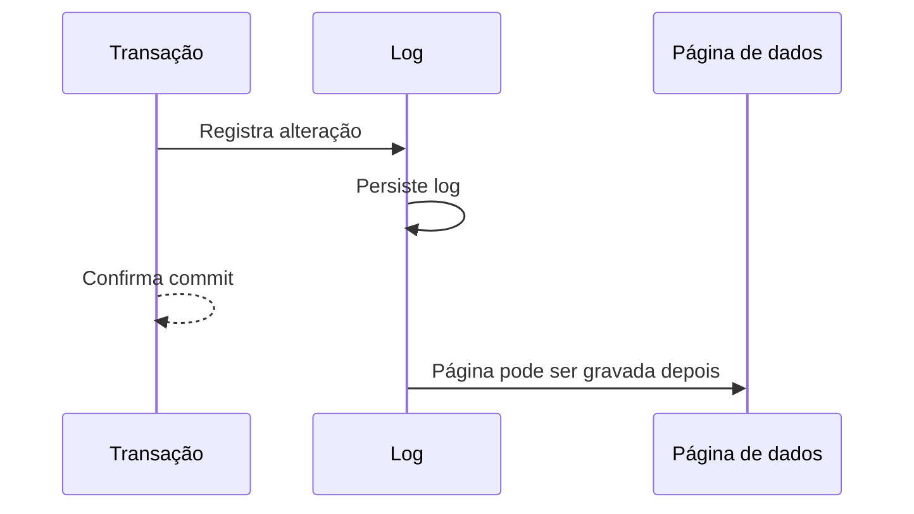

# 06 — Arquitetura e Armazenamento Interno

## Da consulta ao dispositivo

O SGBD apresenta objetos lógicos, mas persiste bytes em arquivos ou volumes. Entre esses níveis existem páginas, registros, buffers e estruturas de acesso.

## Páginas

A página é uma unidade de leitura, gravação e cache. Contém cabeçalho, registros e espaço livre. Ler uma única linha pode exigir carregar sua página inteira.

Registros de tamanho variável precisam de diretórios ou ponteiros. Atualizações podem caber na página, mover dados ou criar versões.

## Organização de arquivos

Um heap mantém registros sem ordem física obrigatória. Estruturas ordenadas favorecem intervalos, enquanto hashing favorece igualdade. A organização altera custo de inserção e leitura.

## Buffer pool

Como memória é mais rápida que armazenamento persistente, o gerenciador mantém páginas frequentes em cache. Políticas de substituição decidem quais páginas remover. Páginas alteradas e ainda não persistidas são chamadas de sujas.

## Write-Ahead Log

No Write-Ahead Logging (WAL), o registro necessário à recuperação deve chegar ao log persistente antes da página de dados correspondente. Isso permite refazer mudanças confirmadas após falha.

## Checkpoints

Checkpoints registram um ponto de referência para limitar o trabalho de recuperação. Não significam que todo histórico anterior pode ser descartado imediatamente; isso depende de backups, replicação e transações ativas.

## Armazenamento por linha e por coluna

Orientação por linha favorece operações que acessam muitos atributos de poucos registros. Orientação por coluna favorece análises de poucos atributos sobre muitas linhas, compressão e vetorização.

## Durabilidade e falhas

Disco, processo, sistema operacional ou nó podem falhar. Durabilidade depende do caminho completo: buffers, cache do dispositivo, log, configuração de sincronização e replicação.

## Boas práticas

- Dimensionar memória e I/O pela carga.
- Monitorar cache, latência e crescimento.
- Entender garantias de persistência.
- Separar backup de replicação.
- Testar recuperação.

## Erros comuns

- imaginar que cada linha é um arquivo;
- ignorar amplificação de escrita;
- assumir que commit sempre espera a mesma persistência;
- tratar cache como origem durável.

## Próximo Capítulo

➡️ [[07-Transacoes-e-Propriedades-ACID|07 — Transações e Propriedades ACID]]
