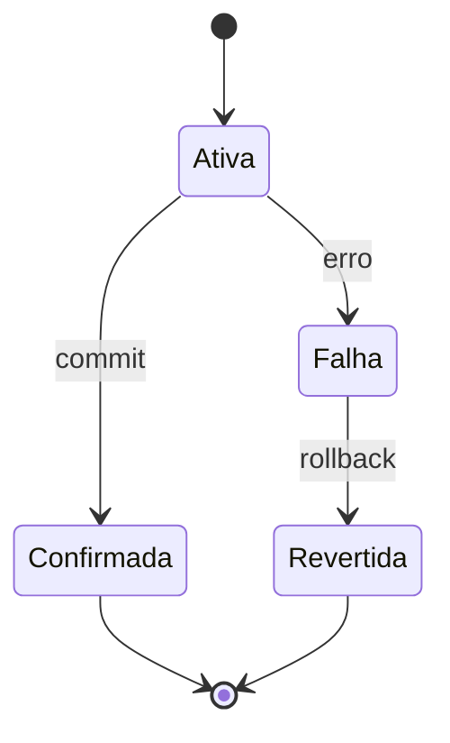

# 07 — Transações e Propriedades ACID

## Unidade de trabalho

Uma transação agrupa operações que devem ser tratadas como uma unidade. Transferir saldo exige debitar uma conta e creditar outra; aplicar apenas metade viola a regra do domínio.

```sql
BEGIN;
UPDATE contas SET saldo = saldo - 100 WHERE conta_id = 1;
UPDATE contas SET saldo = saldo + 100 WHERE conta_id = 2;
COMMIT;
```

## Atomicidade

Todas as operações produzem efeito ou nenhuma produz. Em falha, o SGBD desfaz ou ignora alterações incompletas.

## Consistência

Uma transação leva o Banco de Dados de um estado válido para outro, respeitando restrições definidas. O SGBD preserva regras declaradas; não inventa regras de negócio ausentes.

## Isolamento

Transações concorrentes não devem observar interferências incompatíveis com o nível escolhido. Isolamento completo se aproxima de uma execução serial, mas pode reduzir concorrência.

## Durabilidade

Depois do commit confirmado, o resultado deve sobreviver às falhas cobertas pela garantia do sistema. Log, sincronização, replicação e configuração influenciam essa propriedade.

## Estados



## Autocommit e fronteiras

Em autocommit, cada comando forma uma transação. Para regras com várias operações, a aplicação deve declarar a fronteira adequada. Transações longas retêm recursos e ampliam conflitos.

## Savepoints

Savepoints permitem reverter parte do trabalho sem encerrar toda a transação, quando suportados.

## Transações distribuídas

Coordenar atomicidade entre serviços ou Bancos de Dados introduz falhas de rede e participantes indisponíveis. Protocolos de commit e padrões de compensação possuem trade-offs; uma transação local não se estende automaticamente a todo sistema.

## Boas práticas

- Manter transações curtas.
- Definir fronteiras pela regra de negócio.
- Tratar falhas e retentativas.
- Não realizar interação humana dentro da transação.
- Conhecer garantias do driver e do SGBD.

## Erros comuns

- confundir consistência ACID com dados sempre corretos;
- esquecer rollback em exceções;
- manter transações abertas;
- presumir atomicidade entre sistemas independentes.

## Próximo Capítulo

➡️ [[08-Concorrencia-Isolamento-e-Recuperacao|08 — Concorrência, Isolamento e Recuperação]]
