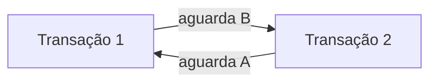

# 08 — Concorrência, Isolamento e Recuperação

## Por que controlar concorrência?

Múltiplas sessões aumentam capacidade, mas podem interferir. O objetivo é equilibrar correção e paralelismo.

## Anomalias

- **leitura suja:** observa alteração ainda não confirmada;
- **leitura não repetível:** a mesma linha muda entre leituras;
- **fantasma:** a repetição de um predicado retorna linhas diferentes;
- **atualização perdida:** uma escrita sobrescreve outra sem incorporar seu efeito;
- **write skew:** decisões sobre versões consistentes separadamente violam uma regra conjunta.

## Níveis de isolamento

| Nível conceitual | Garantia crescente | Custo possível |
| --- | --- | --- |
| Read Uncommitted | mínima | anomalias amplas |
| Read Committed | evita leitura suja | leituras podem mudar |
| Repeatable Read | estabiliza leituras | conflitos maiores |
| Serializable | efeito equivalente a ordem serial | bloqueio ou abortos |

Implementações diferem entre SGBDs; o nome do nível não basta para inferir todas as anomalias.

## Locks

Locks compartilhados permitem leituras compatíveis; exclusivos protegem escrita. Granularidade pode ser linha, página, tabela ou intervalo.

Deadlock ocorre quando transações aguardam recursos umas das outras.

O SGBD detecta e aborta uma participante; a aplicação precisa estar preparada para repetir.

## MVCC

Multi-Version Concurrency Control mantém versões para que leituras obtenham snapshots sem bloquear todas as escritas. Versões antigas precisam ser limpas, e conflitos de escrita continuam possíveis.

## Concorrência otimista

A operação verifica se a versão lida ainda é atual antes de gravar. Funciona bem com poucos conflitos e exige tratamento de falha.

## Recuperação

Após falha, o SGBD usa log e páginas persistidas para refazer transações confirmadas e impedir efeitos de incompletas. Backups cobrem perdas além da recuperação local.

Objetivos importantes:

- **RPO:** quantidade de dados que pode ser perdida;
- **RTO:** tempo aceitável para restaurar o serviço.

## Boas práticas

- Escolher isolamento pela anomalia intolerável.
- Acessar recursos em ordem consistente.
- Repetir transações abortadas com limites.
- Monitorar locks e transações longas.
- Testar restauração segundo RPO e RTO.

## Erros comuns

- aumentar isolamento sem medir impacto;
- ignorar deadlocks;
- usar locks de aplicação sem expiração;
- considerar réplica um backup;
- definir RPO/RTO sem testes.

## Próximo Capítulo

➡️ [[09-Indices-Consultas-e-Desempenho|09 — Índices, Consultas e Desempenho]]
