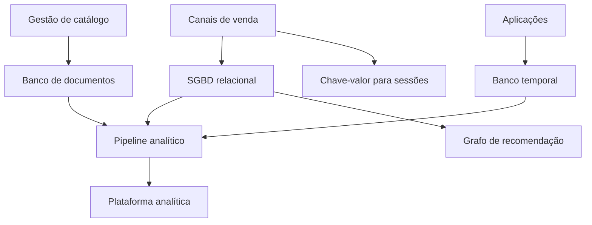

# 10 — Estudo de Caso: Bancos de Dados na DataRetail S.A.

## Cenário

A DataRetail S.A. cresceu usando um único Banco de Dados relacional para pedidos, catálogo, sessões, telemetria e relatórios. A solução simplificou o início, mas cargas diferentes passaram a competir por recursos.

Problemas observados:

- relatórios longos afetam o checkout;
- sessões geram alto volume de leituras por chave;
- catálogo contém atributos variáveis;
- eventos de navegação crescem continuamente;
- recomendações precisam percorrer relações entre clientes e produtos;
- backups não atingem o RTO esperado.

## Requisitos por domínio

| Domínio | Operação dominante | Garantia central |
| --- | --- | --- |
| Pedidos e pagamentos | transações curtas | consistência e integridade |
| Catálogo | leitura de agregados flexíveis | evolução estrutural |
| Sessões | acesso por chave com expiração | baixa latência |
| Telemetria | escrita temporal contínua | retenção e agregação |
| Recomendação | travessia de relações | consultas de grafo |
| Analytics | leitura de grandes conjuntos | isolamento da operação |

## Decisão arquitetural

A equipe evita substituir tudo de uma vez. Mantém pedidos no SGBD relacional e cria componentes especializados apenas onde o benefício compensa a complexidade.



## Pedidos e pagamentos

O pedido utiliza transação para cabeçalho, itens, reserva e estado do pagamento. Chaves estrangeiras e restrições protegem referências. Idempotência impede pedido duplicado após retentativa.

Uma transação local não inclui serviços externos. Confirmações de pagamento chegam por eventos e atualizam o estado com chave idempotente.

## Catálogo

Produtos compartilham atributos obrigatórios, mas categorias possuem detalhes diferentes. Documentos agrupam atributos consultados juntos. A equipe mantém validação de schema por versão; flexibilidade não significa ausência de contrato.

## Sessões

Sessões são acessadas por token, possuem vida curta e toleram reconstrução. Um Banco de Dados chave-valor com expiração atende melhor que joins complexos.

## Telemetria

Eventos são indexados por tempo e origem, agregados em janelas e expirados por retenção. A carga não é misturada às transações de pedidos.

## Analytics

Consultas analíticas leem réplicas ou produtos derivados, sem concorrer diretamente com o checkout. A replicação reduz carga de leitura, mas não substitui backups.

## Concorrência no estoque

Duas compras tentam reservar a última unidade. A atualização precisa verificar disponibilidade atomicamente.

```sql
UPDATE estoque
SET quantidade = quantidade - 1
WHERE produto_id = 900
  AND quantidade >= 1;
```

Se nenhuma linha for alterada, a reserva falha. A aplicação não deve ler e gravar em operações independentes sem controle.

## Índices

Pedidos são consultados por cliente e data; um índice composto pode apoiar esse padrão. Índices adicionais são aprovados após análise de plano, seletividade e custo de escrita.

## Recuperação

Cada componente recebe RPO, RTO, backup e teste de restauração coerentes. Dados de sessão podem ser reconstruídos; pedidos exigem proteção mais rigorosa.

## Trade-offs

Persistência poliglota melhora adequação, mas aumenta:

- tecnologias operadas;
- integração e observabilidade;
- políticas de segurança;
- backups e recuperação;
- competências da equipe.

Por isso, uma nova tecnologia exige carga significativa e benefício mensurável.

## Critérios de aceite

- checkout isolado de consultas analíticas;
- integridade de pedidos preservada;
- retentativas sem duplicação;
- contratos versionados;
- planos críticos medidos;
- restauração testada;
- responsáveis e níveis de serviço definidos.

## Lições

O melhor Banco de Dados depende da carga. Consistência, acesso, escala, recuperação e capacidade operacional devem ser avaliados juntos.

## Próximo Capítulo

➡️ [[11-Resumo|11 — Resumo]]
