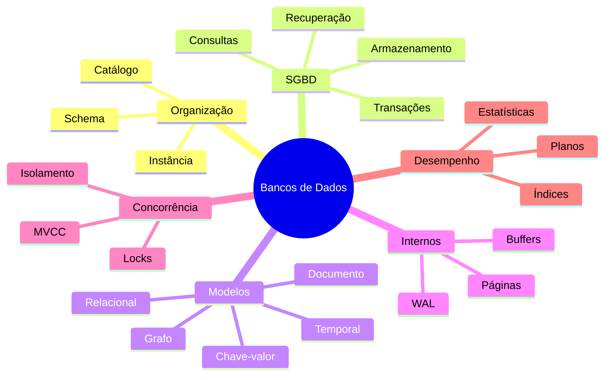

# 11 — Resumo

## Mapa do módulo

## Conceitos essenciais

- Banco de Dados é a coleção persistente e organizada; SGBD é o software gerenciador.
- Schema define estrutura; instância representa valores em um momento.
- Catálogo contém metadados usados por pessoas e pelo próprio sistema.
- Abstração separa visões externas, modelo lógico e armazenamento físico.
- Modelos diferentes atendem padrões de acesso diferentes.
- Páginas são unidades de I/O e buffers aproximam dados da CPU.
- WAL registra alterações antes das páginas correspondentes.
- ACID reúne atomicidade, consistência, isolamento e durabilidade.
- Locks, versões e validação coordenam concorrência.
- Índices aceleram acessos específicos ao custo de espaço e escrita.
- O otimizador escolhe planos usando estimativas e estatísticas.

## Matriz de decisões

| Questão | Efeito no desenho |
| --- | --- |
| Relações e integridade fortes? | favorece modelo relacional |
| Acesso somente por chave? | chave-valor pode ser adequado |
| Agregado hierárquico variável? | documento pode reduzir reconstrução |
| Travessias profundas? | grafo pode favorecer consultas |
| Eventos ordenados pelo tempo? | temporal pode otimizar retenção |
| Escrita intensa? | limitar índices e medir contenção |
| RPO/RTO rigorosos? | reforçar log, backup, réplica e testes |

## Checklist

- [ ] Domínio e padrões de acesso conhecidos.
- [ ] Garantias de consistência explícitas.
- [ ] Schema, chaves e restrições definidos.
- [ ] Fronteiras transacionais documentadas.
- [ ] Isolamento escolhido pelas anomalias intoleráveis.
- [ ] Índices justificados por planos reais.
- [ ] Crescimento e retenção planejados.
- [ ] Backup e restauração testados.
- [ ] Segurança e observabilidade implementadas.
- [ ] Complexidade operacional aceita pela equipe.

## Síntese

> [!summary]
> Bancos de Dados são sistemas de compromissos. Nenhum modelo maximiza simultaneamente flexibilidade, integridade, latência, escala e simplicidade. Engenharia começa por requisitos e valida as decisões por comportamento observável.

## Próximo Capítulo

➡️ [[12-Perguntas-de-Entrevista|12 — Perguntas de Entrevista]]
