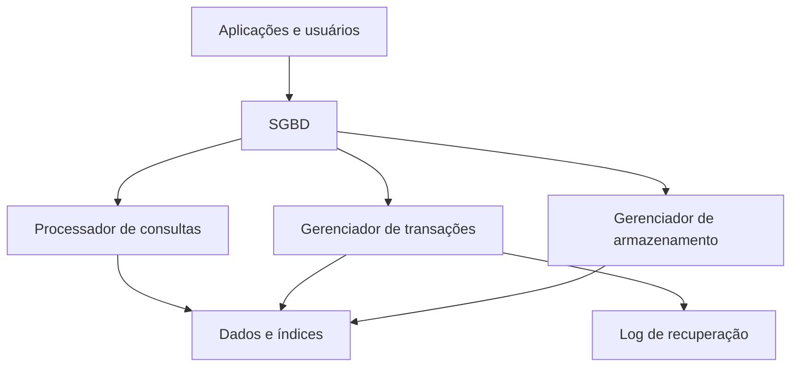

# Módulo 03 — Bancos de Dados

> [!abstract]
> Bancos de Dados organizam, preservam e disponibilizam informações sob regras explícitas. Este módulo apresenta os fundamentos que permanecem válidos entre tecnologias: modelos, arquitetura interna, transações, concorrência, recuperação, índices e distribuição.

## Objetivos do módulo

- compreender por que Bancos de Dados existem;
- distinguir Banco de Dados de Sistema Gerenciador de Banco de Dados (SGBD);
- comparar modelos relacionais e não relacionais;
- compreender armazenamento, páginas, buffers e logs;
- explicar propriedades ACID, transações e isolamento;
- reconhecer índices, planos e custos de consulta;
- analisar replicação, particionamento e consistência distribuída;
- selecionar uma categoria de Banco de Dados por requisitos.

## Estrutura

### Fundamentos

- [[01-Objetivos]]
- [[02-Introducao]]
- [[03-O-que-e-um-Banco-de-Dados]]
- [[04-Sistemas-Gerenciadores-de-Bancos-de-Dados]]
- [[05-Modelos-de-Bancos-de-Dados]]
- [[06-Arquitetura-e-Armazenamento-Interno]]
- [[07-Transacoes-e-Propriedades-ACID]]
- [[08-Concorrencia-Isolamento-e-Recuperacao]]
- [[09-Indices-Consultas-e-Desempenho]]

### Aplicação e revisão

- [[10-Estudo-de-Caso-DataRetail]]
- [[11-Resumo]]
- [[12-Perguntas-de-Entrevista]]
- [[13-Exercicios]]
- [[13-Gabarito]]
- [[14-Laboratorio]]
- [[14-Solucao]]
- [[15-Referencias]]

## Mapa conceitual

## Limites do módulo

O foco é compreender mecanismos e decisões. Sintaxe SQL será aprofundada no Volume 04; modelagem no Volume 05; administração e implementação PostgreSQL no Volume 08.

## Projeto Integrador

A DataRetail S.A. precisa separar cargas transacionais, catálogo, eventos, cache e análise. O módulo mostrará por que diferentes requisitos podem levar a diferentes categorias de Banco de Dados.
