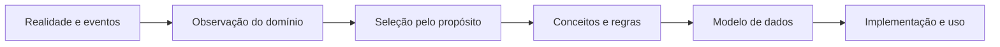
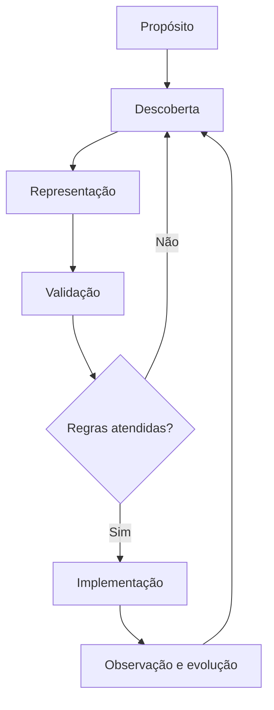
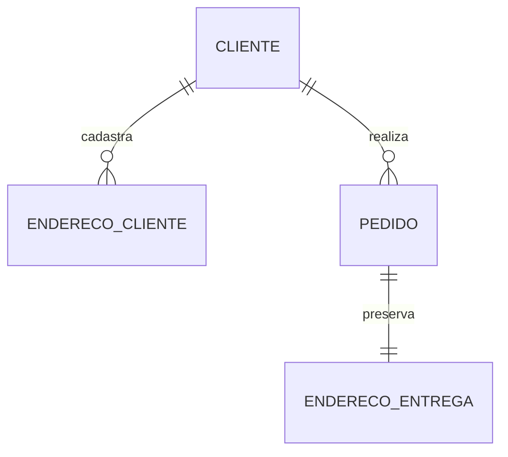

# 03 — O que é Modelagem de Dados

## Objetivos

Ao final deste capítulo, você deverá ser capaz de:

- definir Modelagem de Dados e modelo de dados;
- distinguir domínio, realidade observada, abstração e implementação;
- explicar por que propósito e escopo determinam o modelo;
- reconhecer os principais produtos e participantes da modelagem;
- avaliar um modelo por critérios técnicos e semânticos.

## Da realidade à representação

Organizações operam em um mundo contínuo e ambíguo, enquanto sistemas precisam de categorias e regras explícitas. Uma pessoa pode ser cliente em um processo, responsável financeiro em outro e destinatária em uma entrega. Modelar significa decidir quais dessas perspectivas importam para um propósito e como serão representadas.

**Modelagem de Dados** é o processo de descobrir, representar, validar e documentar conceitos, fatos, relações, regras e necessidades de uso de um domínio. Um **modelo de dados** é um dos resultados desse processo: uma representação estruturada que permite comunicar e implementar essas decisões.

> [!important]
> Modelagem é o processo; modelo é o artefato produzido. Um diagrama isolado não substitui descoberta, validação e documentação das regras.

## Abstração deliberada

Todo modelo omite detalhes. Um modelo de vendas pode preservar preço, quantidade e instante da compra, mas não a cor da tela usada pelo cliente. Essa omissão não é um defeito quando o detalhe está fora do propósito declarado.

A qualidade não depende de copiar toda a realidade. Depende de representar os elementos necessários com significado claro e precisão suficiente.

## Domínio, escopo e contexto

O **domínio** é a área de conhecimento e atividade considerada, como vendas, logística ou pagamentos. O **escopo** delimita quais partes serão modeladas. O **contexto** esclarece em qual processo os termos possuem determinado significado.

Na DataRetail S.A., a palavra “produto” pode representar:

- uma oferta comercial no catálogo;
- uma unidade física em estoque;
- um item vendido em um pedido;
- uma categoria usada em relatórios.

Tratar essas perspectivas como um único conceito pode apagar regras importantes. Separá-las sem necessidade também aumenta complexidade. A decisão exige conversar com especialistas e testar cenários reais.

## Modelo de dados e schema

Os termos são relacionados, mas não equivalentes.

| Elemento | Função |
| --- | --- |
| Modelo de dados | Representa conceitos, estrutura e regras em um nível de abstração |
| Schema | Declara uma estrutura formal aceita por um sistema ou formato |
| Instância | Conjunto de valores existentes em determinado momento |
| Metadados | Descrevem significado, estrutura, origem, responsabilidade e uso |

Um modelo lógico pode existir antes de qualquer schema. Um schema físico pode implementar somente parte das regras do modelo; outras podem permanecer em serviços, contratos ou processos operacionais. Quanto mais uma regra crítica puder ser declarada e verificada perto dos dados, menor a chance de consumidores divergirem.

## O que um modelo precisa comunicar

Um modelo útil explicita, conforme seu nível:

- conceitos relevantes e suas definições;
- propriedades e domínios de valores;
- identidades e chaves;
- relações, cardinalidades e opcionalidades;
- regras de integridade;
- eventos, estados e histórico;
- limites de responsabilidade;
- pressupostos e decisões;
- necessidades de consulta e mudança.

Diagramas ajudam a visualizar estrutura, mas não expressam sozinhos todas as restrições. Glossários, exemplos, decisões arquiteturais e cenários de validação complementam o modelo.

## Participantes da modelagem

Modelagem é uma atividade colaborativa.

| Participante | Contribuição principal |
| --- | --- |
| Especialista do domínio | significado, regras, exceções e linguagem do negócio |
| Product Owner ou responsável pelo processo | propósito, prioridade e limites |
| Arquiteto ou modelador | coerência, abstração e padrões |
| Engenharia de software | comportamento transacional e implementação |
| Engenharia de Dados | integração, histórico, contratos e consumo analítico |
| Governança e segurança | definição, responsabilidade, classificação e conformidade |
| Consumidor | consultas, decisões e interpretação esperada |

Um modelo desenhado apenas por uma área tende a refletir seus pressupostos locais. Revisões cruzadas revelam ambiguidades antes que se tornem incompatibilidades persistentes.

## Processo iterativo

Uma sequência prática de modelagem contém:

1. declarar propósito, consumidores e decisões apoiadas;
2. delimitar domínio, contexto e escopo;
3. reunir termos, exemplos, eventos e regras;
4. identificar conceitos, identidades e relações;
5. construir uma representação no nível adequado;
6. validar com casos normais, limites e exceções;
7. transformar o modelo para a implementação;
8. observar o uso e controlar sua evolução.

## Validação por cenários

Uma definição abstrata se torna verificável quando aplicada a exemplos. Para o domínio de pedidos, pergunte:

- um cliente anônimo pode comprar?
- um pedido pode conter o mesmo produto duas vezes?
- como descontos são distribuídos entre itens?
- o que ocorre quando um produto muda de preço?
- uma entrega parcial cria quantas entregas?
- como cancelamentos e devoluções preservam o histórico?

Cada resposta deve ser representada ou explicitamente delegada a outra camada. Cenários extremos frequentemente revelam que um relacionamento ou atributo estava mal definido.

## Critérios de qualidade

Um bom modelo equilibra diferentes propriedades.

| Critério | Pergunta de avaliação |
| --- | --- |
| Correção semântica | representa as regras confirmadas do domínio? |
| Clareza | participantes interpretam conceitos da mesma forma? |
| Completude adequada | contém o necessário para o propósito declarado? |
| Consistência | definições e regras não se contradizem? |
| Integridade | estados inválidos podem ser prevenidos ou detectados? |
| Rastreabilidade | decisões possuem origem e justificativa? |
| Evolutividade | mudanças previsíveis podem ser incorporadas com segurança? |
| Adequação ao uso | consultas, transações e níveis de serviço são atendidos? |

Esses critérios podem entrar em tensão. Maior generalidade pode reduzir clareza; maior desempenho pode introduzir redundância; regras rígidas podem dificultar uma evolução legítima. O trabalho profissional consiste em tornar os trade-offs explícitos.

## Exemplo: endereço do pedido

Uma primeira proposta associa o pedido ao endereço atual do cliente. O modelo parece simples, mas altera o histórico quando o cliente muda de residência. Se o requisito é comprovar o destino utilizado na compra, o pedido precisa preservar um snapshot do endereço ou referenciar uma versão imutável.

O exemplo mostra que modelar não é apenas escolher substantivos. É decidir identidade, tempo, mutabilidade e significado.

## Boas práticas

- use a linguagem do domínio e mantenha um glossário;
- registre exemplos positivos, negativos e casos-limite;
- separe fatos observados de decisões de implementação;
- nomeie conceitos pelo significado, não pela tela ou sistema de origem;
- modele explicitamente tempo e histórico quando forem requisitos;
- mantenha decisões e pressupostos próximos ao diagrama;
- valide o modelo com produtores e consumidores;
- revise o modelo quando o domínio ou os padrões de acesso mudarem.

## Erros comuns

### Confundir modelo com desenho

Um diagrama visualmente correto pode esconder definições vagas e regras ausentes.

### Copiar a estrutura do sistema legado

Schemas existentes são evidências do domínio, mas também carregam limitações e decisões históricas. Devem ser investigados, não tratados automaticamente como verdade conceitual.

### Buscar um modelo universal

Modelos são orientados a propósito. Operação, integração e análise podem exigir representações diferentes do mesmo fato, desde que transformações e significados sejam governados.

### Ignorar o tempo

Sobrescrever valores funciona apenas quando o estado anterior não possui relevância. Preços, contratos, consentimentos e endereços frequentemente exigem vigência ou histórico.

### Otimizar cedo demais

Desnormalização e duplicação sem evidência criam inconsistência e dificultam evolução. Primeiro preserve significado e regras; depois meça e otimize conscientemente.

## Resumo

- Modelagem de Dados é um processo de descoberta, representação, validação e evolução.
- Um modelo é uma abstração orientada a propósito, domínio, contexto e escopo.
- Modelo, schema, instância e metadados possuem papéis distintos.
- Diagramas precisam ser complementados por definições, regras, cenários e decisões.
- A qualidade combina correção semântica, clareza, integridade, rastreabilidade, evolução e adequação ao uso.
- Modelar exige colaboração e iteração contínua.

## Próximo Capítulo

➡️ **04 — Níveis Conceitual, Lógico e Físico**
