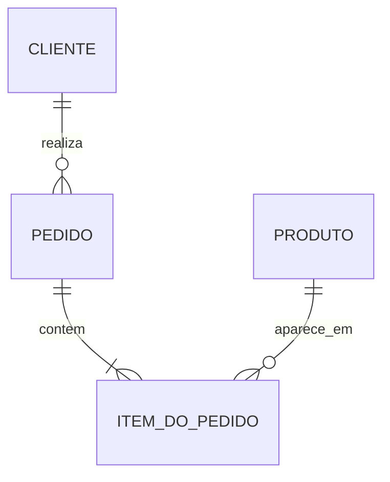

# 04 — Níveis Conceitual, Lógico e Físico

## Objetivos

Ao final deste capítulo, você deverá ser capaz de:

- distinguir os níveis conceitual, lógico e físico;
- identificar quais decisões pertencem a cada nível;
- transformar conceitos do domínio em estruturas implementáveis;
- manter rastreabilidade entre regras de negócio e schema;
- reconhecer quando uma decisão técnica contaminou prematuramente o modelo.

## Separar perguntas para melhorar decisões

Uma conversa sobre pedidos pode começar com uma regra simples: “um cliente realiza pedidos, e cada pedido contém produtos”. Se a discussão saltar imediatamente para nomes de tabelas, tipos de coluna e índices, decisões de implementação podem esconder dúvidas sobre identidade, cardinalidade e histórico.

Os níveis de modelagem separam grupos de perguntas. O modelo conceitual privilegia significado; o lógico organiza esse significado segundo um paradigma; o físico o implementa em uma tecnologia e um ambiente concretos.


Essa progressão não é uma cascata rígida. Descobertas físicas podem revelar requisitos ausentes, mas o retorno deve atualizar os níveis anteriores de maneira consciente.

## Modelo conceitual

O modelo conceitual representa os principais conceitos do domínio, seus relacionamentos e regras essenciais em linguagem compreensível para especialistas de negócio e tecnologia.

Ele responde principalmente:

- quais conceitos existem?
- o que cada conceito significa?
- como eles se relacionam?
- quais regras e limites são essenciais?
- o que está dentro ou fora do escopo?

Normalmente evita tabelas, tipos de dados, índices e detalhes de fornecedor. Pode usar um diagrama entidade-relacionamento de alto nível, um glossário e regras textuais.

### Exemplo conceitual

Para a DataRetail S.A.:



O diagrama comunica que um cliente pode realizar vários pedidos, um pedido contém ao menos um item e um produto pode aparecer em vários itens. Ainda não determina nomes de colunas ou estratégia de chave.

> [!note]
> Notações variam. Todo modelo deve acompanhar uma legenda e regras textuais quando a interpretação puder ser ambígua.

## Modelo lógico

O modelo lógico transforma os conceitos em estruturas compatíveis com um paradigma, como relacional, documentos ou grafos, sem depender necessariamente de um produto específico.

No modelo relacional, ele define:

- relações e atributos;
- chaves candidatas e primárias;
- chaves estrangeiras;
- cardinalidade e opcionalidade;
- domínios de valores;
- dependências e normalização;
- restrições que preservam regras.

### Transformação para relações

Uma representação lógica simplificada pode ser:

```text
CLIENTE(cliente_id, nome, email)
PRODUTO(produto_id, sku, nome)
PEDIDO(pedido_id, cliente_id, realizado_em, status)
ITEM_PEDIDO(pedido_id, produto_id, quantidade, preco_unitario)
```

As regras complementares estabelecem que `email` e `sku` são únicos, `cliente_id` em `PEDIDO` referencia `CLIENTE` e a combinação `(pedido_id, produto_id)` identifica um item quando o mesmo produto aparece no máximo uma vez por pedido.

O último pressuposto precisa ser validado. Se a mesma oferta puder aparecer em linhas separadas por vendedor, lote ou promoção, a identidade do item deverá mudar.

## Modelo físico

O modelo físico especifica como o modelo lógico será implementado em uma tecnologia concreta. Ele incorpora capacidades, limitações e metas operacionais.

Decisões físicas incluem:

- nomes concretos de schemas, tabelas e colunas;
- tipos de dados e codificação;
- restrições suportadas pelo SGBD;
- índices e organização de armazenamento;
- particionamento e distribuição;
- compressão e retenção;
- segurança, privilégios e auditoria;
- parâmetros dependentes de volume e padrões de acesso.

### Implementação SQL

O trecho abaixo materializa parte do modelo em PostgreSQL:

```sql
CREATE TABLE customer (
    customer_id BIGINT GENERATED ALWAYS AS IDENTITY PRIMARY KEY,
    name TEXT NOT NULL,
    email TEXT NOT NULL UNIQUE
);

CREATE TABLE product (
    product_id BIGINT GENERATED ALWAYS AS IDENTITY PRIMARY KEY,
    sku TEXT NOT NULL UNIQUE,
    name TEXT NOT NULL
);

CREATE TABLE sales_order (
    order_id BIGINT GENERATED ALWAYS AS IDENTITY PRIMARY KEY,
    customer_id BIGINT NOT NULL REFERENCES customer (customer_id),
    placed_at TIMESTAMPTZ NOT NULL,
    status TEXT NOT NULL CHECK (status IN ('pending', 'confirmed', 'cancelled'))
);

CREATE TABLE order_item (
    order_id BIGINT NOT NULL REFERENCES sales_order (order_id),
    product_id BIGINT NOT NULL REFERENCES product (product_id),
    quantity INTEGER NOT NULL CHECK (quantity > 0),
    unit_price NUMERIC(14, 2) NOT NULL CHECK (unit_price >= 0),
    PRIMARY KEY (order_id, product_id)
);

CREATE INDEX idx_sales_order_customer_placed
    ON sales_order (customer_id, placed_at DESC);
```

`TIMESTAMPTZ`, identidade, precisão monetária e índice são decisões físicas. O relacionamento entre cliente e pedido, por sua vez, nasceu no domínio e atravessou os três níveis.

## Comparação dos níveis

| Aspecto | Conceitual | Lógico | Físico |
| --- | --- | --- | --- |
| Foco | significado e escopo | organização no paradigma | implementação e operação |
| Público principal | negócio e tecnologia | modeladores e engenharia | engenharia, DBA e plataforma |
| Elementos | conceitos, relações, regras | atributos, chaves, domínios | tipos, índices, partições |
| Dependência tecnológica | mínima | do paradigma | do produto e ambiente |
| Validação | cenários do domínio | integridade e coerência | testes, planos e carga |
| Mudança típica | nova regra de negócio | nova estrutura lógica | otimização ou migração |

## Rastreabilidade entre níveis

Cada decisão relevante deve poder ser rastreada até uma necessidade.

| Regra do domínio | Decisão lógica | Decisão física |
| --- | --- | --- |
| pedido pertence a um cliente | `PEDIDO.cliente_id` obrigatório | `NOT NULL` e `FOREIGN KEY` |
| quantidade deve ser positiva | domínio de quantidade maior que zero | `CHECK (quantity > 0)` |
| SKU identifica uma oferta | chave candidata de produto | restrição `UNIQUE` |
| preço da venda deve ser histórico | preço no item do pedido | `NUMERIC(14, 2)` em `order_item` |
| consultar pedidos recentes do cliente | acesso por cliente e data | índice composto |

A rastreabilidade permite revisar se uma regra foi realmente implementada e se uma otimização ainda corresponde a um padrão de uso válido.

## Transformações não são mecânicas

Passar de um nível a outro exige decisões. Um relacionamento muitos-para-muitos pode virar uma relação associativa no modelo relacional, um array incorporado em um documento ou uma aresta em um grafo. Nenhuma transformação é universalmente correta sem conhecer consistência, volume, ciclo de vida e consultas.

Também não existe correspondência obrigatória de uma entidade conceitual para uma tabela. Uma entidade pode exigir múltiplas relações; várias entidades podem ser materializadas juntas; visões e produtos derivados podem representar perspectivas adicionais.

## Quando os níveis divergem legitimamente

O modelo físico pode introduzir redundância, índices ou particionamento sem alterar o significado conceitual. Uma plataforma analítica pode materializar dimensões e fatos derivados do modelo operacional. Essas diferenças são legítimas quando possuem justificativa, transformação controlada e semântica documentada.

> [!warning]
> A divergência se torna perigosa quando o schema físico passa a expressar regras diferentes do modelo oficial sem que a decisão seja registrada e validada.

## Boas práticas

- declare o propósito e o público de cada artefato;
- mantenha nomes e definições rastreáveis entre níveis;
- registre regras textuais que o diagrama não expressa;
- valide o conceitual com especialistas do domínio;
- valide o lógico com exemplos e estados inválidos;
- valide o físico com restrições executáveis, planos e carga;
- trate índices e desnormalização como decisões mensuráveis;
- atualize os modelos quando a implementação legítima mudar.

## Erros comuns

### Colocar tipos físicos no modelo conceitual

Escolher `VARCHAR(100)` antes de definir o significado do atributo desloca a discussão para uma limitação técnica prematura.

### Considerar o modelo lógico independente do paradigma

Um modelo lógico relacional e um modelo lógico de documentos organizam identidade e relacionamentos de formas diferentes, ainda que partam do mesmo conceito.

### Gerar o físico automaticamente e encerrar a modelagem

Ferramentas aceleram transformações, mas não conhecem padrões de acesso, capacidade, segurança, retenção ou operação.

### Atualizar apenas o Banco de Dados

Quando o schema muda sem atualizar definições e decisões, a documentação deixa de representar o sistema real.

### Usar o físico como modelo conceitual

Tabelas legadas podem refletir otimizações, limitações e débitos históricos. Interpretá-las diretamente como verdade do domínio perpetua ambiguidades.

## Resumo

- O modelo conceitual representa significado, escopo e regras essenciais.
- O modelo lógico organiza os dados segundo um paradigma.
- O modelo físico implementa estruturas em uma tecnologia e ambiente concretos.
- A progressão acrescenta decisões sem perder a semântica original.
- Transformações exigem julgamento; não são apenas conversões automáticas.
- Rastreabilidade conecta regras do domínio, estruturas lógicas e controles físicos.
- Validação muda por nível: cenários, integridade e comportamento operacional.

## Próximo Capítulo

➡️ [[05-Entidades-Atributos-e-Relacionamentos|05 — Entidades, Atributos e Relacionamentos]]
