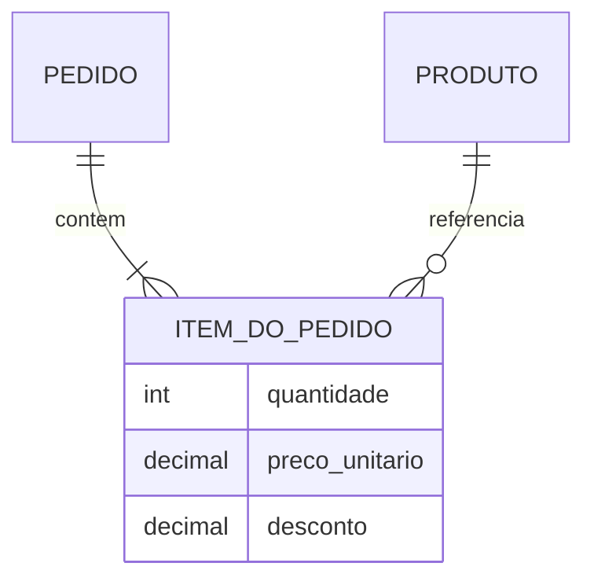
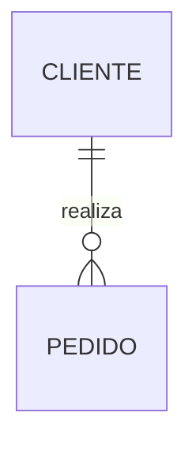
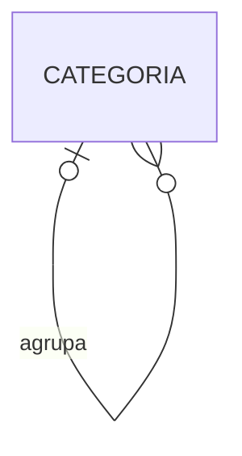
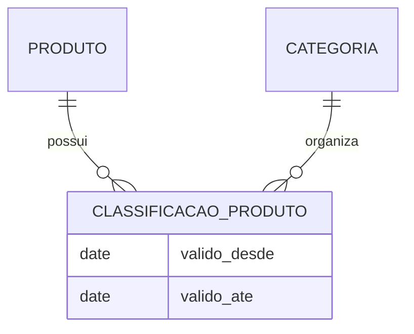
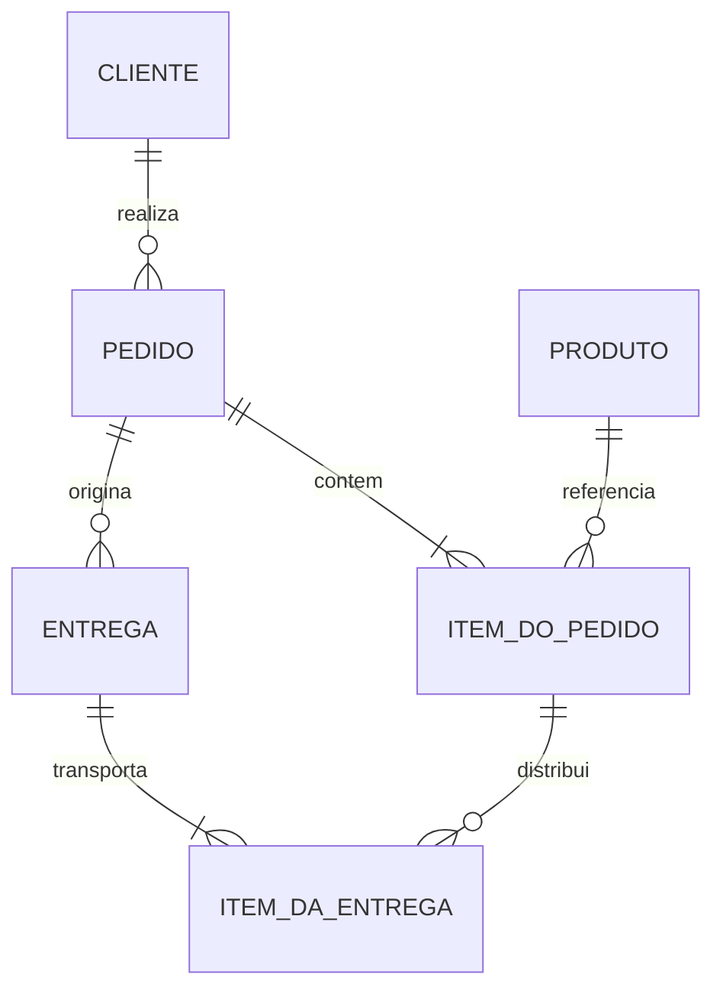

# 05 — Entidades, Atributos e Relacionamentos

## Objetivos

Ao final deste capítulo, você deverá ser capaz de:

- distinguir entidade, tipo de entidade e ocorrência;
- identificar entidades por identidade, ciclo de vida e regras próprias;
- classificar atributos e definir seus domínios;
- modelar relacionamentos binários, recursivos e associativos;
- reconhecer quando um atributo representa outro conceito;
- validar um modelo entidade-relacionamento com cenários do domínio.

## Os elementos do domínio

Depois de delimitar propósito e níveis de abstração, o modelador precisa identificar os elementos que compõem o domínio. No modelo entidade-relacionamento, três elementos fornecem a base: entidades representam conceitos com identidade; atributos descrevem propriedades; relacionamentos expressam associações significativas.

Essa separação parece simples, mas exige julgamento. “Endereço” pode ser um atributo composto em um contexto, uma entidade com histórico em outro e um snapshot imutável associado ao pedido em um terceiro.

## Entidades

Uma **entidade** é algo relevante para o domínio que possui identidade distinguível e sobre o qual fatos precisam ser preservados. Pode representar algo concreto, como um produto, ou abstrato, como um contrato, pagamento ou pedido.

É útil distinguir:

- **tipo de entidade**: definição geral, como `CLIENTE`;
- **ocorrência ou instância**: um cliente específico;
- **conjunto de entidades**: ocorrências conhecidas daquele tipo.

> [!note]
> Em conversas informais, “entidade” costuma designar tanto o tipo quanto uma ocorrência. O contexto deve deixar claro qual significado está sendo usado.

## Como reconhecer uma entidade

Um conceito é um forte candidato quando apresenta várias destas características:

- possui identidade própria;
- tem ciclo de vida independente;
- participa de relacionamentos relevantes;
- possui regras e estados próprios;
- precisa ser referenciado por outros conceitos;
- requer histórico ou responsabilidade específica.

Na DataRetail S.A., `PEDIDO` possui identidade, nasce em determinado instante, muda de estado, contém itens, recebe pagamentos e origina entregas. Portanto, não é apenas um grupo de atributos do cliente.

## Entidades fortes, dependentes e associativas

### Entidade forte

Possui identidade definida independentemente de outra entidade. `CLIENTE` e `PRODUTO` são exemplos usuais, embora a identidade exata ainda precise ser especificada.

### Entidade dependente

Sua existência ou identidade depende de outra entidade. Um `ITEM_DO_PEDIDO` não faz sentido sem o pedido ao qual pertence. Em notações clássicas, uma entidade cuja identificação depende da chave de outra pode ser chamada de **entidade fraca**.

### Entidade associativa

Transforma um relacionamento em um conceito capaz de possuir atributos e regras. A associação entre pedido e produto precisa registrar quantidade, preço praticado e desconto; por isso, `ITEM_DO_PEDIDO` é mais expressivo que uma ligação direta.



## Entidade ou atributo?

A decisão depende do propósito.

| Pergunta | Indício de entidade |
| --- | --- |
| precisa de identidade própria? | será referenciada separadamente |
| possui vários atributos internos? | estrutura relevante deve ser preservada |
| muda em ritmo diferente do conceito principal? | possui ciclo de vida próprio |
| participa de outros relacionamentos? | conecta-se a conceitos adicionais |
| precisa de histórico independente? | versões ou vigências precisam ser consultadas |

Um telefone simples pode ser atributo do cliente. Se cada telefone tiver tipo, verificação, consentimento, vigência e uso em notificações, pode merecer uma entidade própria.

Não existe regra de que todo substantivo seja entidade. “Venda”, “compra” e “pedido” podem descrever o mesmo conceito sob perspectivas diferentes; um glossário deve resolver a terminologia antes de multiplicar estruturas.

## Atributos

Um **atributo** descreve uma propriedade relevante de uma entidade ou relacionamento. Seu significado inclui mais que um nome: domínio de valores, unidade, formato, obrigatoriedade, origem, temporalidade e regra de validação também fazem parte da definição.

### Simples e compostos

Um atributo simples é tratado como uma unidade no modelo. Um atributo composto possui partes com significado próprio. `endereco_entrega` pode ser decomposto em logradouro, número, cidade, região e código postal quando essas partes são consultadas ou validadas.

### Monovalorados e multivalorados

Um atributo monovalorado possui, no contexto considerado, um valor por ocorrência. Um atributo multivalorado admite vários valores, como telefones de contato.

No modelo relacional, armazenar vários telefones em uma única coluna dificulta validação e consulta. Uma relação ou entidade dependente normalmente representa melhor a multiplicidade.

### Armazenados e derivados

Um atributo armazenado preserva o valor diretamente. Um atributo derivado pode ser calculado a partir de outros dados. O total de um item pode ser derivado de quantidade, preço e desconto.

Persistir um valor derivado pode ser legítimo por histórico, desempenho ou auditoria, mas exige definir a fonte de verdade e como evitar divergência.

### Obrigatórios e opcionais

Obrigatoriedade é uma regra do domínio, não apenas a presença de `NOT NULL`. Um pedido confirmado pode exigir pagamento aprovado, enquanto um pedido pendente ainda não. Algumas regras dependem do estado e não cabem em uma restrição simples.

### Identificadores

Um ou mais atributos podem distinguir ocorrências. A análise completa de chaves será feita no próximo capítulo, mas a identidade deve ser discutida desde a descoberta do conceito.

## Domínio de um atributo

O domínio define o conjunto de valores semanticamente válidos. Para `quantidade`, declarar apenas “inteiro” é insuficiente. Pode ser necessário estabelecer:

- valor maior que zero;
- unidade de medida;
- limite máximo por item;
- tratamento de produtos fracionados;
- comportamento em devoluções;
- precisão e arredondamento.

```sql
quantity INTEGER NOT NULL CHECK (quantity > 0)
```

A restrição física implementa parte do domínio. A documentação explica o significado que a sintaxe não carrega.

## Valores ausentes

Ausência pode significar fatos diferentes: desconhecido, ainda não informado, não aplicável, protegido ou perdido. Representar todos como `NULL` pode ser tecnicamente necessário, mas a semântica precisa permanecer clara.

> [!warning]
> Valores sentinela como `0`, `-1`, `1900-01-01` ou `N/A` misturam ausência com valores reais e frequentemente quebram agregações e regras.

Quando diferentes motivos de ausência afetam decisões, um estado ou motivo explícito pode ser necessário.

## Relacionamentos

Um **relacionamento** expressa uma associação relevante entre ocorrências de entidades. Ele deve possuir significado nomeado por um verbo ou expressão: cliente **realiza** pedido; pedido **contém** item; pagamento **liquida** obrigação.

Um relacionamento não deve existir apenas porque duas tabelas possuem colunas parecidas. Ele precisa representar uma regra confirmada do domínio.

## Grau do relacionamento

### Binário

Relaciona dois tipos de entidade e é o caso mais comum.



### Recursivo

Relaciona ocorrências do mesmo tipo em papéis diferentes. Uma categoria pode possuir uma categoria superior.



Os nomes dos papéis — categoria pai e categoria filha — eliminam ambiguidade.

### Ternário ou de grau superior

Relaciona simultaneamente três ou mais tipos. Deve ser usado quando o significado depende da combinação completa e não pode ser preservado por relacionamentos binários independentes.

Por exemplo, o preço negociado pode depender conjuntamente de cliente, produto e período contratual. Dividir isso em três relações binárias pode criar combinações inexistentes.

## Atributos do relacionamento

Alguns valores descrevem a associação, não uma entidade isolada. A quantidade de um produto em um pedido pertence à participação daquele produto naquele pedido. Ao transformar a associação em `ITEM_DO_PEDIDO`, esses atributos ficam localizados no conceito correto.

## Relacionamentos e tempo

Relacionamentos também mudam. Um produto pertence a uma categoria em determinado período; um funcionário gerencia uma unidade durante uma vigência; um endereço atende uma região enquanto uma regra logística está ativa.

Quando o histórico importa, a associação deve preservar início, fim e, quando necessário, motivo da mudança.



## Exemplo integrado da DataRetail

Considere estas regras:

1. um cliente pode realizar pedidos;
2. cada pedido contém uma ou mais linhas;
3. cada linha referencia uma oferta vendida;
4. o preço praticado e a quantidade pertencem à linha;
5. um pedido pode originar várias entregas;
6. uma entrega pode conter somente parte das linhas e quantidades.

A última regra exige uma associação adicional entre entrega e item do pedido. Uma ligação direta entre pedido e entrega não informa quais unidades foram despachadas.



`ITEM_DA_ENTREGA` precisa registrar a quantidade despachada. O modelo passa a representar entregas parciais sem duplicar o pedido ou perder a origem da linha.

## Validação do modelo

Use exemplos concretos para testar:

- toda entidade possui critério de identidade?
- os atributos pertencem ao conceito correto?
- atributos multivalorados foram reconhecidos?
- valores derivados têm fonte de verdade?
- relacionamentos possuem nomes e papéis claros?
- atributos da associação foram colocados no relacionamento?
- mudanças temporais preservam o histórico necessário?
- o modelo representa exceções como entrega parcial e devolução?

## Boas práticas

- nomeie entidades no singular e por significado do domínio;
- defina cada conceito em um glossário;
- use verbos para nomear relacionamentos;
- registre papéis em relacionamentos recursivos;
- especifique domínio, unidade e temporalidade dos atributos;
- transforme associações com atributos em entidades associativas;
- represente histórico somente quando houver requisito claro;
- valide com dados de exemplo e contraexemplos.

## Erros comuns

### Transformar todo substantivo em entidade

Isso cria modelos fragmentados sem identidade ou ciclo de vida justificáveis.

### Criar atributos genéricos

Campos como `valor`, `tipo`, `codigo1` ou `informacoes` escondem semântica e dificultam validação.

### Misturar múltiplos valores

Listas delimitadas em um atributo impedem integridade por elemento e tornam consultas dependentes de parsing.

### Colocar fatos históricos na entidade atual

Consultar o preço atual do produto para recompor uma venda altera o passado. O valor praticado pertence ao item da transação.

### Substituir um relacionamento ternário sem preservar significado

Relações binárias independentes podem permitir combinações que nunca existiram juntas.

### Ignorar papéis

Em auto-relacionamentos ou múltiplas associações entre as mesmas entidades, papéis explícitos evitam interpretações inversas.

## Resumo

- Entidades representam conceitos com identidade e relevância para o domínio.
- Atributos descrevem propriedades e precisam de domínio, unidade e semântica.
- Entidades dependentes e associativas preservam existência e fatos de uma relação.
- Relacionamentos expressam regras, possuem papéis e podem carregar atributos.
- Multiplicidade, tempo e histórico podem transformar um atributo em uma entidade.
- A escolha entre entidade, atributo e relacionamento depende do propósito e do ciclo de vida.
- Cenários concretos revelam ambiguidades e conceitos ausentes.

## Próximo Capítulo

➡️ **06 — Chaves, Cardinalidade e Integridade**
