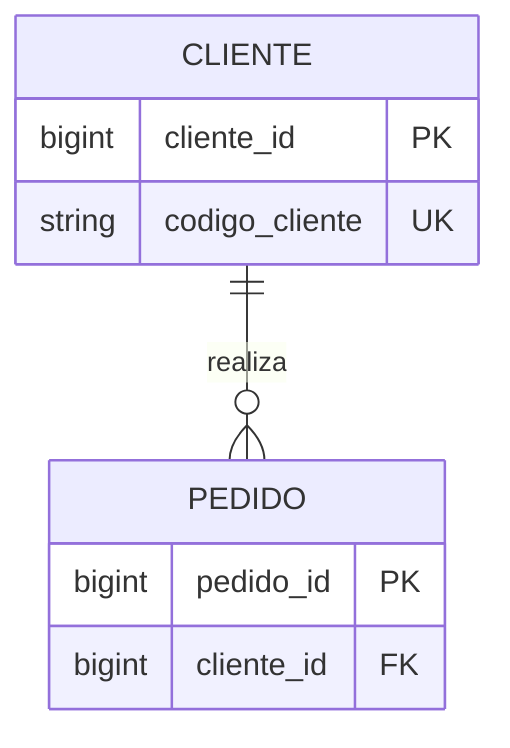
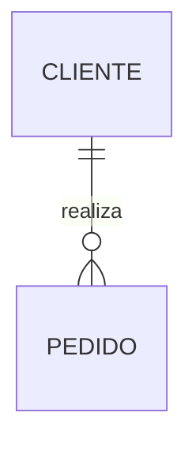
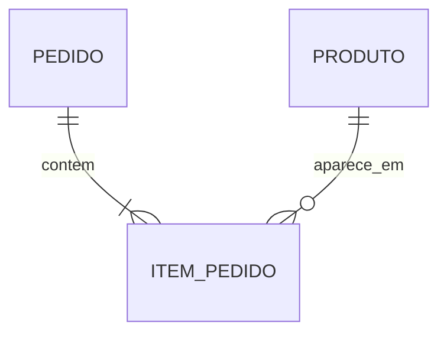

# 06 — Chaves, Cardinalidade e Integridade

## Objetivos

Ao final deste capítulo, você deverá ser capaz de:

- distinguir superchave, chave candidata, primária, alternativa e estrangeira;
- comparar chaves naturais, substitutas, simples e compostas;
- interpretar cardinalidade mínima e máxima;
- transformar relacionamentos um-para-um, um-para-muitos e muitos-para-muitos;
- escolher ações de integridade referencial conscientemente;
- representar invariantes de domínio com restrições verificáveis.

## Identidade e estados válidos

Um modelo precisa responder duas perguntas fundamentais: **como distinguir cada ocorrência?** e **quais combinações de dados são permitidas?** Chaves tratam identidade e referência; cardinalidades delimitam participação; restrições de integridade impedem ou detectam estados inválidos.

Sem essas regras, registros podem parecer corretos isoladamente e ainda contradizer o domínio: dois produtos com o mesmo SKU, um item ligado a pedido inexistente ou uma entrega com quantidade superior à comprada.

## Chaves

Uma **chave** é um conjunto de atributos usado para distinguir ou referenciar ocorrências. Chaves não são apenas detalhes técnicos: expressam como o domínio reconhece identidade.

### Superchave

Qualquer conjunto de atributos que identifica unicamente uma ocorrência. Se `customer_id` é único, então `{customer_id}` e `{customer_id, email}` são superchaves. A segunda contém um atributo desnecessário.

### Chave candidata

Superchave mínima: nenhum atributo pode ser removido sem perder unicidade. Uma entidade pode possuir várias chaves candidatas, como identificador interno e um código externo estável.

### Chave primária

Chave candidata escolhida como referência principal no modelo relacional. Deve ser única, não nula e estável. A escolha não torna as demais regras de unicidade dispensáveis.

### Chave alternativa

Chave candidata que não foi escolhida como primária. Ela continua sendo uma regra do domínio e normalmente deve possuir uma restrição `UNIQUE`.

### Chave estrangeira

Conjunto de atributos que referencia uma chave candidata de outra relação — ou da própria relação em um relacionamento recursivo. Ela preserva a existência do alvo e materializa uma associação.



## Chaves naturais e substitutas

Uma **chave natural** deriva de um identificador significativo do domínio, como SKU ou número oficial de contrato. Uma **chave substituta** é criada pelo sistema, como um inteiro gerado ou UUID.

| Aspecto | Natural | Substituta |
| --- | --- | --- |
| Significado | reconhecida pelo domínio | significado técnico |
| Estabilidade | depende da regra externa | controlada pelo sistema |
| Tamanho | pode ser amplo ou composto | geralmente uniforme |
| Integração | ajuda quando o identificador é compartilhado | exige mapeamento de identidades |
| Privacidade | pode expor dado sensível | evita propagar identificador sensível |

A escolha não precisa ser exclusiva. É comum usar uma chave substituta como primária e preservar a chave natural com `UNIQUE`.

> [!warning]
> Adicionar um identificador gerado não elimina duplicidades de negócio. Sem uma chave candidata declarada, duas linhas podem representar a mesma ocorrência real.

CPF, e-mail e telefone raramente são boas chaves primárias universais: podem mudar, faltar, ser compartilhados, possuir regras territoriais e envolver dados pessoais.

## Chaves simples e compostas

Uma chave simples possui um atributo. Uma chave composta utiliza dois ou mais atributos cuja combinação fornece identidade.

Em `ITEM_PEDIDO`, `(pedido_id, numero_linha)` pode identificar cada linha. Já `(pedido_id, produto_id)` só é válido se o domínio proibir o mesmo produto em linhas distintas.

```sql
CREATE TABLE order_item (
    order_id BIGINT NOT NULL,
    line_number INTEGER NOT NULL CHECK (line_number > 0),
    product_id BIGINT NOT NULL,
    quantity INTEGER NOT NULL CHECK (quantity > 0),
    PRIMARY KEY (order_id, line_number)
);
```

Chaves compostas expressam dependência e unicidade diretamente, mas se propagam às referências. Uma chave substituta pode simplificar essas referências sem remover a unicidade composta do negócio.

## Estabilidade e escopo da identidade

Uma chave precisa ser avaliada por:

- **unicidade**: distingue ocorrências no escopo correto?
- **minimalidade**: contém somente o necessário?
- **estabilidade**: pode mudar durante o ciclo de vida?
- **disponibilidade**: existe desde a criação?
- **escopo**: é única globalmente, por origem ou por período?
- **semântica**: identifica a entidade ou apenas uma representação local?

O número `12345` pode ser único dentro de uma loja, mas não em toda a empresa. Nesse caso, a identidade natural talvez seja `(loja_id, numero_pedido)`. Integrações precisam preservar o namespace de origem.

## Resolução de identidade

Em Engenharia de Dados, fontes diferentes podem atribuir identificadores distintos ao mesmo conceito. Unir registros somente por nome ou e-mail cria falsos positivos e negativos.

Um mapeamento de identidades deve registrar:

- sistema de origem;
- identificador na origem;
- identificador canônico;
- regra ou evidência de correspondência;
- vigência e estado do vínculo;
- tratamento de fusões e separações incorretas.

Identidade é uma decisão governada, não apenas um `JOIN` aproximado.

## Cardinalidade

Cardinalidade descreve quantas ocorrências de uma entidade podem ou devem se associar a uma ocorrência de outra. A notação mínima e máxima torna duas dimensões explícitas:

- **mínima**: participação opcional (`0`) ou obrigatória (`1`);
- **máxima**: uma (`1`) ou muitas (`N`).

| Símbolo conceitual | Significado |
| --- | --- |
| `0..1` | nenhuma ou uma |
| `1..1` | exatamente uma |
| `0..N` | nenhuma ou muitas |
| `1..N` | uma ou muitas |

## Um-para-um

Cada ocorrência se relaciona com no máximo uma do outro lado. Esse relacionamento pode representar separação por segurança, ciclo de vida ou opcionalidade.

Exemplo: um pedido pode ter no máximo um documento fiscal principal, e cada documento pertence a exatamente um pedido.

```sql
CREATE TABLE invoice (
    invoice_id BIGINT PRIMARY KEY,
    order_id BIGINT NOT NULL UNIQUE REFERENCES sales_order (order_id)
);
```

A chave estrangeira sozinha permitiria vários documentos por pedido; `UNIQUE` implementa o limite de um.

## Um-para-muitos

Uma ocorrência do lado “um” pode se relacionar com várias do lado “muitos”; cada ocorrência do lado “muitos” referencia no máximo uma do primeiro lado.



Se todo pedido exigir cliente, a chave estrangeira será `NOT NULL`. Se compras anônimas forem permitidas, a participação precisa ser opcional e documentada — não simplesmente deixada nula por conveniência.

## Muitos-para-muitos

Ocorrências de ambos os lados podem participar várias vezes. No modelo relacional, uma relação associativa preserva as combinações e seus atributos.



```sql
CREATE TABLE order_item (
    order_id BIGINT NOT NULL REFERENCES sales_order (order_id),
    line_number INTEGER NOT NULL,
    product_id BIGINT NOT NULL REFERENCES product (product_id),
    quantity INTEGER NOT NULL CHECK (quantity > 0),
    PRIMARY KEY (order_id, line_number)
);
```

## Regras mínimas nem sempre cabem na chave estrangeira

Uma chave estrangeira garante que cada item aponte para um pedido, mas não garante que todo pedido possua ao menos um item. A cardinalidade mínima `1..N` do lado dos itens pode exigir transação, validação diferida, trigger ou regra de publicação.

Da mesma forma, “um pedido confirmado deve ter pagamento aprovado” depende do estado conjunto de entidades. O modelo deve registrar a invariante mesmo quando o mecanismo físico não for uma restrição declarativa simples.

## Integridade de entidade

Cada ocorrência precisa ser distinguível. No modelo relacional, a chave primária impõe unicidade e ausência de nulos. Chaves candidatas adicionais preservam identidades alternativas.

## Integridade de domínio

Valores devem pertencer ao domínio definido: tipo, faixa, formato, unidade e combinações permitidas.

```sql
status TEXT NOT NULL
    CHECK (status IN ('pending', 'confirmed', 'cancelled')),
total NUMERIC(14, 2) NOT NULL
    CHECK (total >= 0)
```

Tipos e `CHECK` protegem parte da semântica. Regras que mudam frequentemente podem usar tabelas de referência, mas isso não deve permitir estados incoerentes.

## Integridade referencial

Uma chave estrangeira impede referências a ocorrências inexistentes. Ao alterar ou excluir o alvo, é necessário escolher uma ação coerente com o ciclo de vida.

| Ação | Efeito | Uso consciente |
| --- | --- | --- |
| `RESTRICT` ou `NO ACTION` | rejeita a operação | preserva dependências existentes |
| `CASCADE` | propaga atualização ou exclusão | componentes com ciclo de vida dependente |
| `SET NULL` | remove a referência | associação realmente opcional |
| `SET DEFAULT` | aplica valor padrão | raro; exige significado válido |

`CASCADE` pode ser adequado para itens de um pedido descartável em um ambiente de teste, mas perigoso para dados financeiros históricos. Ação referencial é decisão de domínio e retenção.

## Integridade semântica

Algumas invariantes atravessam linhas ou tabelas:

- soma das quantidades entregues não excede a quantidade comprada;
- período de vigência termina após o início;
- intervalos ativos não se sobrepõem para a mesma regra;
- pedido confirmado possui ao menos um item;
- moeda do item é compatível com a moeda do pedido.

Essas regras podem exigir restrições avançadas, transações, triggers ou serviços. Independentemente do mecanismo, devem possuir dono, teste e tratamento de falha.

## Exemplo integrado da DataRetail

Considere o núcleo abaixo:

```sql
CREATE TABLE sales_order (
    order_id BIGINT GENERATED ALWAYS AS IDENTITY PRIMARY KEY,
    source_system TEXT NOT NULL,
    source_order_id TEXT NOT NULL,
    customer_id BIGINT NOT NULL REFERENCES customer (customer_id),
    status TEXT NOT NULL CHECK (status IN ('pending', 'confirmed', 'cancelled')),
    UNIQUE (source_system, source_order_id)
);

CREATE TABLE order_item (
    order_id BIGINT NOT NULL REFERENCES sales_order (order_id) ON DELETE RESTRICT,
    line_number INTEGER NOT NULL CHECK (line_number > 0),
    product_id BIGINT NOT NULL REFERENCES product (product_id),
    quantity INTEGER NOT NULL CHECK (quantity > 0),
    PRIMARY KEY (order_id, line_number)
);
```

O identificador substituto facilita referências internas. A restrição `(source_system, source_order_id)` impede duplicação do pedido da origem. A chave composta do item expressa que o número da linha é único dentro do pedido. As chaves estrangeiras impedem pedidos sem cliente válido e itens sem pedido ou produto.

## Concorrência e integridade

Um modelo correto ainda precisa de execução transacional. Duas operações podem validar separadamente um limite e, juntas, violá-lo. Restrições no SGBD, atualizações condicionais e isolamento apropriado protegem invariantes sob concorrência.

> [!important]
> Validar somente na interface não preserva integridade quando múltiplas aplicações, pipelines ou usuários escrevem nos mesmos dados.

## Integridade em pipelines

Sistemas analíticos nem sempre aplicam chaves estrangeiras fisicamente. Isso não elimina a regra; transfere sua verificação para contratos, testes e monitoramento.

Controles típicos incluem:

- unicidade das chaves de negócio;
- ausência de nulos em identificadores obrigatórios;
- referências sem correspondência;
- cardinalidade inesperada após `JOIN`;
- duplicidade introduzida por reprocessamento;
- reconciliação de totais e contagens;
- quarentena para violações não publicáveis.

## Boas práticas

- descubra chaves candidatas antes de escolher a primária;
- preserve a unicidade de negócio ao adotar chave substituta;
- documente escopo, estabilidade e origem dos identificadores;
- expresse cardinalidade mínima e máxima em ambos os lados;
- derive nulabilidade da participação, não da conveniência;
- escolha ações referenciais pelo ciclo de vida e retenção;
- implemente invariantes críticas o mais próximo possível dos dados;
- teste integridade sob concorrência e reprocessamento.

## Erros comuns

### Usar identificador gerado como única regra de unicidade

Cada duplicata recebe um ID diferente e passa a parecer válida, embora represente o mesmo fato do negócio.

### Usar atributo mutável como chave primária

Mudanças propagam referências e dificultam histórico. Preserve-o como chave candidata quando sua unicidade ainda for relevante.

### Interpretar chave estrangeira como cardinalidade completa

Ela não garante sozinha máximos de um nem mínimos de pelo menos um no lado referenciado.

### Aplicar exclusão em cascata indiscriminadamente

Uma operação local pode remover um grafo inteiro de dados históricos.

### Confiar apenas na aplicação

Importações, scripts e novos serviços podem ignorar validações locais.

### Fazer `JOIN` sem compreender cardinalidade

Um relacionamento muitos-para-muitos inesperado multiplica linhas e valores agregados sem necessariamente produzir erro técnico.

## Resumo

- Chaves representam identidade, unicidade e referência.
- Chaves candidatas permanecem regras mesmo quando uma chave substituta é escolhida.
- Chaves compostas expressam identidade dentro de um escopo.
- Cardinalidade combina participação mínima e multiplicidade máxima.
- Relações um-para-um exigem unicidade; muitos-para-muitos exigem associação explícita.
- Integridade inclui entidade, domínio, referência e invariantes semânticas.
- Restrições, transações, testes e monitoramento são mecanismos complementares.
- Pipelines devem verificar chaves e cardinalidades mesmo quando o destino não as impõe.

## Próximo Capítulo

➡️ **07 — Normalização e Dependências**
