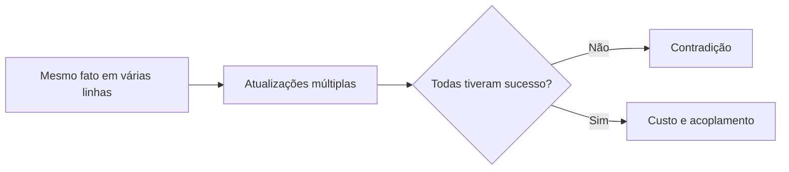
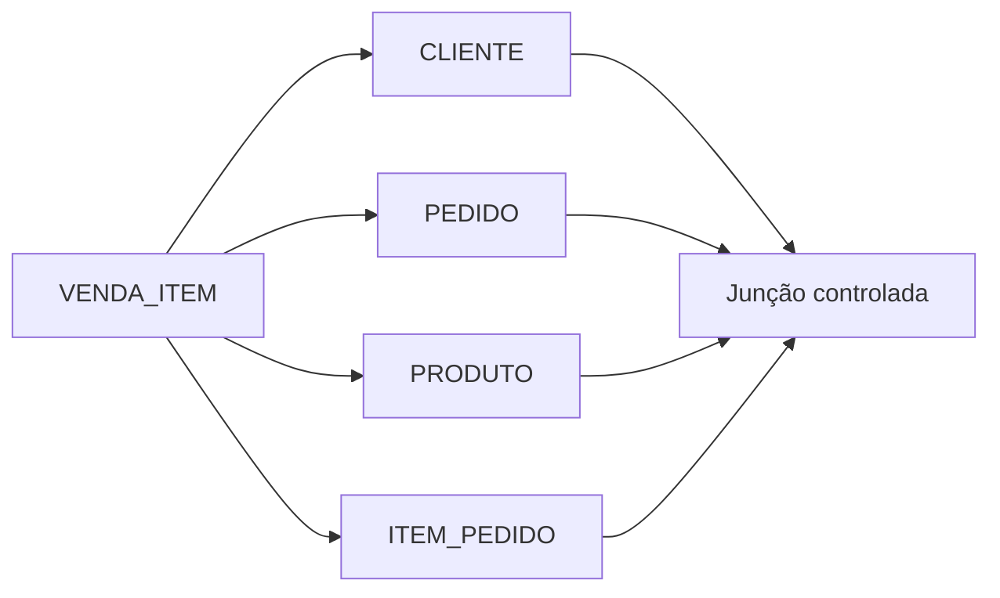

# 07 — Normalização e Dependências

## Objetivos

Ao final deste capítulo, você deverá ser capaz de:

- reconhecer anomalias causadas por fatos misturados;
- interpretar dependências funcionais;
- aplicar 1FN, 2FN, 3FN e BCNF em exemplos práticos;
- avaliar junção sem perda e preservação de dependências;
- distinguir normalização de decomposição arbitrária;
- justificar desnormalização com critérios mensuráveis.

## O custo dos fatos repetidos

Uma planilha de pedidos pode repetir nome e e-mail do cliente em cada item, descrição do produto em cada venda e dados do pedido em todas as linhas. A estrutura facilita uma visualização inicial, mas transforma um único fato em várias cópias que podem divergir.

**Normalização** é um processo de análise e organização de relações para reduzir redundâncias problemáticas e anomalias, com base nas dependências entre atributos. Seu objetivo não é criar o maior número possível de tabelas, mas colocar cada fato onde possa ser preservado de maneira coerente.

## Uma relação problemática

Considere:

```text
VENDA_ITEM(
    pedido_id,
    pedido_data,
    cliente_id,
    cliente_nome,
    cliente_email,
    produto_id,
    produto_nome,
    quantidade,
    preco_unitario
)
```

Suponha que a chave seja `(pedido_id, produto_id)` e que o mesmo produto apareça no máximo uma vez em cada pedido.

Essa relação mistura fatos sobre pedido, cliente, produto e participação do produto no pedido.

## Anomalias

### Anomalia de atualização

O nome de um produto aparece em muitas vendas. Se apenas parte das linhas for atualizada, o mesmo produto passa a possuir nomes diferentes.

### Anomalia de inserção

Não é possível cadastrar um produto antes da primeira venda sem inventar valores de pedido e cliente.

### Anomalia de exclusão

Excluir o único pedido que contém um produto pode remover também a única informação disponível sobre esse produto.



As anomalias indicam que fatos com identidades e ciclos de vida diferentes foram armazenados juntos.

## Dependência funcional

Uma dependência funcional `X → Y` afirma que, em toda instância válida da relação, dois registros com os mesmos valores de `X` também possuem os mesmos valores de `Y`.

Na relação do exemplo:

```text
pedido_id → pedido_data, cliente_id
cliente_id → cliente_nome, cliente_email
produto_id → produto_nome
(pedido_id, produto_id) → quantidade, preco_unitario
```

`X` é o **determinante** e `Y` é funcionalmente dependente de `X`.

> [!important]
> Dependências são regras do domínio, não coincidências observadas em uma amostra. Se hoje cada cliente possui um e-mail, isso só constitui `cliente_id → cliente_email` quando a regra permanecer válida para todas as ocorrências permitidas.

## Dependências triviais e não triviais

Uma dependência é trivial quando o lado direito já está contido no esquerdo, como `(pedido_id, produto_id) → pedido_id`. Ela é sempre verdadeira e não revela uma regra de decomposição.

Dependências não triviais relacionam conjuntos distintos e ajudam a identificar onde um fato pertence.

## Dependência total, parcial e transitiva

### Dependência total

Um atributo depende de toda a chave composta. Em `(pedido_id, produto_id) → quantidade`, remover qualquer parte do determinante impede identificar a quantidade daquele item.

### Dependência parcial

Um atributo depende apenas de parte de uma chave composta. `pedido_id → pedido_data` mostra que `pedido_data` não depende de toda a chave de `VENDA_ITEM`.

### Dependência transitiva

Um atributo não chave depende de outro atributo não chave. Se `pedido_id → cliente_id` e `cliente_id → cliente_nome`, então `pedido_id → cliente_nome` por transitividade. O nome pertence ao cliente, não ao pedido.

## Fecho e identificação de chaves

O **fecho** de um conjunto de atributos `X`, denotado `X+`, contém os atributos que podem ser determinados a partir de `X` usando as dependências conhecidas. Se o fecho contém todos os atributos da relação, `X` é uma superchave; se for mínimo, é uma chave candidata.

Para `(pedido_id, produto_id)` no exemplo:

1. a combinação determina quantidade e preço;
2. `pedido_id` determina data e cliente;
3. cliente determina nome e e-mail;
4. `produto_id` determina nome do produto;
5. o fecho alcança todos os atributos.

O raciocínio confirma a superchave e mostra dependências que causam redundância.

## Primeira Forma Normal — 1FN

Uma relação está na Primeira Forma Normal quando cada atributo contém valores do domínio adotado como atômicos e não existem grupos repetidos dentro de uma linha.

Uma coluna `produtos = 'P1:2;P2:1'` viola o propósito da 1FN porque esconde uma coleção que precisa ser interpretada por parsing.

```text
PEDIDO(pedido_id, produtos)
```

deve ser representado, no modelo relacional normalizado, por:

```text
PEDIDO(pedido_id, ...)
ITEM_PEDIDO(pedido_id, produto_id, quantidade)
```

Atomicidade depende do uso. Um endereço pode ser um valor atômico quando nunca é decomposto, mas deixa de sê-lo quando cidade e código postal possuem regras e consultas próprias.

## Segunda Forma Normal — 2FN

Uma relação está na 2FN quando está na 1FN e todo atributo não primo depende funcionalmente da chave candidata completa, não de apenas parte dela. Atributo **primo** é aquele que participa de alguma chave candidata.

O problema surge principalmente com chaves compostas. Em `VENDA_ITEM`, dados do pedido dependem apenas de `pedido_id`, e dados do produto apenas de `produto_id`.

A decomposição inicial separa:

```text
PEDIDO(pedido_id, pedido_data, cliente_id, cliente_nome, cliente_email)
PRODUTO(produto_id, produto_nome)
ITEM_PEDIDO(pedido_id, produto_id, quantidade, preco_unitario)
```

Agora os atributos do item dependem da chave completa do item.

## Terceira Forma Normal — 3FN

Uma relação está na 3FN quando está na 2FN e não mantém dependências transitivas inadequadas de chaves para atributos não chave.

Em `PEDIDO`, temos:

```text
pedido_id → cliente_id
cliente_id → cliente_nome, cliente_email
```

Os dados do cliente são separados:

```text
CLIENTE(cliente_id, cliente_nome, cliente_email)
PEDIDO(pedido_id, pedido_data, cliente_id)
PRODUTO(produto_id, produto_nome)
ITEM_PEDIDO(pedido_id, produto_id, quantidade, preco_unitario)
```

Cada fato passa a ter um local principal: dados do cliente em `CLIENTE`, do produto em `PRODUTO`, do pedido em `PEDIDO` e da associação em `ITEM_PEDIDO`.

## Forma Normal de Boyce-Codd — BCNF

Uma relação está em BCNF quando, para toda dependência funcional não trivial `X → Y`, `X` é uma superchave.

BCNF é mais restritiva que 3FN. A diferença aparece em relações com dependências sobrepostas e múltiplas chaves candidatas. Em muitos modelos operacionais comuns, chegar à 3FN também leva à BCNF; isso não deve ser presumido sem analisar os determinantes.

Considere uma relação de alocação em que:

- cada especialista atende uma categoria;
- em cada loja, uma categoria possui um especialista responsável.

```text
ALOCACAO(loja_id, especialista_id, categoria_id)

especialista_id → categoria_id
(loja_id, categoria_id) → especialista_id
```

`especialista_id` determina categoria, mas não é superchave da relação completa porque não determina a loja. Portanto, a relação viola BCNF. A decomposição precisa ser avaliada também quanto à preservação das dependências.

## Além da BCNF

Dependências multivaloradas independentes podem causar redundância mesmo em BCNF. Se um produto possui vários fornecedores e várias certificações sem relação entre eles, armazenar todas as combinações multiplica linhas.

```text
PRODUTO_FORNECEDOR(produto_id, fornecedor_id)
PRODUTO_CERTIFICACAO(produto_id, certificacao_id)
```

Essa separação está relacionada à Quarta Forma Normal. Formas superiores existem, mas 1FN, 2FN, 3FN e BCNF resolvem a maior parte dos fundamentos necessários neste módulo.

## Decomposição sem perda

Decompor uma relação é seguro somente quando a junção das partes reconstrói exatamente os fatos válidos, sem perder linhas nem criar combinações espúrias.

Na decomposição de pedido e cliente, `cliente_id` referencia uma ocorrência única de `CLIENTE`; a junção recompõe os atributos do cliente associados ao pedido.



Uma regra prática para decomposição binária sem perda é que os atributos comuns determinem funcionalmente todos os atributos de pelo menos uma das relações resultantes.

## Preservação de dependências

Uma decomposição preserva dependências quando as regras originais podem ser verificadas localmente nas relações resultantes, sem precisar fazer junções.

Às vezes, alcançar BCNF pode dificultar a verificação local de uma dependência. O projeto precisa equilibrar:

- ausência de redundância;
- junção sem perda;
- preservação das dependências;
- simplicidade das restrições;
- necessidades operacionais.

3FN pode ser escolhida conscientemente quando preserva dependências importantes que uma decomposição em BCNF tornaria mais complexas.

## Implementação normalizada da DataRetail

```sql
CREATE TABLE customer (
    customer_id BIGINT PRIMARY KEY,
    name TEXT NOT NULL,
    email TEXT NOT NULL UNIQUE
);

CREATE TABLE product (
    product_id BIGINT PRIMARY KEY,
    name TEXT NOT NULL
);

CREATE TABLE sales_order (
    order_id BIGINT PRIMARY KEY,
    placed_at TIMESTAMPTZ NOT NULL,
    customer_id BIGINT NOT NULL REFERENCES customer (customer_id)
);

CREATE TABLE order_item (
    order_id BIGINT NOT NULL REFERENCES sales_order (order_id),
    product_id BIGINT NOT NULL REFERENCES product (product_id),
    quantity INTEGER NOT NULL CHECK (quantity > 0),
    unit_price NUMERIC(14, 2) NOT NULL CHECK (unit_price >= 0),
    PRIMARY KEY (order_id, product_id)
);
```

`unit_price` permanece no item porque representa o preço praticado naquela venda, não o preço atual do produto. Valores iguais em várias linhas não significam necessariamente redundância: é preciso compreender o fato representado.

## Normalização não apaga histórico

Separar cliente e pedido não significa que o pedido deva sempre consultar o estado atual do cliente. Se nome fiscal, endereço ou condição comercial precisam refletir o momento da transação, o modelo deve preservar um snapshot ou uma versão válida.

A decisão temporal precede a normalização. Caso contrário, uma decomposição aparentemente elegante pode alterar o significado histórico.

## Desnormalização

**Desnormalização** introduz redundância deliberada para atender um objetivo mensurável, como reduzir custo de leitura, materializar um produto analítico ou preservar um snapshot.

Ela é justificável quando existe:

- padrão de acesso conhecido;
- medição que demonstra o problema;
- fonte de verdade definida;
- mecanismo confiável de sincronização ou reconstrução;
- teste de consistência;
- plano de recuperação e evolução.

Exemplos incluem visões materializadas, tabelas agregadas, cache e modelos dimensionais. Duplicação acidental não é desnormalização; é ausência de controle.

## Modelos operacionais e analíticos

Normalização costuma beneficiar cargas operacionais com muitas escritas e invariantes locais. Modelos analíticos frequentemente repetem atributos dimensionais para simplificar leitura e manter histórico.

Isso não transforma formas normais em regras obsoletas. Dependências funcionais continuam úteis para descobrir o grão, evitar duplicidade e explicar quais atributos pertencem a cada dimensão ou fato.

## Método prático

1. declare a chave e o grão da relação;
2. liste as dependências como regras do domínio;
3. identifique grupos repetidos e atributos não atômicos;
4. procure dependências parciais de chaves compostas;
5. procure dependências transitivas;
6. verifique se todo determinante não trivial é superchave;
7. decomponha preservando significado e junção sem perda;
8. verifique dependências e restrições após a decomposição;
9. teste inserção, atualização e exclusão;
10. desnormalize apenas com evidência e controles.

## Boas práticas

- derive dependências de regras confirmadas, não de amostras;
- declare o grão antes de analisar a relação;
- preserve chaves candidatas em todas as decomposições;
- diferencie fato atual de snapshot histórico;
- avalie junção sem perda e dependências preservadas;
- use restrições para tornar o modelo verificável;
- registre o motivo e o dono de cada redundância;
- meça leituras e escritas antes de desnormalizar.

## Erros comuns

### Decorar formas normais sem entender dependências

Normalização é raciocínio sobre fatos e determinantes, não uma sequência mecânica de tabelas.

### Tratar repetição como redundância automaticamente

O preço praticado pode se repetir, mas cada ocorrência pertence a uma venda diferente e preserva história.

### Decompor sem chave de junção

As partes não podem reconstruir os fatos ou produzem combinações espúrias.

### Normalizar atributos derivados do sistema, não do domínio

Uma coincidência nos dados atuais pode deixar de valer e tornar o modelo incorreto.

### Desnormalizar por antecipação

Redundância eleva custo de escrita, sincronização, qualidade e evolução sem garantia de benefício.

### Usar 3FN como sinônimo de modelo perfeito

Formas normais tratam dependências específicas. Temporalidade, segurança, cardinalidade e adequação ao uso ainda precisam ser modeladas.

## Resumo

- Normalização reduz anomalias ao localizar fatos conforme suas dependências.
- Dependência funcional é uma regra do domínio expressa como `X → Y`.
- 1FN elimina grupos repetidos; 2FN trata dependências parciais; 3FN trata transitivas.
- BCNF exige que todo determinante não trivial seja uma superchave.
- Decomposições precisam ser sem perda e, quando possível, preservar dependências.
- Valores repetidos não são necessariamente redundantes; o significado e o tempo importam.
- Desnormalização deve ser deliberada, mensurada e controlada.
- Formas normais ajudam modelos operacionais e também a análise do grão em modelos analíticos.

## Próximo Capítulo

➡️ [[08-Modelagem-Transacional-e-Analitica|08 — Modelagem Transacional e Analítica]]
