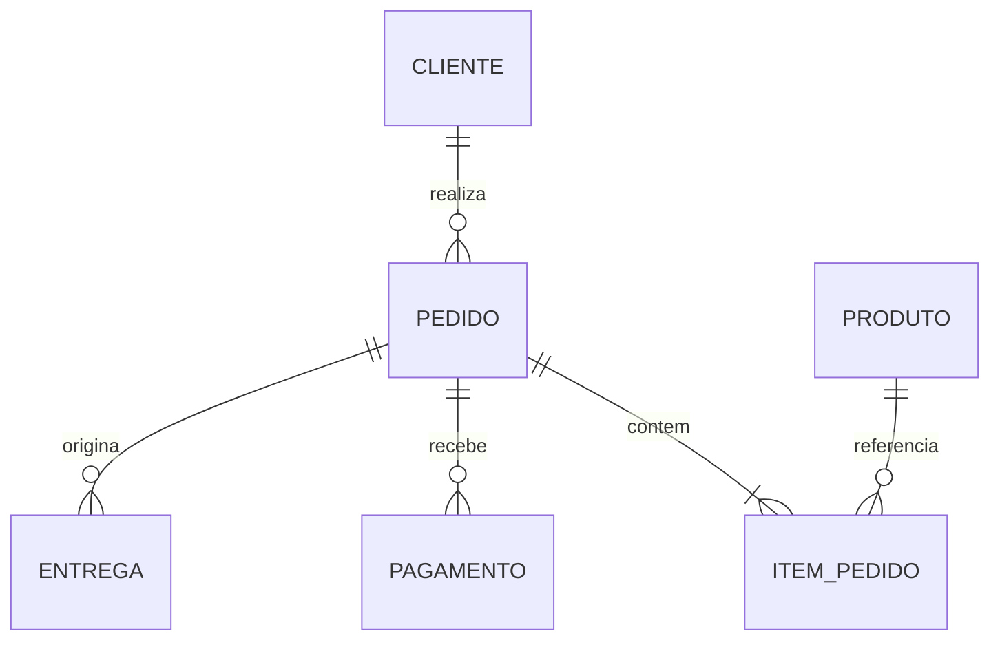
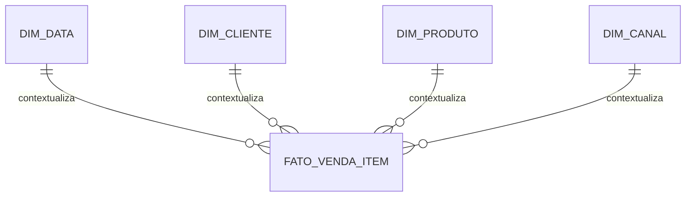
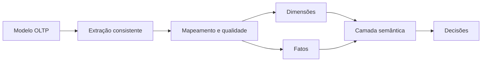

# 08 — Modelagem Transacional e Analítica

## Objetivos

Ao final deste capítulo, você deverá ser capaz de:

- comparar cargas transacionais e analíticas;
- declarar o grão de uma tabela de fatos;
- distinguir fatos, dimensões e medidas;
- transformar dados operacionais em um modelo analítico;
- reconhecer fatos aditivos, semiaditivos e não aditivos;
- preservar histórico e evitar dupla contagem.

## Um domínio, propósitos diferentes

O checkout precisa registrar um pedido com baixa latência, integridade e concorrência segura. A diretoria quer analisar receita por mês, categoria, região e canal em milhões de itens. Embora ambos usem dados de vendas, seus padrões de acesso e mudança são diferentes.

Modelos transacionais priorizam operações pequenas e consistentes sobre o estado do negócio. Modelos analíticos priorizam leitura, agregação, histórico e interpretação estável. Copiar o schema operacional diretamente para análise transfere sua complexidade sem responder às perguntas analíticas.

## Comparação

| Aspecto | Transacional — OLTP | Analítico — OLAP |
| --- | --- | --- |
| Propósito | executar processos | apoiar decisões |
| Operações | inserções e atualizações curtas | leituras e agregações amplas |
| Estado | atual e operacional | histórico e derivado |
| Estrutura | frequentemente normalizada | frequentemente dimensional |
| Consultas | previsíveis por chave | exploratórias por dimensões |
| Concorrência | muitas escritas simultâneas | muitas leituras e cargas controladas |
| Granularidade | entidades e transações | eventos mensuráveis em grão declarado |

São tendências, não limites absolutos. A decisão deve considerar requisitos reais.

## Modelo transacional

O núcleo operacional da DataRetail separa cliente, produto, pedido e item para preservar identidades e regras.



Esse modelo responde bem a perguntas como “qual é o estado do pedido 5001?” e “este pagamento pertence a um pedido válido?”. Para calcular vendas históricas por categoria, exige várias junções, filtros de estado e interpretação temporal.

## Modelo dimensional

Modelagem dimensional organiza processos mensuráveis em **fatos** e contextos descritivos em **dimensões**.



O desenho em torno de uma tabela fato e dimensões diretamente conectadas é conhecido como **esquema estrela**. Dimensões normalizadas em subestruturas formam variantes do esquema floco de neve; a escolha envolve usabilidade, governança e custo.

## O grão vem primeiro

O **grão** declara exatamente o que cada linha representa. Antes de escolher medidas ou dimensões, complete a frase:

> Uma linha da fato representa **um item de um pedido confirmado no momento da venda**.

Grãos possíveis incluem:

- uma linha por pedido;
- uma linha por item do pedido;
- uma linha por pagamento;
- uma linha por evento de status;
- uma linha por produto por loja por dia.

Misturar item e pagamento na mesma fato pode multiplicar valores quando um pedido possui vários de ambos. Fatos de processos diferentes devem ser modelados separadamente e relacionados por dimensões conformadas.

## Tabelas fato

Uma tabela fato registra eventos, medições ou estados em determinado grão. Pode conter:

- chaves das dimensões;
- medidas numéricas;
- identificadores degenerados, como número do pedido;
- timestamps e indicadores necessários ao processo.

### Fato transacional

Uma linha por evento, como item vendido ou pagamento aprovado.

### Snapshot periódico

Uma linha por entidade e período, como estoque de cada produto ao final do dia.

### Snapshot acumulado

Uma linha acompanha marcos de um processo, como criação, aprovação, separação e entrega do pedido.

## Medidas e aditividade

| Tipo | Exemplo | Agregação segura |
| --- | --- | --- |
| Aditiva | receita do item | todas as dimensões compatíveis |
| Semiaditiva | saldo de estoque | produtos e lojas, não o tempo indiscriminadamente |
| Não aditiva | percentual, preço unitário | recalcular por componentes ou regra |

Somar margens percentuais ou estoques diários ao longo do mês produz resultados sem significado. O contrato da medida deve declarar fórmula, unidade, moeda e dimensões de agregação.

## Dimensões

Dimensões descrevem quem, o quê, quando, onde, como e por quê. Normalmente possuem uma chave substituta analítica e preservam a chave de negócio da origem.

Uma dimensão de produto pode conter SKU, nome, marca, categoria e departamento para permitir filtros e agrupamentos. Esses atributos podem repetir-se por opção de usabilidade; sua origem e atualização precisam ser governadas.

## Dimensões conformadas

Uma dimensão conformada possui significado e chaves compatíveis entre fatos. `DIM_DATA` e `DIM_PRODUTO` podem conectar vendas, devoluções e estoque, permitindo análises consistentes sem juntar fatos diretamente.

Conformidade exige definição comum, não apenas nomes iguais. “Cliente” em vendas pode representar comprador; em entrega, destinatário. Os papéis precisam ser explícitos.

## Histórico de dimensões

Quando um atributo muda, existem estratégias diferentes:

- **sobrescrever** quando apenas o estado atual importa;
- **criar nova versão** quando fatos devem manter o contexto histórico;
- **preservar atributos anterior e atual** para casos específicos.

Uma dimensão versionada costuma incluir chave substituta, chave de negócio, início de vigência, fim de vigência e indicador da versão atual.

```text
produto_sk | produto_id | categoria | valido_desde | valido_ate | atual
```

O pipeline associa cada fato à versão válida no instante do evento. Isso evita que uma mudança de categoria reclassifique silenciosamente todo o histórico.

## Dimensão data e papéis

Uma dimensão data oferece atributos como ano, trimestre, mês, semana e dia útil. A mesma dimensão pode desempenhar papéis diferentes: data do pedido, do pagamento e da entrega.

Os papéis precisam ser nomeados na camada semântica para evitar que “vendas de janeiro” misture datas de processos distintos.

## Exemplo de estrela da DataRetail

```sql
CREATE TABLE fact_sales_item (
    sale_item_key BIGINT PRIMARY KEY,
    order_number TEXT NOT NULL,
    order_date_key INTEGER NOT NULL,
    customer_key BIGINT NOT NULL,
    product_key BIGINT NOT NULL,
    channel_key INTEGER NOT NULL,
    quantity NUMERIC(14, 3) NOT NULL,
    gross_amount NUMERIC(14, 2) NOT NULL,
    discount_amount NUMERIC(14, 2) NOT NULL,
    net_amount NUMERIC(14, 2) NOT NULL,
    UNIQUE (order_number, product_key)
);
```

A chave de unicidade só é correta se um produto aparecer uma vez por pedido. Se o grão real for a linha do pedido, `order_line_number` deve participar da chave.

## Da origem ao produto analítico



A transformação deve reconciliar contagens e valores, tratar cancelamentos e devoluções, preservar a linhagem e definir o atraso aceitável.

## Erros comuns

- definir colunas antes do grão;
- misturar processos com cardinalidades diferentes na mesma fato;
- somar medidas não aditivas;
- usar a chave operacional como única chave de dimensão histórica;
- juntar fatos diretamente e multiplicar linhas;
- sobrescrever dimensões quando o histórico é requisito;
- copiar o schema OLTP como modelo de consumo;
- não reconciliar o produto analítico com a origem.

## Boas práticas

- declare processo, grão, dimensões e fatos nessa ordem;
- documente fórmula, unidade e aditividade de cada medida;
- preserve chaves de negócio e linhagem;
- modele processos diferentes em fatos diferentes;
- use dimensões conformadas para integração;
- teste unicidade no grão declarado;
- trate eventos atrasados e correções;
- valide totais contra fontes autorizadas.

## Resumo

- Modelos transacionais executam processos; modelos analíticos apoiam decisões.
- O grão define o significado de cada linha da fato.
- Fatos registram eventos ou snapshots; dimensões fornecem contexto.
- Aditividade determina agregações válidas.
- Dimensões conformadas integram processos.
- Versionamento preserva o contexto histórico.
- Transformações exigem contratos, reconciliação e linhagem.

## Próximo Capítulo

➡️ [[09-Evolucao-Trade-offs-e-Governanca|09 — Evolução, Trade-offs e Governança]]
