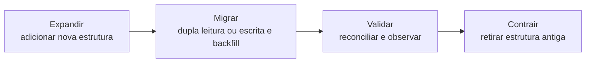

# 09 — Evolução, Trade-offs e Governança

## Objetivos

Ao final deste capítulo, você deverá ser capaz de:

- planejar mudanças de schema compatíveis;
- distinguir mudanças aditivas, restritivas e semânticas;
- aplicar o padrão expandir-migrar-contrair;
- avaliar trade-offs de redundância, flexibilidade e desempenho;
- definir responsabilidades e artefatos de governança;
- testar migrações, rollback e qualidade histórica.

## Modelos mudam

Novos canais, regras fiscais e processos logísticos alteram o domínio. Também surgem novos volumes, consultas e requisitos regulatórios. Um modelo incapaz de evoluir força consumidores a depender de exceções; uma mudança sem controle quebra contratos silenciosamente.

Evolução de modelo é a disciplina de alterar significado e estrutura com impacto conhecido, transição segura e evidências de correção.

## Tipos de mudança

| Tipo | Exemplo | Risco principal |
| --- | --- | --- |
| Aditiva | nova coluna opcional | consumidores que assumem schema fechado |
| Restritiva | tornar coluna obrigatória | dados históricos e produtores antigos |
| Estrutural | dividir uma tabela | consultas e integrações |
| Semântica | redefinir “receita líquida” | resultados comparáveis apenas na aparência |
| Identidade | trocar chave ou regra de deduplicação | duplicidade e perda de vínculos |
| Temporal | passar a manter histórico | vigência e backfill |

Mudanças aditivas não são automaticamente seguras. Um campo novo pode alterar interpretação, volume ou política de acesso.

## Compatibilidade

- **retrocompatibilidade**: consumidores novos leem dados antigos;
- **compatibilidade futura**: consumidores antigos toleram dados novos;
- **compatibilidade plena**: ambos os sentidos são suportados durante a transição.

O contrato deve definir o que é garantido: nomes, tipos, nulabilidade, chaves, semântica, frequência e política de evolução.

## Expandir, migrar e contrair

Uma mudança segura evita substituir tudo de uma vez.

Exemplo para tornar `currency` obrigatória:

1. adicionar a coluna anulável;
2. adaptar produtores para preenchê-la;
3. preencher o histórico com regra documentada;
4. publicar métricas de cobertura;
5. migrar consumidores;
6. rejeitar novos nulos;
7. aplicar `NOT NULL` quando todo o conjunto estiver válido;
8. remover caminhos antigos após a janela acordada.

## Backfill

Backfill recalcula ou preenche dados históricos. Ele precisa declarar:

- fonte e regra usadas;
- intervalo e partições afetadas;
- idempotência;
- tratamento de valores impossíveis de reconstruir;
- impacto operacional;
- reconciliação antes e depois;
- versão da lógica e evidências.

Inferir moeda histórica pelo país atual do cliente pode reescrever o passado incorretamente. Quando não houver evidência suficiente, a ausência deve permanecer explícita.

## Mudanças semânticas

Renomear uma coluna não resolve uma mudança de definição. Se `receita` antes incluía frete e agora o exclui, séries históricas deixam de ser comparáveis.

Estratégias incluem:

- criar uma nova métrica com nome e versão distintos;
- recalcular o histórico quando possível;
- marcar a quebra na série;
- manter as duas definições durante transição;
- comunicar consumidores e atualizar a camada semântica.

## Migração de chaves

Alterar identidade é uma das mudanças mais arriscadas. O processo deve construir um mapa entre chaves antigas e novas, medir correspondências `1:1`, `1:N`, `N:1` e não resolvidas, preservar aliases e evitar reutilização de identificadores.

Fusões de clientes exigem histórico do vínculo e capacidade de corrigir uma fusão indevida. A chave canônica não deve apagar as evidências das fontes.

## Trade-offs de modelagem

### Normalização versus leitura simples

Normalização reduz anomalias; materializações reduzem junções. A solução pode manter uma fonte normalizada e produtos derivados reconstruíveis.

### Flexibilidade versus contratos

Campos livres aceleram mudanças locais, mas transferem validação para consumidores. Flexibilidade precisa de schema, versão e observabilidade, mesmo em documentos sem estrutura rígida.

### Estado atual versus histórico

Manter apenas o atual reduz volume; histórico permite auditoria e análise temporal. Retenção, privacidade e finalidade limitam o que deve ser preservado.

### Chave natural versus substituta

Identidade de negócio facilita interoperabilidade; chave substituta oferece estabilidade técnica. Preservar ambas costuma equilibrar necessidades.

### Consistência versus disponibilidade operacional

Regras síncronas fortes protegem invariantes, mas podem elevar acoplamento. Derivações assíncronas toleram atraso, desde que o nível de serviço e a reconciliação sejam explícitos.

## Governança do modelo

Governança define quem decide, como o significado é registrado e quais evidências autorizam mudanças.

Artefatos úteis incluem:

- glossário e catálogo;
- diagramas conceituais, lógicos e físicos;
- contratos de dados;
- decisões arquiteturais;
- classificação de sensibilidade;
- linhagem;
- donos de domínio e produtos;
- testes e níveis de serviço;
- registro de versões e depreciações.

## Responsabilidades

| Papel | Responsabilidade |
| --- | --- |
| Dono do domínio | aprovar significado e regras |
| Produtor | cumprir contrato e comunicar mudanças |
| Engenharia de Dados | preservar transformação, chaves e qualidade |
| Governança | manter definições, responsabilidades e políticas |
| Segurança e privacidade | classificar, limitar acesso e retenção |
| Consumidor | usar conforme semântica e reportar impacto |

## Revisão de uma mudança

Uma proposta deve responder:

- qual problema resolve?
- qual regra do domínio mudou?
- quais produtores e consumidores são afetados?
- a mudança é compatível?
- como ocorrerão backfill e dupla operação?
- quais testes provam equivalência ou nova semântica?
- como rollback ou roll-forward funcionarão?
- quando o legado será removido?
- quem aprova e responde por incidentes?

## Observabilidade da evolução

Durante a migração, monitore:

- nulos e valores inválidos;
- duplicidade de chaves;
- referências órfãs;
- divergência entre estruturas antiga e nova;
- cobertura de backfill;
- atraso de produtores;
- consumidores ainda no contrato antigo;
- custo, latência e incidentes.

## Exemplo DataRetail: múltiplas entregas

O modelo antigo guarda uma data de entrega no pedido. O negócio passa a permitir entregas parciais.

Uma migração segura:

1. cria `ENTREGA` e `ITEM_ENTREGA`;
2. gera uma entrega histórica por pedido já entregue;
3. grava novas entregas na estrutura nova;
4. deriva temporariamente a data legada da última entrega;
5. reconcilia pedidos, itens e quantidades;
6. migra consumidores para eventos de entrega;
7. deprecia a coluna antiga.

O modelo conceitual também muda: entrega deixa de ser atributo do pedido e passa a ter identidade e ciclo de vida próprios.

## Erros comuns

- alterar tipo ou significado sem inventariar consumidores;
- assumir que coluna opcional é mudança inofensiva;
- executar backfill não idempotente;
- remover a estrutura antiga antes da reconciliação;
- versionar o schema sem versionar a semântica;
- manter compatibilidade indefinidamente sem prazo;
- documentar o modelo, mas não o sistema real;
- preservar dados históricos sem finalidade ou retenção definida.

## Boas práticas

- prefira mudanças pequenas e reversíveis;
- use expandir-migrar-contrair;
- trate identidade e semântica como mudanças críticas;
- teste migrações com volume e exceções reais;
- reconcilie contagens, chaves e valores;
- publique depreciação com prazo e responsáveis;
- mantenha modelos e contratos sincronizados;
- registre a justificativa de cada trade-off.

## Resumo

- Modelos evoluem com domínio, escala e regulação.
- Compatibilidade precisa ser definida por contrato.
- Expandir-migrar-contrair reduz mudanças abruptas.
- Backfills exigem evidência, idempotência e reconciliação.
- Mudanças semânticas não se resolvem apenas com renomeação.
- Trade-offs precisam de propósito, métricas e controles.
- Governança conecta significado, responsáveis, segurança e evolução.

## Próximo Capítulo

➡️ [[10-Estudo-de-Caso-DataRetail|10 — Estudo de Caso DataRetail]]
