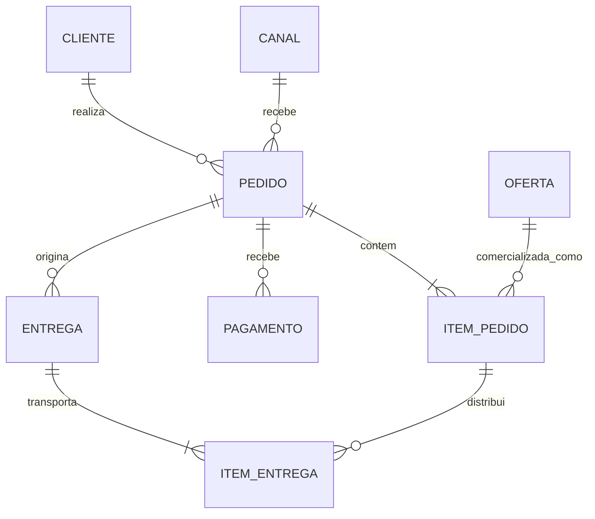
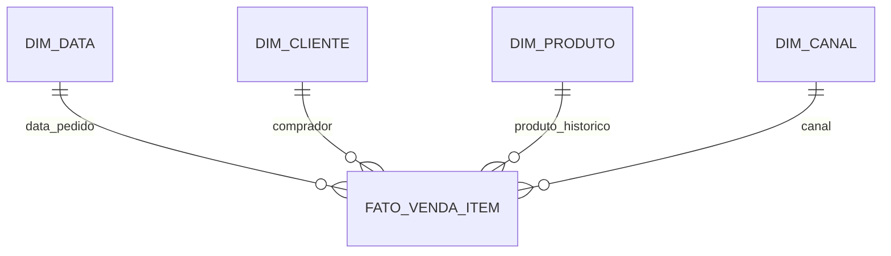
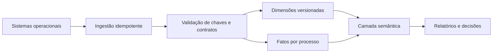

# 10 — Estudo de Caso DataRetail

## Contexto

A DataRetail S.A. vende por e-commerce, aplicativo e lojas físicas. O crescimento criou interpretações divergentes: a loja reutiliza números de pedido, o catálogo sobrescreve preços, o sistema antigo guarda uma única data de entrega e relatórios somam pagamentos com itens, duplicando receita.

O objetivo é projetar um núcleo operacional consistente e um produto analítico de vendas, preservando identidade, histórico e evolução.

## Requisitos do domínio

- clientes podem comprar em vários canais;
- um pedido pertence a um canal e possui linhas numeradas;
- a mesma oferta pode aparecer mais de uma vez se promoção ou vendedor diferirem;
- preço, desconto e moeda da venda precisam ser históricos;
- um pedido pode receber vários pagamentos;
- um pedido pode originar entregas parciais;
- a soma entregue por linha não pode exceder a quantidade comprada;
- vendas confirmadas e devoluções devem alimentar análises separáveis;
- alterações de categoria do produto não devem reclassificar o passado.

## Glossário mínimo

| Termo | Definição |
| --- | --- |
| Cliente | parte que realiza a compra |
| Oferta | produto comercializável em canal e período |
| Pedido | intenção de compra registrada por uma origem |
| Item do pedido | linha comercial no contexto do pedido |
| Pagamento | tentativa ou liquidação financeira associada ao pedido |
| Entrega | expedição física com ciclo de vida próprio |
| Venda líquida | valor dos itens menos descontos, sem frete, após confirmação |

## Modelo conceitual



## Decisões de identidade

- `cliente_id` canônico é substituto; identificadores das fontes permanecem mapeados;
- pedido é único por `(sistema_origem, pedido_origem_id)`;
- item é identificado por `(pedido_id, numero_linha)`;
- pagamento preserva o identificador do provedor;
- entrega possui identificador próprio, pois pode existir várias vezes por pedido;
- oferta é distinta de produto para representar canal, preço e vigência.

## Modelo lógico operacional

```text
CLIENTE(cliente_id, nome, email)
IDENTIDADE_CLIENTE(cliente_id, sistema_origem, id_origem, valido_desde, valido_ate)
CANAL(canal_id, nome)
PRODUTO(produto_id, sku, nome)
OFERTA(oferta_id, produto_id, canal_id, valido_desde, valido_ate)
PEDIDO(pedido_id, sistema_origem, id_origem, cliente_id, canal_id, realizado_em, status, moeda)
ITEM_PEDIDO(pedido_id, numero_linha, oferta_id, quantidade, preco_unitario, desconto)
PAGAMENTO(pagamento_id, pedido_id, provedor_id, valor, status, ocorrido_em)
ENTREGA(entrega_id, pedido_id, status, despachado_em, entregue_em)
ITEM_ENTREGA(entrega_id, pedido_id, numero_linha, quantidade)
```

## Invariantes

- chaves de origem são únicas dentro de seu namespace;
- quantidade de item e entrega é positiva;
- preço e desconto não são negativos;
- desconto não excede o valor bruto da linha;
- moeda é coerente em todo o pedido;
- entrega referencia uma linha do mesmo pedido;
- soma entregue não excede quantidade comprada;
- intervalos de uma mesma oferta não se sobrepõem;
- status segue transições permitidas.

## Implementação de uma invariante estrutural

```sql
ALTER TABLE delivery
    ADD CONSTRAINT uq_delivery_order UNIQUE (delivery_id, order_id);

CREATE TABLE delivery_item (
    delivery_id BIGINT NOT NULL,
    order_id BIGINT NOT NULL,
    line_number INTEGER NOT NULL,
    quantity NUMERIC(14, 3) NOT NULL CHECK (quantity > 0),
    PRIMARY KEY (delivery_id, order_id, line_number),
    FOREIGN KEY (order_id, line_number)
        REFERENCES order_item (order_id, line_number),
    FOREIGN KEY (delivery_id, order_id)
        REFERENCES delivery (delivery_id, order_id)
);
```

A soma entregue exige validação transacional adicional. As chaves compostas impedem associar à entrega uma linha de outro pedido.

## Modelo analítico

O processo principal é venda confirmada. O grão é **uma linha do item confirmado no instante do pedido**.



Medidas:

- quantidade;
- valor bruto = quantidade × preço unitário;
- desconto;
- valor líquido = valor bruto − desconto.

Pagamentos formam outra fato no grão de tentativa de pagamento. Entregas formam uma fato de item entregue. Relacioná-las por dimensões evita a multiplicação resultante de juntar diretamente itens, pagamentos e entregas.

## Histórico de produto

`DIM_PRODUTO` recebe nova versão quando categoria ou departamento mudam. A venda referencia a versão válida na data do pedido. Correções cadastrais sem mudança de significado podem seguir política de sobrescrita documentada.

## Fluxo de dados



## Evolução: entrega parcial

O legado possuía `pedido.data_entrega`. A migração aplica:

1. criação de `ENTREGA` e `ITEM_ENTREGA`;
2. backfill de uma entrega para pedidos históricos concluídos;
3. dupla escrita temporária;
4. reconciliação de pedidos e quantidades;
5. migração dos consumidores;
6. depreciação da coluna antiga.

## Testes de aceite

| Regra | Teste |
| --- | --- |
| pedido único na origem | duplicidade por sistema e ID igual a zero |
| linhas únicas | unicidade por pedido e número da linha |
| referências válidas | nenhuma chave estrangeira órfã |
| entrega limitada | soma entregue menor ou igual à comprada |
| grão da fato | uma linha por pedido e linha confirmada |
| reconciliação | valor líquido analítico igual ao operacional elegível |
| histórico | categoria da venda permanece após mudança do produto |
| idempotência | reprocessamento não altera contagens ou totais |

## Incidente evitado

O relatório anterior juntava itens, dois pagamentos e duas entregas do mesmo pedido, multiplicando cada item quatro vezes. A separação por processos e a proibição de juntar fatos diretamente eliminam a duplicação. A reconciliação por pedido detecta qualquer nova explosão de cardinalidade.

## Decisões e trade-offs

- núcleo operacional normalizado para proteger escrita e integridade;
- modelos analíticos derivados para leitura e histórico;
- chaves substitutas acompanhadas de unicidade de negócio;
- dimensões versionadas somente para atributos historicamente relevantes;
- regras não declarativas possuem testes, transação e observabilidade;
- estruturas antigas têm prazo de depreciação.

## Resultado

O modelo distingue identidade, processo e tempo. Pedidos, pagamentos e entregas possuem ciclos próprios; produtos operacionais e históricos não se confundem; as métricas têm grão e fórmula; mudanças podem ser migradas com reconciliação.

## Próximo Capítulo

➡️ [[11-Resumo|11 — Resumo]]
