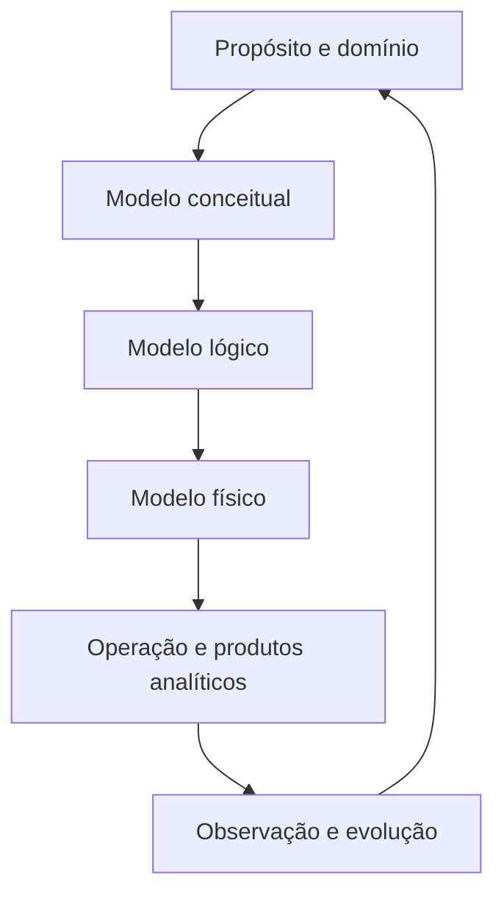

# 11 — Resumo

## Ideia central

Modelagem de Dados transforma conhecimento do domínio em representações explícitas, verificáveis e adequadas a um propósito. Não se resume a desenhar tabelas: inclui descoberta, identidade, regras, tempo, consumo e evolução.

## Conceitos essenciais

| Conceito | Síntese |
| --- | --- |
| Entidade | conceito com identidade e relevância |
| Atributo | propriedade com domínio e significado |
| Relacionamento | associação que expressa regra do domínio |
| Chave candidata | identificador mínimo e único |
| Cardinalidade | participação mínima e máxima |
| Integridade | prevenção ou detecção de estados inválidos |
| Dependência funcional | regra `X → Y` sobre determinação de atributos |
| Normalização | organização de fatos para reduzir anomalias |
| Grão | significado exato de cada linha |
| Fato | evento, medição ou snapshot analítico |
| Dimensão | contexto descritivo para análise |

## Níveis

- **conceitual**: significado, escopo, conceitos e regras;
- **lógico**: organização segundo um paradigma;
- **físico**: implementação em tecnologia e ambiente concretos.

Rastreabilidade conecta cada restrição física à regra que a originou.

## Identidade e integridade

- chave substituta não elimina a chave de negócio;
- chaves compostas expressam identidade em um escopo;
- chave estrangeira não implementa sozinha toda cardinalidade;
- nulabilidade deriva da participação;
- invariantes podem exigir restrições, transações e testes;
- pipelines precisam verificar unicidade e referências mesmo sem enforcement físico.

## Normalização

| Forma | Questão principal |
| --- | --- |
| 1FN | existem grupos repetidos ou valores não atômicos para o uso? |
| 2FN | atributo depende apenas de parte da chave composta? |
| 3FN | atributo não chave depende de outro atributo não chave? |
| BCNF | todo determinante não trivial é superchave? |

Decomposição deve preservar junção sem perda e, quando possível, dependências. Desnormalização exige evidência, fonte de verdade e reconciliação.

## Transacional e analítico

- OLTP protege processos e escrita concorrente;
- OLAP apoia leitura, histórico e agregação;
- declarar o grão precede escolher dimensões e medidas;
- fatos de processos diferentes não devem ser juntados diretamente;
- aditividade determina agregações válidas;
- dimensões conformadas integram processos;
- versionamento preserva contexto histórico.

## Evolução

Mudanças podem ser aditivas, restritivas, estruturais, semânticas, de identidade ou temporais. O padrão recomendado é:

1. expandir;
2. migrar e preencher histórico;
3. reconciliar;
4. contrair após a depreciação.

## Checklist de modelagem

- [ ] propósito, consumidores e escopo estão declarados;
- [ ] glossário diferencia conceitos ambíguos;
- [ ] entidades possuem identidade e ciclo de vida;
- [ ] atributos têm domínio, unidade e temporalidade;
- [ ] relacionamentos possuem papéis e cardinalidades;
- [ ] chaves candidatas e de origem foram preservadas;
- [ ] invariantes possuem mecanismo e teste;
- [ ] dependências e anomalias foram analisadas;
- [ ] o grão de cada produto está explícito;
- [ ] histórico e estado atual não se confundem;
- [ ] mudanças possuem compatibilidade e depreciação;
- [ ] modelos, contratos e implementação estão sincronizados.

## Erros a evitar

- começar por tipos de coluna;
- copiar o schema legado como verdade do domínio;
- usar ID gerado como única unicidade;
- misturar listas em uma coluna;
- ignorar tempo e vigência;
- definir fatos antes do grão;
- somar medidas não aditivas;
- mudar semântica sem versão;
- desnormalizar sem medir;
- confiar apenas na aplicação para integridade.

## Autoavaliação

Você concluiu os fundamentos quando consegue:

- explicar o mesmo domínio nos três níveis;
- justificar entidade, atributo e relacionamento;
- derivar chaves e cardinalidades;
- normalizar uma relação por suas dependências;
- projetar um fato com grão e medidas válidas;
- planejar uma evolução compatível e reconciliável.

## Próximo Capítulo

➡️ [[12-Perguntas-de-Entrevista|12 — Perguntas de Entrevista]]
