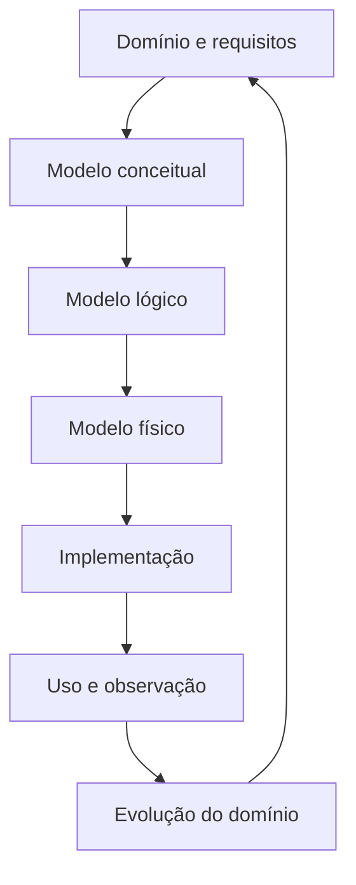

# Módulo 04 — Modelagem

> [!abstract]
> Modelar dados é transformar conhecimento do domínio em uma representação explícita, verificável e adequada ao uso. Este módulo apresenta os fundamentos da modelagem conceitual, lógica e física, incluindo entidades, relacionamentos, chaves, normalização, modelos analíticos e evolução.

## Objetivos do módulo

- compreender o papel da modelagem na comunicação entre negócio e tecnologia;
- distinguir modelos conceitual, lógico e físico;
- identificar entidades, atributos, relacionamentos e restrições;
- interpretar cardinalidade, opcionalidade e dependência;
- selecionar chaves e preservar integridade;
- aplicar fundamentos de normalização;
- comparar modelos transacionais e analíticos;
- avaliar redundância, desempenho, evolução e governança.

## Estrutura

### Fundamentos

- [[01-Objetivos]]
- [[02-Introducao]]
- [[03-O-que-e-Modelagem-de-Dados]]
- [[04-Niveis-Conceitual-Logico-e-Fisico]]
- [[05-Entidades-Atributos-e-Relacionamentos]]
- [[06-Chaves-Cardinalidade-e-Integridade]]
- 07 — Normalização e Dependências
- 08 — Modelagem Transacional e Analítica
- 09 — Evolução, Trade-offs e Governança

### Aplicação e revisão planejada

- 10 — Estudo de Caso DataRetail
- 11 — Resumo
- 12 — Perguntas de Entrevista
- 13 — Exercícios
- 13 — Gabarito
- 14 — Laboratório
- 14 — Solução
- 15 — Referências

## Mapa conceitual

## Limites do módulo

O foco é desenvolver raciocínio de modelagem independente de ferramenta. Sintaxe SQL será aprofundada no Volume 04, modelagem especializada no Volume 05 e implementação PostgreSQL no Volume 08.

## Projeto Integrador

A DataRetail S.A. precisa representar clientes, produtos, pedidos, pagamentos e entregas sem perder regras do negócio. O módulo acompanhará a passagem do entendimento do domínio até modelos transacionais e analíticos verificáveis.
