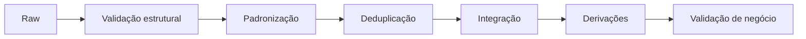

# 05 — Transformação de Dados

## Da representação ao significado

Transformar é aplicar regras determinísticas e versionadas para produzir o contrato do destino. A sequência típica é validar, padronizar, deduplicar, integrar, derivar e testar.

## Operações

- conversão explícita de tipos e fusos;
- padronização de códigos e unidades;
- tratamento semântico de ausências;
- deduplicação por chave e regra de precedência;
- resolução de identidades;
- joins com cardinalidade testada;
- cálculo de métricas e classificação;
- mascaramento ou minimização de dados sensíveis.

## Regras determinísticas

Mesma entrada e mesma versão de regra devem produzir a mesma saída. Funções dependentes do relógio, ordem não definida ou estado oculto prejudicam reprocessamento.

## Dados inválidos

Falhas críticas bloqueiam publicação; registros isolados podem ir para quarentena com motivo, payload, origem e execução. Nunca descarte silenciosamente.

## Precisão

Dinheiro exige decimal e regra de arredondamento; timestamps exigem timezone; unidades precisam ser convertidas antes de agregação. Transformações “convenientes” podem alterar significado.

## Testes

Verifique schema, domínios, unicidade, referências, cardinalidade de joins, reconciliação, limites e exemplos conhecidos.

## Próximo Capítulo

➡️ [[06-Carga-de-Dados|06 — Carga de Dados]]
