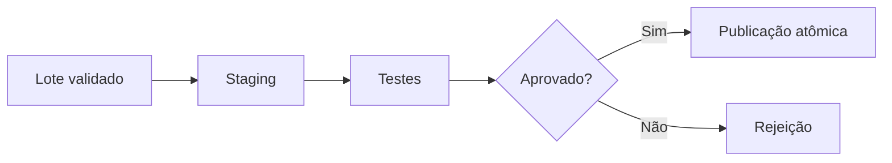

# 06 — Carga de Dados

## Semântica de escrita

Carga publica dados no destino. Antes de implementar, defina se a operação acrescenta, substitui, atualiza ou versiona.

| Estratégia | Uso | Controle essencial |
| --- | --- | --- |
| Append | eventos imutáveis | chave idempotente |
| Truncate-reload | conjuntos pequenos completos | troca atômica |
| Upsert | estado mutável | chave e precedência |
| Type 2 | histórico dimensional | vigência sem sobreposição |
| Partição | lotes por período | publicação de partição completa |

## Staging e publicação

Carregue primeiro em staging, valide contagens e regras e publique por transação, troca de tabela ou partição. Consumidores não devem observar metade do lote.

## Upsert

Upsert requer chave de negócio e regra de atualização. Eventos antigos não devem sobrescrever estado mais novo. Registre `source_updated_at` ou versão e compare precedência.

## Reconciliação

Compare contagens, chaves distintas, somas de controle, mínimos/máximos e rejeições. A equação deve explicar: extraídos = carregados + rejeitados + filtrados intencionalmente.

## Próximo Capítulo

➡️ [[07-Cargas-Incrementais-e-CDC|07 — Cargas Incrementais e CDC]]
