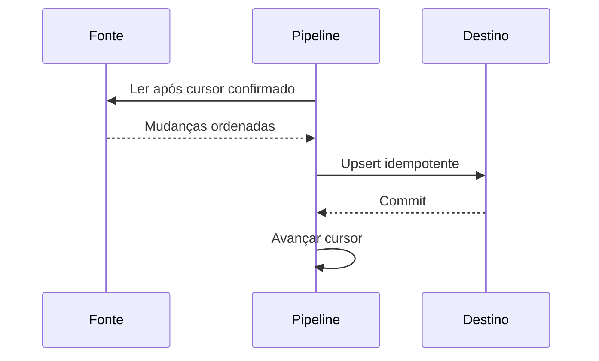

# 07 — Cargas Incrementais e CDC

## Incrementalidade

Processar apenas mudanças reduz custo, mas introduz estado. O pipeline precisa saber até onde confirmou e como tratar eventos atrasados.

## Watermark seguro

Use cursor composto, avance somente após publicação e sobreponha uma janela quando atualizações puderem chegar atrasadas. Deduplicação torna a sobreposição segura.

## CDC

CDC por log captura inserts, updates e deletes com posição ordenável. Requer snapshot inicial, continuidade entre snapshot e log, retenção do log e tratamento de alterações de schema.

## Exclusões

Watermark em linhas atuais não detecta delete físico. Alternativas: tombstones, coluna de exclusão, tabela de auditoria, CDC ou reconciliação periódica.

## Eventos fora de ordem

Compare versão ou instante da origem; não use apenas horário de chegada. Defina política para empates e correções retroativas.

## Próximo Capítulo

➡️ [[08-Confiabilidade-Idempotencia-e-Reprocessamento|08 — Confiabilidade, Idempotência e Reprocessamento]]
