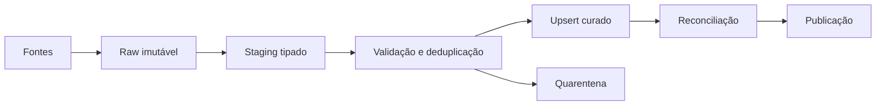

# 10 — Estudo de Caso DataRetail

## Cenário

Web, aplicativo e lojas exportam pedidos. O financeiro exige vendas confirmadas até 7h, sem duplicidade, com rastreabilidade e capacidade de recalcular seis meses.

## Contrato

Grão: uma linha por item de pedido. Chave: `(source_system, source_order_id, line_number)`. Moeda BRL; timestamps UTC; cancelados permanecem com estado explícito.

## Arquitetura

## Incremental

Cursor composto `(updated_at, event_id)`, sobreposição de 24 horas e upsert por chave de negócio. O cursor só avança após commit e auditoria. Exclusões chegam como tombstones.

## Transformações

- tipos e UTC;
- total não negativo;
- status controlado;
- deduplicação pela maior versão;
- resolução de produto e cliente;
- líquido = quantidade × preço − desconto;
- segregação de inválidos.

## Controles

`extraídos = válidos + rejeitados`; unicidade no grão; nenhuma referência órfã; soma por pedido reconciliada; idempotência em retry; checksum do raw; auditoria por lote.

## Incidente

Um retry após timeout repetia inserts. A correção substituiu append por upsert, adicionou chave única, commit atômico e consulta do estado antes de avançar o cursor.

## Aceite

- segunda execução não altera resultado;
- atraso abaixo de 7h;
- rejeições possuem motivo;
- backfill publica por partição após validação;
- fonte operacional não sofre degradação relevante;
- métricas permitem localizar cada registro.

## Próximo Capítulo

➡️ [[11-Resumo|11 — Resumo]]
