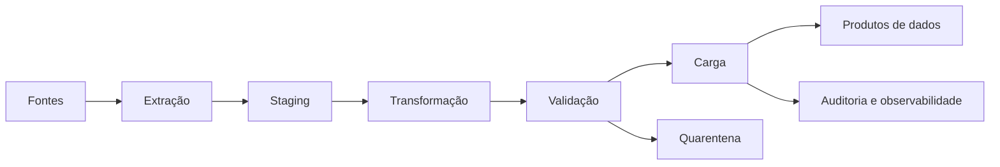

# Módulo 05 — ETL

> [!abstract]
> ETL movimenta dados entre contextos preservando significado, qualidade e rastreabilidade. O módulo aborda o ciclo completo: extração, transformação, carga, mudanças incrementais, idempotência, testes e operação.

## Estrutura

- [[01-Objetivos]]
- [[02-Introducao]]
- [[03-O-que-e-ETL]]
- [[04-Extracao-de-Dados]]
- [[05-Transformacao-de-Dados]]
- [[06-Carga-de-Dados]]
- [[07-Cargas-Incrementais-e-CDC]]
- [[08-Confiabilidade-Idempotencia-e-Reprocessamento]]
- [[09-Testes-Desempenho-e-Operacao]]
- [[10-Estudo-de-Caso-DataRetail]]
- [[11-Resumo]]
- [[12-Perguntas-de-Entrevista]]
- [[13-Exercicios]]
- [[13-Gabarito]]
- [[14-Laboratorio]]
- [[14-Solucao]]
- [[15-Referencias]]

## Mapa

## Limites

O foco é ETL como padrão de processamento e seus invariantes. ELT será aprofundado no próximo módulo; ferramentas específicas aparecem apenas como exemplos.

## Projeto Integrador

A DataRetail S.A. consolidará pedidos de canais distintos em um produto confiável, incremental e reconciliável.
