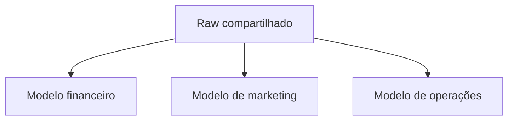

# 02 — Introdução

Plataformas analíticas modernas armazenam grandes volumes e executam transformações paralelas. ELT usa essa capacidade: primeiro preserva os dados carregados, depois cria representações de consumo dentro da plataforma.

Isso separa ingestão e transformação, permite múltiplos produtos derivados e facilita reprocessamento. Também amplia o risco de expor dados brutos, duplicar lógica e consumir recursos sem controle.

## Questões orientadoras

- quais dados podem entrar na zona raw?
- quem pode acessá-los?
- qual contrato separa raw, staging e mart?
- como dependências são ordenadas?
- quando reconstruir ou processar incrementalmente?
- como testar sem copiar lógica entre modelos?
- como atribuir custo e responsabilidade?

## Próximo Capítulo

➡️ [[03-O-que-e-ELT|03 — O que é ELT]]
