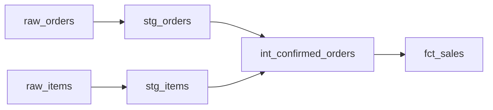

# 06 — Camadas, Modelos e Produtos

## Responsabilidades

| Camada | Responsabilidade |
| --- | --- |
| Raw | evidência próxima da fonte |
| Staging | tipos, nomes, deduplicação e limpeza local |
| Intermediate | regras reutilizáveis e integrações |
| Mart | fatos, dimensões e produtos orientados ao consumo |

Camadas são contratos, não obrigação de copiar fisicamente todos os dados. Uma view pode representar staging; uma tabela incremental pode materializar um mart.

## Princípios

- uma fonte entra uma vez e é reutilizada;
- staging não contém regra de métrica corporativa;
- intermediários evitam duplicar joins;
- marts declaram grão e consumidor;
- exposição ocorre somente por interfaces governadas.

## Grafo

## Próximo Capítulo

➡️ [[07-Incrementalidade-e-Materializacoes|07 — Incrementalidade e Materializações]]
