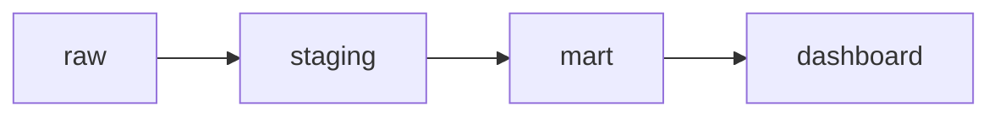

# 08 — Testes, Documentação e Linhagem

## Testes

- `NOT NULL` para campos obrigatórios;
- unicidade para o grão;
- relacionamentos para referências;
- valores aceitos e limites;
- testes unitários com entradas e saídas conhecidas;
- reconciliação com a fonte;
- atualidade e volume por partição.

Testes devem executar antes da exposição e produzir evidência por versão.

## Documentação

Descreva propósito, grão, colunas, fórmulas, donos, origem, SLO e política de evolução. Documentação gerada do mesmo código reduz divergência, mas texto semântico continua necessário.

## Linhagem

Linhagem permite avaliar impacto e rastrear um valor. Linhagem de tabela não substitui regras de coluna e versões do código.

## CI

Compile SQL, valide DAG, execute lint, testes unitários e modelos modificados com seus descendentes. Produção requer promoção controlada.

## Próximo Capítulo

➡️ [[09-Governanca-Seguranca-Custo-e-Desempenho|09 — Governança, Segurança, Custo e Desempenho]]
