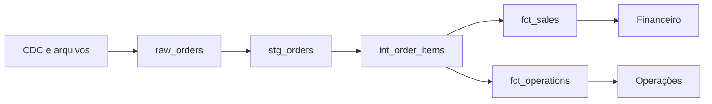

# 10 — Estudo de Caso DataRetail

## Cenário

Pedidos de três canais chegam à plataforma analítica. Finanças e operações precisam de produtos distintos, mas com definições conformadas.

## Arquitetura

## Contratos

Raw preserva payload e metadados. Staging padroniza UTC, decimal e chaves. `fct_sales` possui grão de item confirmado; cancelamentos continuam em operações.

## Incremental

Modelos reprocessam 24 horas e fazem merge por `(source, order_id, line_number)`. Snapshot versiona categoria de produto. Full refresh mensal compara equivalência.

## Testes

Unicidade, não nulos, referências, status aceitos, líquido não negativo, reconciliação por dia e atualidade até 7h.

## Incidente

Um analista consultou raw e somou versões duplicadas. O acesso foi restringido, o mart passou a ser interface oficial e a documentação destacou grão e política de versão.

## Aceite

- produtos compartilham dimensões conformadas;
- raw não é exposto ao BI;
- modelos são reconstruíveis;
- incremental equivale ao full refresh;
- custo e linhagem são atribuíveis.

## Próximo Capítulo

➡️ [[11-Resumo|11 — Resumo]]
