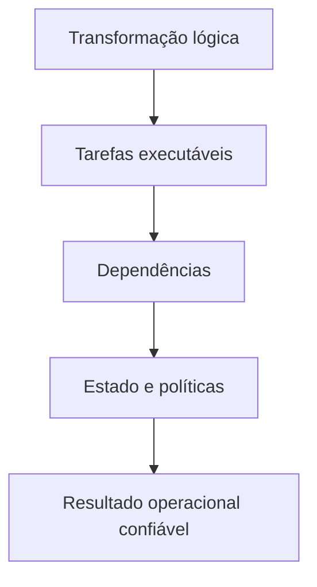

# Introdução

Os processos estudados em [[ETL]] e [[ELT]] descrevem a ordem conceitual de extração, carga e transformação. Um pipeline acrescenta a essa ordem uma representação executável: tarefas, dependências, parâmetros, estado, políticas de falha e critérios de sucesso.

Uma sequência de scripts pode funcionar em condições ideais. Em produção, porém, arquivos chegam atrasados, APIs limitam requisições, schemas evoluem e execuções são interrompidas. O desenho precisa responder: o que já terminou, o que pode ser repetido, qual resultado foi publicado e como recuperar uma partição sem duplicar dados?

## Duas perspectivas complementares

- **Plano de dados:** lê, transforma, transporta e grava registros.
- **Plano de controle:** agenda, coordena, registra estado, aplica políticas e emite alertas.

O orquestrador pertence principalmente ao plano de controle; motores SQL, Spark e consumidores de eventos realizam o trabalho pesado no plano de dados. Confundir esses papéis produz componentes difíceis de escalar e diagnosticar.

> [!warning]
> “A execução terminou” não significa “os dados estão corretos”. Sucesso técnico e sucesso de dados precisam de verificações distintas.

O próximo capítulo estabelece a unidade central dessa discussão: [[03-O-que-e-um-Pipeline-de-Dados]].
